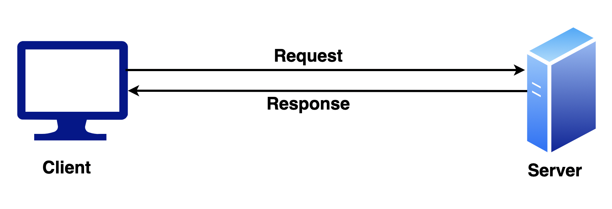
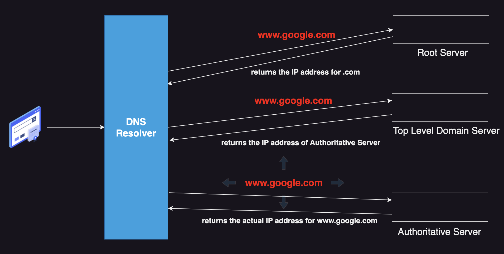
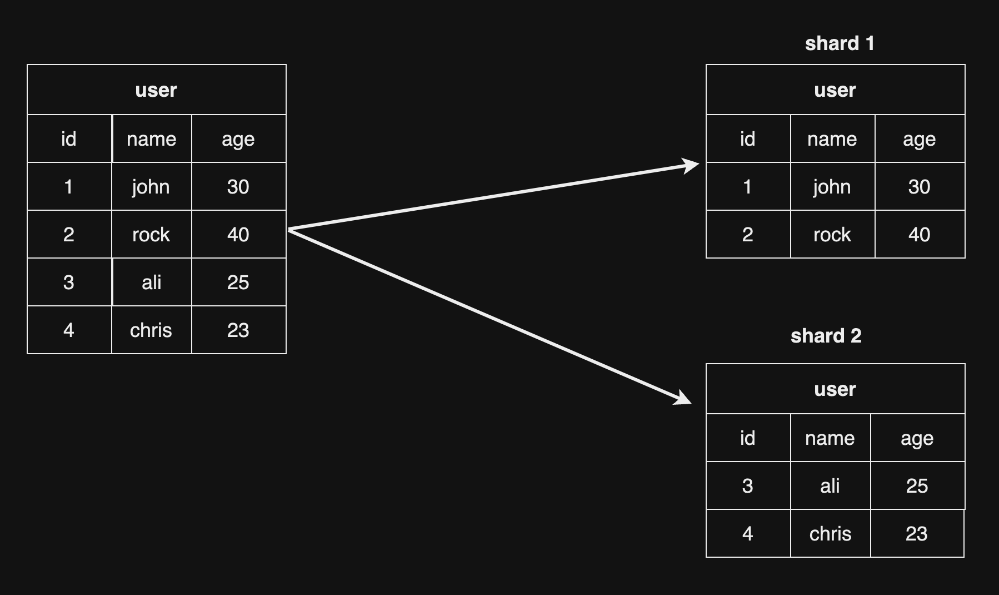
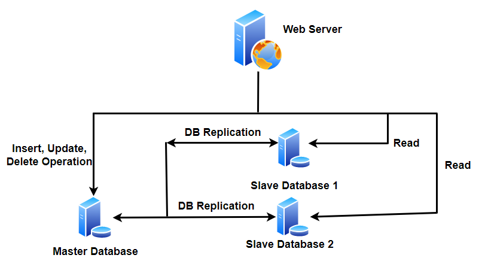

# সিস্টেম ডিজাইন বাংলা

এটি একটি রিপোজিটরি যেখানে সিস্টেম ডিজাইন এর মৌলিক জিনিসগুলো নিয়ে আলোচনা করা হয়েছে।

[এই টিউটোরিয়াল এর উদ্দেশ্য আপনাকে মৌলিক জিনিসগুলোর ধারণা দেয়া]

  

### সুচিপত্র

- [Section 1: System Design](#section-1-system-design)
- [Section 2: Database - SQL and NoSQL]
- [Section 3: Client Server Architecture](#section-3-client-server-architecture)
- [Section 4: Reliability](#section-4-reliability)
- [Section 5: Performance Metrics](#section-5-performance-metrics)
- [Section 6: Distributed System](#section-6-distributed-system)
- [Section 7: Domain Name System](#section-7-domain-name-system)
- [Section 8: Proxy](#section-8-proxy)
- [Section 9: REST API](#section-9-rest-api)
- [Section 10: Scalability](#section-10-scalability)
- [Section 11: Sharding](#section-11-sharding)
- [Section 12: Database Replication](#section-12-database-replication)
- [Section 13: Caching](#section-13-caching)
- [Section 14: Content Delivery Network]
- [Section 15: Consistent Hashing]
- [Section 16: CAP Theorem]
- [Section 17: Message Queue]
- [Section 18: Design a Rate Limiter]
- [Section 19: Design a Chat System]
- [Section 20: Design a Notification System]
- [Section 21: Resources](#section-21-resources)

## Section 1: System Design

আমরা যখন কোন এপ্লিকেশন ডেভেলপ করতে যাই আমাদের একটি নির্দিষ্ট প্রকারের ডিজাইন মেনে চলতে হয়, তার কারণ হল আমাদের এপ্লিকেশনে কোন এক সময় থেকে যদি প্রচুর মানুষ ব্যবহার করা শুরু করতে থাকে, তখন আমাদের এপ্লিকেশন যাতে প্রচুর লোড ভালোভাবে নিতে পারে কোন প্রকারের কানেকশন নষ্ট বা পারফরমেন্স ডাউন হওয়া ছাড়া সেজন্য। সেই ডিজাইন কে বলা হয় সিস্টেম ডিজাইন।

(এই স্পেসিফিক সিস্টেম ডিজাইন মূলত ব্যাকএন্ড ইঞ্জিনিয়ারিং এর সাথে সম্পৃক্ত।)

## Section 3: Client Server Architecture

ক্লায়েন্ট রিকুয়েস্ট করবে সার্ভারকে কিছু স্পেসিকিফ রিসোর্স এর জন্য, সার্ভার সেই রিকুয়েস্ট পাওয়ার পর সে তার যাবতীয় প্রসেস শেষ করে ক্লায়েন্টকে রেসপন্স দিয়ে দিবে, এটি ক্লায়েন্ট সার্ভার আর্কিটেকচার।

  

আমাদের সব উদাহরণ থাকবে ক্লায়েন্ট সার্ভার আর্কিটেকচারের উপর ভিত্তি করে।

## Section 4: Reliability

সিস্টেম যদি কোনো প্রকারের Fault/Error থাকার পরও ভালোভাবে কাজ করতে পারে কিংবা সিস্টেমটি যদি বন্ধ না হয়, তবে সেই সিস্টেমটি Reliable। আমাদের মনে রাখতে হবে এক বা একাধিক Fault এর কারণে সিস্টেম Failure হতে পারে।

Fault এরকম হতে পারে কোনো user সিস্টেমটি কে এমনভাবে ব্যবহার করেছে যাতে কোনো Failure হয়ে গেল, সেটা ইচ্ছাকৃত বা অনিচ্ছাকৃতভাবেও হতে পারে, তখন যদি সিস্টেমটি বন্ধ না হয়ে কোনো প্রকারের Warning message দেখালো তখন সেই সিস্টেমটিকে আমরা Reliable বলতে পারি।

🔗 [**আরও পড়ুন: রিলাইবিলিটি**](./sections/reliability/README.md)

## Section 5: Performance Metrics

### Throughput

একটি নির্দিষ্ট সময়ের ভিত্তিতে কোনো সিস্টেম যতটুকু কাজ সম্পাদন করতে পারে সেটি হচ্ছে Throughput। যেমন, প্রতি ১০ সেকেন্ড এ সিস্টেম যদি ৫০ টি API request সম্পন্ন করতে পারে তাহলে তার Throughput হবে ৫০/১০ = ৫।

### Time to First Byte

ক্লায়েন্ট Resource জন্য যখন সার্ভারকে Request করে এবং ক্লায়েন্ট সার্ভার থেকে FIRST BYTE of Response যখন গ্রহণ করে তার মধ্যকার সময়টুকু (Request করা থেকে শুরু করে এবং FIRST BYTE গ্রহণ করার সময় পর্যন্ত) হল Time to First Byte।

🔗 [**আরও পড়ুন: পারফরম্যান্স ম্যাট্রিক্স**](./sections/performance-metrics/README.md)

## Section 6: Distributed System

একাধিক কম্পিউটার (বা কম্পোনেন্ট) একসাথে কাজ করার ফলে কোন কাজ শেষ হয় এবং End User এর কাছে একটি কম্পিউটার (বা কম্পোনেন্ট) হিসেবে আসে, সেই সিস্টেমটি হল ডিস্ট্রিবিউটেড সিস্টেম। এই মেশিনগুলোতে শেয়ার্ড স্টেট(Shared State) থাকে, কঙ্কারেন্টলি (Concurrently) কাজ করতে পারে, প্রতিটি সিস্টেম একে অপরের সাথে Information শেয়ার করতে পারবে।

বর্তমান সময়ে Distributed System এর উদাহরণ হল YouTube।

YouTube কেন?

- সার্ভার User থেকে রিকুয়েস্ট পায় Video Upload কিংবা Video Watch করার জন্য।
- ভিডিও এনকোড।
- ডাটাবেস সিস্টেম।

এগুলো সবকিছু মিলে Distributed System YouTube তৈরি করে।

## Section 7: Domain Name System

Domain Name System কিংবা DNS একটি নির্দিষ্ট Human Readable Domain (যেমন www.google.com) কে একটি নির্দিষ্ট IP-তে রূপান্তর করে।
এই রূপান্তর করার পদ্ধতিটা শুরু হয় DNS Resolver দিয়ে,

- DNS Resolver মূলত Human Readable Domain কে নির্দিষ্ট IP-তে রূপান্তর করে থাকে। এর ৩টি পার্ট আছে,
  - Root Server, এই সার্ভার মূলত .com, .org, .net ইত্যাদির তথ্য রাখে এবং সেগুলোর IP সেই DNS Resolver কে দিয়ে থাকে যেমন .com এর জন্য .com এর IP, .org এর জন্য .org এর IP
  - Top Level Domain Server, এই সার্ভার মূলত প্রতিটি Top Level Domain (www.google.com এর TLD হল .com) এর Authorititve Server এর তথ্য নিজের মধ্যে রাখে।
  - Authorititve Server, এই সার্ভারের মধ্যে সেই Human Readable Domain (যেমন www.google.com) এর IP পাওয়া যায়।

  

## Section 8: Proxy

ক্লায়েন্ট যখন সার্ভারকে রিকুয়েস্ট পাঠানোর সময় সরাসরি সার্ভারকে রিকুয়েস্ট না করে অন্য একটি সার্ভাররের মাধ্যমে রিকুয়েস্ট করলে, সেই প্রসেস হচ্ছে প্রক্সি এবং যে সার্ভার দিয়ে রিকুয়েস্ট করবে সেটা হচ্ছে প্রক্সি সার্ভার।

বাস্তব জীবনে প্রক্সির একটি উদাহরণ হচ্ছে NGINX।

🔗 [**আরও পড়ুন: প্রক্সি**](./sections/proxy/README.md)

## Section 9: REST Api

রেস্ট এপিআই বুঝার পূর্বে আমাদের বুঝতে হবে রেস্ট(REST) মানে কি, REST মানে হল Representational State Transfer যার মানে দাড়ায় এটি একটি আর্কিটেকচারাল স্টাইল যা ব্যবহার করা হয় স্টেট ট্রান্সফার এর জন্য। এখন REST Api হল, এক প্রকারের এপিআই কনভেনশন যা ব্যবহার করা হয় দুটি এন্ড(যেমনঃ ক্লায়েন্ট এবং সার্ভার) এর মধ্যে স্টেট ট্রান্সফার করাকে নিশ্চিত করার জন্য।

স্টেট ট্রান্সফার নিশ্চিত করতে কিছু স্পেসিফিক HTTP Methods ব্যবহার করা হয়, GET, POST, PUT, PATCH & DELETE, প্রতিটি ম্যাথোডের ব্যবহার জানতে REST Api সেকশনে ক্লিক করুন।

🔗 [**আরও পড়ুন: রেস্ট এপিআই**](./sections/rest-api/README.md)

## Section 10: Scalability

স্কেলেবিলিটি সাধারণত সিস্টেমের ক্ষমতাকে বুঝায় যখন সিস্টেমে ট্রাফিকের পরিমাণ বাড়তে থাকে। উদাহরণ বলা যেতে পারে, একটি ওয়েবসাইটের ডাটাবেসে এখন একটি নির্দিষ্ট পরিমাণ রিকুয়েস্ট করা হচ্ছে কিন্তু আজ থেকে ৫ মাস পর রিকুয়েস্ট ২ গুণ হয়ে গেল তার ঠিক আরও ৫ মাস পর রিকুয়েস্ট ৪ গুণ হয়ে গেল, একটা সময় দেখা যেতে পারে ডাটাবেস সার্ভার এত পরিমাণ রিকুয়েস্ট লোড নিতে পারছে না, এই সমস্যার সমাধানের জন্য স্কেল করাকে স্কেলেবিলিটি বলে।

স্কেলেবিলিটি সাধারণত 2 প্রকারের, ভার্টিকাল স্কেলেবিলিটি (Vertical Scalability) এবং হরাইজন্টাল স্কেলেবিলিটি (Horizontal Scalability)।

🔗 [**আরও পড়ুন: স্কেলেবিলিটি**](./sections/scalability/README.md)

## Section 11: Sharding

Horizontal Scaling কে Sharding বলে। Sharding হল ডেটা পৃথক করা। উদাহরণ বলা যায়, ডাটাবেসের ডেটা যদি বাড়তে থাকে এবং এত পরিমাণ ডেটা Store করার ক্ষমতা যদি ডাটাবেসের না থাকে তখন আরও রিসোর্স (ডাটাবেসের সংখ্যা) বৃদ্ধি করে আমরা ডেটা পৃথক করে রাখি তাহলে সেটাই Sharding।

(বিস্তারিত চলমান)

  

## Section 12: Database Replication

Database Replication এক প্রকারের Strategy, যেখানে একটি Master Database এবং একটি কিংবা একাধিক Slave Database থাকবে। Master Database এর মধ্যে Insert, Delete এবং Update এর কাজ হবে এবং Slave Database মধ্যে Master Database এর ডেটাগুলোর Copy থাকবে এবং তার মধ্যে শুধু Read Operation হবে।

  

🔗 [**আরও পড়ুন: ডেটাবেস রেপ্লিকেশন**](./sections/db_replication/README.md)

## Section 13: Caching

Caching একটি কৌশল যা দ্বারা কোন Expensive Response'কে কোনো মেমোরিতে রাখা হয়, যাতে বার বার আসা সেই রেস্পন্সের রিকোয়েস্ট কে দ্রুত রেসপন্সটি দিতে পারি। মূল সার্ভারে (যেমন ডাটাবেস) হিট করার পরিবর্তে ক্যাশিং সার্ভারে রিকোয়েস্ট করবে। এতে করে যে সুবিধাটুকু হবে,

- Read API রিকোয়েস্ট Fast হবে
- Latency Reduce হবে
- Fault Tolarence এর ঝুঁকি কমবে

  

🔗 [**আরও পড়ুন: ক্যাশিং**](./sections/caching/README.md)

## Section 21: Resources

- <a href="https://github.com/donnemartin/system-design-primer" target="_blank">System Design Primer by Donne Martin (free)</a>
- <a href="https://www.amazon.com/Designing-Data-Intensive-Applications-Reliable-Maintainable/dp/1449373321" target="_blank">Designing Data Intensive pplications (paid)</a>
- <a href="amazon.com/System-Design-Interview-Insiders-Guide/dp/1736049119" target="_blank">System Design Interview by Alex Xu (paid)</a>
