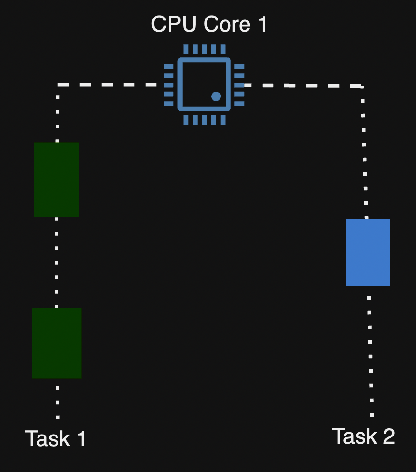
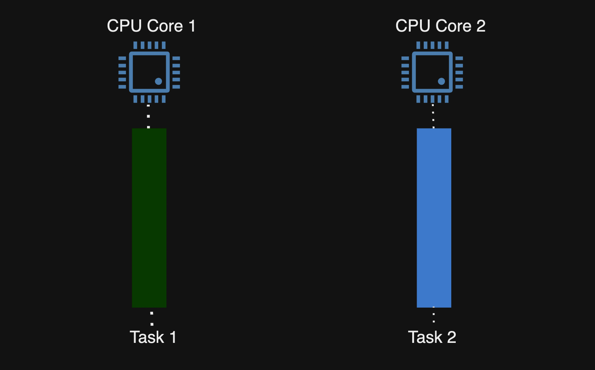
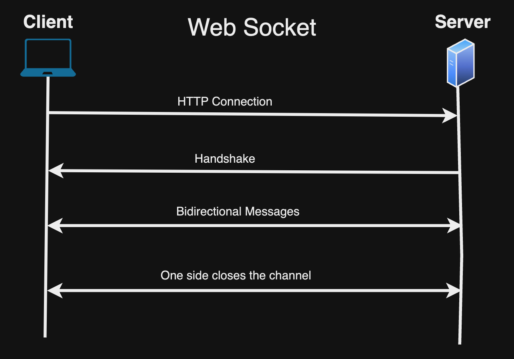

# সিস্টেম ডিজাইন বাংলা

এটি একটি রিপোজিটরি যেখানে সিস্টেম ডিজাইন এর মৌলিক জিনিসগুলো নিয়ে আলোচনা করা হয়েছে।

এই টিউটোরিয়াল এর উদ্দেশ্য আপনাকে মৌলিক জিনিসগুলোর ধারণা দেয়া। ভালো লাগলে star, watch কিংবা fork ক্লিক করে রাখতে পারেন।

<p align="center">
  
</p>

### সূচিপত্র

- [Section 1: System Design](#section-1-system-design)
- [Section 2: Database Engineering](#section-2-database-engineering)
- [Section 3: B+ Tree and Database Indexing](#section-3-b-tree-and-database-indexing)
- [Section 4: Database Transaction](#section-4-database-transaction)
- [Section 5: Client Server Architecture](#section-5-client-server-architecture)
- [Section 6: Reliability](#section-6-reliability)
- [Section 7: Performance Metrics](#section-7-performance-metrics)
- [Section 8: Distributed System](#section-8-distributed-system)
- [Section 9: Domain Name System](#section-9-domain-name-system)
- [Section 10: Transmission Control Protocol](#section-10-transmission-control-protocol)
- [Section 11: User Datagram Protocol](#section-11-user-datagram-protocol)
- [Section 12: HTTP, TLS and HTTPS](#section-12-http-tls-and-https)
- [Section 13: What happens when you type a URL in your browser](#section-13-what-happens-when-you-type-a-url-in-your-browser)
- [Section 14: Concurrency and Parallelism](#section-14-concurrency-and-parallelism)
- [Section 15: High Concurrency Control](#section-15-high-concurrency-control)
- [Section 16: Functional and Non Functional Requirements](#section-16-functional-and-non-functional-requirements)
- [Section 17: Back Of the Envelope Estimation](#section-17-back-of-the-envelope-estimation)
- [Section 18: Authentication and Authorization](#section-18-authentication-and-authorization)
- [Section 19: Stateful and Stateless Architecture](#section-19-stateful-and-stateless-architecture)
- [Section 20: Proxy](#section-20-proxy)
- [Section 21: REST API](#section-21-rest-api)
- [Section 22: Scalability](#section-22-scalability)
- [Section 23: Database Sharding](#section-23-database-sharding)
- [Section 24: Database Replication](#section-24-database-replication)
- [Section 25: Caching](#section-25-caching)
- [Section 26: Content Delivery Network](#section-26-content-delivery-network)
- [Section 27: Rate Limiter](#section-27-rate-limiter)
- [Section 28: CAP Theorem](#section-28-cap-theorem)
- [Section 29: Consistent Hashing] (চলমান)
- [Section 30: Polling, Web Socket, Server-Sent Events and Webhooks](#section-30-polling-web-socket-server-sent-events-and-webhooks)
- [Section 31: Stream and Batch Processing] (চলমান)
- [Section 32: Message Queue](#section-32-message-queue)
- [Section 33: rpc, gRpc] (চলমান)
- [Section 34: Single Sign-On](#section-34-single-sign-on)
- [Section 35: Elasticsearch](#section-35-elasticsearch)
- [Section 36: Bloom Filter](#section-36-bloom-filter)
- [Section 37: Load Balancing Algorithms] (চলমান)
- [Section 38: How OAuth2 works](#section-38-how-oauth2-works)
- [Section 40: Serverless Architecture] (চলমান)
- [Section 41: High Availability best practices by Netflix](#section-41-high-availability-best-practices-by-netflix)
- [Section 42: Real World Problems](#section-42-real-world-problems)
- [Section 43: Resources](#section-43-resources)

## Section 1: System Design

যখন আমরা একটি অ্যাপ্লিকেশন ডেভেলপ করি, তখন একটি নির্দিষ্ট ডিজাইন অনুসরণ করা জরুরি। এর প্রধান কারণ হলো, অ্যাপ্লিকেশনটি যাতে বর্তমানে এবং ভবিষ্যতে কোনও সমস্যা ছাড়াই ভালভাবে কাজ করতে পারে। বিশেষ করে, যদি অ্যাপ্লিকেশনটি এক সময় প্রচুর ব্যবহারকারী পেয়ে থাকে, তখন এটি প্রচুর লোড সহ্য করতে সক্ষম হতে হবে এবং কোনো কানেকশন বিচ্ছিন্নতা বা পারফরম্যান্সের অবনতি ছাড়াই কাজ করতে হবে। এই ধরনের ডিজাইনকেই সিস্টেম ডিজাইন বলা হয়।

(এই স্পেসিফিক সিস্টেম ডিজাইন মূলত ব্যাকএন্ড ইঞ্জিনিয়ারিং এর সাথে সম্পৃক্ত।)

## Section 2: Database Engineering

সিস্টেম ডিজাইন করার সময় ডেটাবেস খুবই গুরুত্বপূর্ণ বিষয়। কোন কোন রকমের এপ্লিকেশন এর জন্য কোন কোন রকমের ডেটাবেস ব্যবহার করবেন, ডেটাবেসের টেবিলের স্ট্রাকচার কেমন, টেবিল কলাম এর ডেটা টাইপ, টেবিল size ইত্যাদি জানা আমাদের দরকার।

এপ্লিকেশন ডেভেলপ করার সময় আমাদের কাজ অনুযায়ী ডেটাবেস নির্বাচন করতে হয়। সাধারণত, আমরা প্রধান দুই ধরনের ডেটাবেস ব্যাবহার করে থাকি - SQL(রিলেশনাল) ডেটাবেস এবং NoSQL(নন-রিলেশনাল) ডেটাবেস। আমরা কেমন বা কোন ধরণের ডাটা ষ্টোর করতে চাই, কিভাবে ষ্টোর করতে চাই, আমাদের কাজের পদ্ধতি ইত্যাদি প্রয়োজন অনুযায়ী ডেটাবেস বাছাই করতে হয়। ডাটার ধরন অনুযায়ী ডেটাবেসগুলো আমাদের ভিন্ন ভিন্ন সুবিধা দিয়ে থাকে।

| SQL                                                                                                                                                   | NoSQL                                                                                               |
| ----------------------------------------------------------------------------------------------------------------------------------------------------- | --------------------------------------------------------------------------------------------------- |
| টেবিলের মধ্যে ডাটা স্টোর করা হয়, যেখানে প্রতিটি সারি একটি এন্টিটি এবং প্রতিটি কলাম একটি ডাটার বৈশিষ্ট্য নিদের্শন করে। টেবিলগুলোর মধ্যে relation থাকে। | কোন প্রকার relation ছাড়া ডাটা বিভিন্নভাবে ষ্টোর করে থাকে। যেমনঃ key-value, graph, document ইত্যাদি। |
| নির্দিষ্ট স্কিমা অনুযায়ী ডাটা স্টোর করা হয়। (ডাটাবেস পরিবর্তনের মাধ্যমে স্কিমা পরবর্তীতে পরিবর্তন করা যায়।)                                           | NoSQL ডাটাবেসে ডাইনামিক স্কিমা থাকে, অর্থাৎ স্কিমা পরিবর্তনযোগ্য।                                   |

🔗 [**আরও পড়ুন: ডেটাবেস**](./sections/database/README.md)

## Section 3: B+ Tree and Database Indexing

প্রথমে আমাদের বুঝতে হবে, B+ ট্রি কি এবং কেনো প্রয়োজন?

এটি একটি self-balancing Tree Data Structure। যা ডেটাবেসে ব্যবহার করা হয় Efficiently Data Retrieve করার জন্য। B+ ট্রি হলো Balanced Tree Index Structure যার প্রতিটি নোডে একাধিক key সংরক্ষণ করে, যা এটিকে ঐতিহ্যবাহী বাইনারি সার্চ ট্রির(Binary Search Tree) তুলনায় অনেক বেশি কার্যকর করে তুলে, বিশেষ করে বড় ডেটাসেটের জন্য।

🔗 [**আরও পড়ুন: ডেটাবেস ইনডেক্সিং**](./sections/database-indexing/README.md)

## Section 4: Database Transaction

ডাটাবেজ ট্রানজাকশন এই সমস্ত প্রশ্ন বা সমস্যার সমাধান করতে পারে:

- ডাটাবেজ সফটওয়্যার বা হার্ডওয়্যার যে কোনো সময় fail হতে পারে। (write অপারেশনের মাঝখানেও)

- নেটওয়ার্কে বাধা আসতে পারে, যা অ্যাপ্লিকেশনকে ডাটাবেজ থেকে অপ্রত্যাশিতভাবে বিচ্ছিন্ন করতে পারে।

- একাধিক ক্লায়েন্ট একই এন্ট্রি আপডেট করার চেষ্টা করতে পারে, যার ফলে একে অপরের পরিবর্তনগুলি ওভাররাইট হতে পারে।

- একটি ক্লায়েন্ট ডাটাবেজ থেকে এমন তথ্য পড়তে পারে যা সম্পূর্ণরূপে Commit করা হয়নি, ফলে তথ্যটি অপ্রাসঙ্গিক বা অসংগতিপূর্ণ হতে পারে।

- ক্লায়েন্টদের মধ্যে concurrency বা race condition এর কারণে অপ্রত্যাশিত বাগ তৈরি হতে পারে।

উপরের পয়েন্টগুলোর উত্তর পেতে হলে নিচের টপিকগুলো বুঝতে হবে।

ডাটাবেসে Transaction বলতে বোঝায় একাধিক READ এবং WRITE অপারেশনকে একটি লজিক্যাল ইউনিট এর মধ্যে আবদ্ধ করা। এর ফলে, সমস্ত READ এবং WRITE অপারেশন একসাথে একটি একক অপারেশন হিসেবে বিবেচিত হয়। অর্থাৎ, যদি সব অপারেশন সফলভাবে সম্পন্ন হয়, তবে COMMIT করা হবে, আর যদি কোনো একটি অপারেশন ব্যর্থ হয়, তবে ROLLBACK এর মাধ্যমে পূর্বের অবস্থা ফিরিয়ে নেওয়া হবে।

সাধারণত Transaction এভাবে শুরু হয়,

```sql
BEGIN

SELECT * FROM users
UPDATE users SET username=“lahin” WHERE id=224

COMMIT
```

আপনি Prisma দিয়ে লিখতে গেলে,

```js
await prisma.$transaction(async (prisma) => {
  const users = await prisma.users.findMany();

  await prisma.user.update({
    where: { id: 224 },
    data: { username: "lahin" },
  });
});
```

🔗 [**আরও পড়ুন: ডাটাবেস ট্রানসাকশান**](./sections/database-transaction/README.md)

## Section 5: Client Server Architecture

ক্লায়েন্ট রিকুয়েস্ট করবে সার্ভারকে কিছু স্পেসিকিফ রিসোর্স এর জন্য, সার্ভার সেই রিকুয়েস্ট পাওয়ার পর সে তার যাবতীয় প্রসেস শেষ করে ক্লায়েন্টকে রেসপন্স দিয়ে দিবে, এটি ক্লায়েন্ট সার্ভার আর্কিটেকচার।

<p align="center">
  
</p>

আমাদের সব উদাহরণ থাকবে ক্লায়েন্ট সার্ভার আর্কিটেকচারের উপর ভিত্তি করে।

## Section 6: Reliability

সিস্টেম যদি কোনো প্রকারের Fault/Error থাকার পরও ভালোভাবে কাজ করতে পারে কিংবা সিস্টেমটি যদি বন্ধ না হয়, তবে সেই সিস্টেমটি Reliable। আমাদের মনে রাখতে হবে এক বা একাধিক Fault এর কারণে সিস্টেম Failure হতে পারে।

Fault এরকম হতে পারে কোনো user সিস্টেমটি কে এমনভাবে ব্যবহার করেছে যাতে কোনো Failure হয়ে গেল, সেটা ইচ্ছাকৃত বা অনিচ্ছাকৃতভাবেও হতে পারে, তখন যদি সিস্টেমটি বন্ধ না হয়ে কোনো প্রকারের Warning message দেখালো তখন সেই সিস্টেমটিকে আমরা Reliable বলতে পারি।

🔗 [**আরও পড়ুন: রিলাইবিলিটি**](./sections/reliability/README.md)

## Section 7: Performance Metrics

### Throughput

একটি নির্দিষ্ট সময়ের ভিত্তিতে কোনো সিস্টেম যতটুকু কাজ সম্পাদন করতে পারে সেটি হচ্ছে Throughput। যেমন, প্রতি ১০ সেকেন্ড এ সিস্টেম যদি ৫০ টি API request সম্পন্ন করতে পারে তাহলে তার Throughput হবে ৫০/১০ = ৫।

### Time to First Byte

ক্লায়েন্ট Resource জন্য যখন সার্ভারকে Request করে এবং ক্লায়েন্ট সার্ভার থেকে FIRST BYTE of Response যখন গ্রহণ করে তার মধ্যকার সময়টুকু (Request করা থেকে শুরু করে এবং FIRST BYTE গ্রহণ করার সময় পর্যন্ত) হল Time to First Byte।

🔗 [**আরও পড়ুন: পারফরম্যান্স ম্যাট্রিক্স**](./sections/performance-metrics/README.md)

## Section 8: Distributed System

একাধিক কম্পিউটার (বা কম্পোনেন্ট) একসাথে কাজ করার ফলে কোন কাজ শেষ হয় এবং End User এর কাছে একটি কম্পিউটার (বা কম্পোনেন্ট) হিসেবে আসে, সেই সিস্টেমটি হল ডিস্ট্রিবিউটেড সিস্টেম। এই মেশিনগুলোতে শেয়ার্ড স্টেট(Shared State) থাকে, কঙ্কারেন্টলি (Concurrently) কাজ করতে পারে, প্রতিটি সিস্টেম একে অপরের সাথে Information শেয়ার করতে পারবে।

বর্তমান সময়ে Distributed System এর উদাহরণ হল YouTube।

YouTube কেন?

- সার্ভার User থেকে রিকুয়েস্ট পায় Video Upload কিংবা Video Watch করার জন্য।
- ভিডিও এনকোড।
- ডাটাবেস সিস্টেম।

এগুলো সবকিছু মিলে Distributed System YouTube তৈরি করে।

## Section 9: Domain Name System

Domain Name System কিংবা DNS একটি নির্দিষ্ট Human Readable Domain (যেমন www.google.com) কে একটি নির্দিষ্ট IP-তে রূপান্তর করে।

আপনি যখন ব্রাউজারে URL টাইপ করেন (যেমন www.google.com)। DNS সাধারণত আপনার দেয়া URL এর IP Address বের করবে এবং সেই IP Address এ আপনার রিকুয়েস্ট প্রসেস হবে।

এই রূপান্তর করার পদ্ধতিটা শুরু হয় DNS Resolver দিয়ে,

- DNS Resolver মূলত Human Readable Domain কে নির্দিষ্ট IP-তে রূপান্তর করে থাকে। এর ৩টি পার্ট আছে,

  - Root Server, এই সার্ভার মূলত .com, .org, .net ইত্যাদির তথ্য রাখে এবং সেগুলোর IP সেই DNS Resolver কে দিয়ে থাকে যেমন .com এর জন্য .com এর IP, .org এর জন্য .org এর IP

  - Top Level Domain Server, এই সার্ভার মূলত প্রতিটি Top Level Domain (www.google.com এর TLD হল .com) এর Authoritative Server এর তথ্য নিজের মধ্যে রাখে।

    - সাধারণ top-level domains: .com, .org, .gov
    - দেশীয় code top-level domains: .jp, .uk, .bd

  - Authoritative Server, এই সার্ভারের মধ্যে সেই Human Readable Domain (যেমন www.google.com) এর IP পাওয়া যায়।

<p align="center">
  
</p>

🔗 [**আরও পড়ুন: ডোমেইন নেইম সিস্টেম**](./sections/domain-name-system/README.md)

## Section 10: Transmission Control Protocol

Transmission Control Protocol অথবা TCP হচ্ছে একটি নেটওয়ার্ক প্রোটোকল যেখানে একাধিক Device একে অপরের সাথে মেসেজ আদান-প্রধান করতে পারে।

TCP কে Reliable বলা হয় কারণ যতক্ষণ পর্যন্ত ডিভাইসগুলো একে অপরের সাথে মেসেজ অদান-প্রধান শেষ হবে না ততক্ষন connection বন্ধ হবে না।

Transmission শুরু হওয়ার পূর্বে TCP 3-way-handshake ব্যবহার করে connection established করে। এটি ৩টি স্টেপে হয়ে থাকে,

- SYN (synchronize): এই flag দ্বারা TCP কানেকশন establish করার রিকোয়েস্ট করা হয়।
- SYN-ACK (synchronize-acknowledge): এই flag কানেকশন establish করতে ব্যবহার করা হয়।
- ACK (acknowledge): এই flag দ্বারা কানেকশন establish সম্পন্ন হওয়ার acknowledge করা হয়।

এই 3-way-handshake নিশ্চিত করে Device'গুলো(ক্লায়েন্ট-সার্ভার) একে অপরের সাথে মেসেজ আদান-প্রধান করতে পারবে কি না।

TCP Reliability নিশ্চিত করে সাধারণত Acknowledgments এবং Retransmissions পদ্ধতি ব্যবহার করে। TCP তে মূলত যখন ক্লায়েন্ট ডেটা send করে সার্ভার রিকোয়েস্ট টি কে Acknowledge করে। ক্লায়েন্ট যদি Acknowledge না পায় তখন ক্লায়েন্ট আবার রিকোয়েস্ট Retransmission করবে। এরকম Reliability নিশ্চিত হয়ে থাকে।

<p align="center">
  
</p>

TCP মূলত Networking এর OSI Model এর Practical Form। এটি Transport Layer থেকে শুরু হয় এবং Application Layer এ কাজ করে।

HTTP, Web Socket, FTP ইত্যাদি মূলত TCP তে চলে।

## Section 11: User Datagram Protocol

UDP মূলত OSI Model এর Transport Layer-এ অবস্থান করে। TCP এর মত এটি reliable না। এতে কোনো 3-way handshake তৈরী হয় না। এটি মূলত Low Latency এবং unreliable connection তৈরী করে।

UDP Process to Process communication establish করে।

TCP তে যেহেতু 3-way handshake তৈরীর মাধ্যমে reliable connection তৈরী হয়, কিন্তু এই 3-way handshake তৈরী করতে সময়ের প্রয়োজন হয় সেজন্য performance কম পাওয়া যায়। Performance এর কথা বিবেচনা করলে UDP একটি better choice।

UDP তে কোনো Error checking হয় না।

<p align="center">
  
</p>

UDP এর use-cases:

- Real-time Communication; উদাহরণ: Skype, Zoom.
- Live Video Streaming; উদাহরণ: Twitch, ESPN+.
- Online Gaming; উদাহরণ: Call of Duty.

UDP লাইভ ভিডিও স্ট্রিমিংয়ের জন্য ব্যবহৃত হয়, কারণ Live ইভেন্টের সাথে সম্প্রচারটি sync রাখা বেশি গুরুত্বপূর্ণ না। UDP ব্যবহার করার সময়, যদি কিছু ফ্রেম হারিয়ে যায়, সেগুলো পুনরায় প্রেরণ করা হয় না। উদাহরণ,

আপনি বিপিএল (ক্রিকেট) দেখছেন। ওভার ১.২-তে হঠাৎ বাফারিং শুরু হলো, আর এখন ওভার ১.৪ চলছে। ওই দুই বল নিয়ে আপনি তেমন চিন্তা করছেন না। আপনি পরের বল দেখছেন। এটি হচ্ছে UDP।

## Section 12: HTTP, TLS and HTTPS

HTTP অর্থাৎ Hyper Text Transfer Protocol, HTTP এক প্রকারের বৈশিষ্ট প্রদান করে থাকে, যার মাধ্যমে Web Browser এবং Web Server নিজেদের ভিতর communication করে থাকে। এটি এক প্রকারের set of rules যা ডেটা ক্লায়েন্ট থেকে সার্ভারে পাঠানো সাহায্য করে। ডেটা হতে পারে Text, Image ইত্যাদি। ক্লায়েন্ট এবং সার্ভারের ভিতর ডেটা আদান প্রধান plain-text এ হয়ে থাকে, এর ফলে HTTP secured না।

TLS কিংবা Transport Layer Security, এটি হলো Cryptographic Protocol যা মূলত communication সুরক্ষিত করার জন্য ব্যবহার করা হয়। এটি ডাটা এনক্রিপ্ট করে থাকে ডাটা ক্লায়েন্ট থেকে সার্ভারে ট্রান্সমিট হওয়ার সময়।

HTTPS অর্থাৎ Hyper Text Transfer Protocol Secure, এটি নিজে HTTP এর সকল বৈশিষ্ট বহন করে শুধু SSL/TLS যোগ করে, ক্লায়েন্ট এবং সার্ভারের মধ্যে ডেটা ট্রান্সফার Encrypted হয়ে থাকে।

<p align="center">
  
</p>

🔗 [**আরও পড়ুন: এইচটিটিপি, টিএলএস এবং এইচটিটিপি'এস**](./sections/http-tls-and-https/README.md)

## Section 13: What happens when you type a URL in your browser

<p align="center">
  
</p>

(ছবিটি ইন্টারনেট থেকে ডাউনলোড করা)। আপনি যখন আপনার ব্রাউজার এর Address Bar এ URL টাইপ করে enter press করবেন, আপনার ব্রাউজার প্রথমে আপনার রিকোয়েস্টটিকে DNS সার্ভার এ পাঠিয়ে দিবে তারপর দেখবে DNS cache এর ভিতর সেই URL এর IP এড্রেস আছে কি না। যদি না থাকে তাহলে বিভিন্ন steps শেষ করার পর DNS সেই URL এর IP রিটার্ন করবে।

তারপর 3-way handshake এর মাধ্যমে IP address এর সার্ভার এর সাথে TCP কানেকশন তৈরী হবে।

পরবর্তীতে browser TCP কানেকশন এর সাহায্যে সেই সার্ভারে HTTP রিকোয়েস্ট করে।

সার্ভার রিকোয়েস্ট প্রসেস করে তারপর রেসপন্স রিটার্ন করে থাকে। ব্রাউজার সেই রেসপন্স কে বিভিন্ন স্টেপ শেষ করে ব্রাউজারে দেখায়।

## Section 14: Concurrency and Parallelism

Concurrency এবং Parallelism বুঝতে হলে আমাদেরকে Process এবং Thread অপারেটিং সিস্টেম এর আলোকে বুঝতে হবে।

Process কি? একটি প্রোগ্রাম(code) যখন execution অবস্থায় থাকে, তখন সেটি একটি Process। এটি এমন একটি environment বা container, যেখানে প্রোগ্রামের জন্য প্রয়োজনীয় সমস্ত রিসোর্স (যেমন, CPU টাইম, মেমরি) বরাদ্দ করা হয় এবং প্রোগ্রামটি চালানো(execute) হয়।

Thread কি? এটি মূলত Process এর Subset। একে Independent Execution Unit ও বলা হয়। একটি Process-এ এক বা একাধিক Thread থাকতে পারে, Thread মূলত Process এর Shared Resource গুলো ব্যবহার করে থাকে। তার কাজ হচ্ছে প্রোগ্রাম এর অপারেশনগুলোকে Concurrently কিংবা Parallelly(core এর উপর নির্ভর করে) execute করা।

Thread ভালোভাবে বুঝার জন্য Concurrency এবং Parallelism বুঝা যাক।

Concurrency কি? Concurrency হচ্ছে Thread এর মধ্যে একাধিক কাজ থেমে থেমে একসঙ্গে সম্পন্ন হচ্ছে, যদি ১টি CPU কোর থাকে।

ধরুন CPU কোর হচ্ছে ১টি, একাধিক কাজ Thread এর মধ্যে যখন থাকে, তখন Context Switching এর মাধ্যমে CPU দ্রুতভাবে একে অপরকে সময় ভাগ করে, অর্থাৎ একটি কাজ থেমে CPU অন্য কাজ শুরু করে, তারপর আবার সেই কাজ পুনরায় চালু করে যতদূর পূর্বের execution এ সম্পন্ন হয়েছে, তারপরের অংশ থেকে আবার শুরু হয়।

যতক্ষণ না পর্যন্ত সব কাজ শেষ হচ্ছে, এরকম চলতে থাকবে।

<p align="center">
  
</p>

Parallelism কি? একাধিক কাজ একই সময়ে আলাদাভাবে/স্বাধীনভাবে সম্পন্ন করা, এবং এটি সম্ভব যখন একাধিক CPU core থাকে।

ধরুন CPU কোর হচ্ছে ২টি, একাধিক কাজ Thread গুলোর মধ্যে execute হবে।

<p align="center">
  
</p>

একাধিক কোর এর মধ্যেও Concurrency হয়ে থাকে। কখন?

যখন সব Thread ব্যস্ত হয়ে পড়বে তখন অন্য Task গুলোর জন্য Context Switching এর মাধ্যমে Task গুলো সম্পাদন করা হবে।

Parallelism উদাহরণ I/O bound task এর জন্য Node.js দিয়ে,

```js
const fetch = require("node-fetch");

async function fetchData() {
  const urls = [
    "https://jsonplaceholder.typicode.com/posts/1",
    "https://jsonplaceholder.typicode.com/posts/2",
    "https://jsonplaceholder.typicode.com/posts/3",
  ];

  const promises = urls.map((url) => fetch(url).then((res) => res.json()));

  const results = await Promise.all(promises); // Parallel Execution

  console.log(results);
}

fetchData();
```

Node.js Parallel Execution এর জন্য Worker Threads, Child Processes, Cluster module রয়েছে।

## Section 15: High Concurrency Control

High Concurrency মানে হচ্ছে, যখন একাধিক user কিংবা একাধিক process একই সময়/একই মুহূর্তে একটি নির্দিষ্ট রিসোর্স কিংবা একটি নির্দিষ্ট ডাটা modify করতে যায়। এর দ্বারা অনেক সমস্যা সৃষ্টি হতে পারে, যার মধ্যে সবচেয়ে গুরুত্বপূর্ণ সমস্যা হচ্ছে Data Inconsistency।

(চলমান)

## Section 16: Functional and Non Functional Requirements

### Functional Requirements

একটি সিস্টেম কি কি কাজ করে সেটি Functional Requirement উল্লেখ করে থাকে। উদাহরণ বলা যায়, সোশ্যাল মিডিয়া সিস্টেমে,

- পোস্ট করা যায়
- পোস্টে লাইক করা যায়
- পোস্টে কমেন্ট করা যায়
- পোস্টে ডিলিট করা যায়

প্রতিটা হচ্ছে এক একটি Functional Requirement।

### Non Functional Requirements

এটি মূলত একটি সিস্টেমের গুণমান বৈশিষ্ট্যতা (Quality Characteristics), উদাহরণ:

- Performance
- Security
- Cost
- Scalability
- Reliability

প্রতিটা হচ্ছে এক একটি Non Functional Requirement।

## Section 17: Back Of the Envelope Estimation

এটি একটি টেকনিক যা আমাদেরকে সিস্টেম ডিজাইন এর Load Balancer, CDN ইত্যাদি ব্যবহার করবো কি না তার আনুমানিক ধারনা হিসাব করে বলে দিতে পারে।

🔗 [**আরও পড়ুন: ব্যাক অফ দা এনভেলপ এস্টিমেশন**](./sections/back-of-the-envelop-estimation/README.md)

## Section 18: Authentication and Authorization

একটি secured সিস্টেম design করতে হলে Authentication এবং Authorization জানা অত্যন্ত গুরুত্বপূর্ণ। Authentication মূলত identity verify করাকে বুজায়। আমরা যখন কোনো সিস্টেমে গিয়ে ইমেইল এবং পাসওয়ার্ড দিয়ে লগইন করার চেষ্টা করি, সেই ইমেইল আর পাসওয়ার্ড ভেরিফাই করে হচ্ছে Authentication।

Authorization হলো কোনো নির্দিষ্ট রিসোর্সে নির্দিষ্ট user এক্সেস করতে পারবে কি না তা বুঝায়। যেমন কোনো এপ্লিকেশন এ নির্দিষ্ট API থাকে যা শুধুমাত্ৰ এডমিনিস্ট্রেটর মানুষ ছাড়া ব্যবহার করতে পারবে না, এখন যদি কেউ এক্সেস করতে চায় তাহলে সেই মানুষটা Authorize আছে কি না সেটাই যাচাই করা হচ্ছে Authorization।

🔗 [**আরও পড়ুন: অথেনটিকেশন এবং অথরিজাশন**](./sections/authentication-and-authorization/README.md)

## Section 19: Stateful and Stateless Architecture

### Stateful

এই আর্কিটেকচারে ডেটা Store এবং Maintain Application সার্ভারে হয়ে থাকে। FTTP হল Stateful।

বাস্তব জীবনে Stateful আর্কিটেকচার এর উদাহরণ হল Web Socket। Web Socket মূলত bidirectional, full-duplex protocol। এখানে Server ডেটা store করে রাখে, যাতে Client সবসময় Server থেকে ডেটা পায়।

### Stateless

এই আর্কিটেকচারে ডেটা Store এবং Maintain Application সার্ভারে হয় না বরং কোনো Database বা Cache এ স্টোর এবং মেইনটেইন হয়। HTTP হল Stateless।

HTTP সবসময় Stateless Architecture, কারণ কোনো protected resource এর জন্য আপনাকে সবসময় request করার সময় cookie/token সাথে দিতে হয়। server কখনো cookie/token স্টোর করে রাখে না।

🔗 [**আরও পড়ুন: স্টেটলেস-স্টেটফুল আর্কিটেকচার**](./sections/stateless-stateful-architecture/README.md)

## Section 20: Proxy

ক্লায়েন্ট যখন সার্ভারকে রিকুয়েস্ট পাঠানোর সময় সরাসরি সার্ভারকে রিকুয়েস্ট না করে অন্য একটি সার্ভাররের মাধ্যমে রিকুয়েস্ট করলে, সেই প্রসেস হচ্ছে প্রক্সি এবং যে সার্ভার দিয়ে রিকুয়েস্ট করবে সেটা হচ্ছে প্রক্সি সার্ভার।

বাস্তব জীবনে প্রক্সির একটি উদাহরণ হচ্ছে NGINX।

🔗 [**আরও পড়ুন: প্রক্সি**](./sections/proxy/README.md)

## Section 21: REST Api

REST Api জানার পূর্বে আমাদের বুঝতে হবে রেস্ট(REST) মানে কি, REST মানে হল Representational State Transfer যার মানে দাড়ায় এটি একটি আর্কিটেকচারাল স্টাইল যা ব্যবহার করা হয় স্টেট ট্রান্সফার এর জন্য। এখন REST Api হল, এক প্রকারের এপিআই কনভেনশন যা ব্যবহার করা হয় দুটি এন্ড(যেমনঃ ক্লায়েন্ট এবং সার্ভার) এর মধ্যে স্টেট ট্রান্সফার করাকে নিশ্চিত করার জন্য।

স্টেট ট্রান্সফার নিশ্চিত করতে কিছু স্পেসিফিক HTTP Methods ব্যবহার করা হয়, GET, POST, PUT, PATCH & DELETE, প্রতিটি ম্যাথোডের ব্যবহার জানতে REST Api সেকশনে ক্লিক করুন।

🔗 [**আরও পড়ুন: রেস্ট এপিআই**](./sections/rest-api/README.md)

## Section 22: Scalability

স্কেলেবিলিটি সাধারণত সিস্টেমের ক্ষমতাকে বুঝায় যখন সিস্টেমে ট্রাফিকের পরিমাণ বাড়তে থাকে। উদাহরণ বলা যেতে পারে, একটি ওয়েবসাইটের ডাটাবেসে এখন একটি নির্দিষ্ট পরিমাণ রিকুয়েস্ট করা হচ্ছে কিন্তু আজ থেকে ৫ মাস পর রিকুয়েস্ট ২ গুণ হয়ে গেল তার ঠিক আরও ৫ মাস পর রিকুয়েস্ট ৪ গুণ হয়ে গেল, একটা সময় দেখা যেতে পারে ডাটাবেস সার্ভার এত পরিমাণ রিকুয়েস্ট লোড নিতে পারছে না, এই সমস্যার সমাধানের জন্য স্কেল করাকে স্কেলেবিলিটি বলে।

স্কেলেবিলিটি সাধারণত 2 প্রকারের, ভার্টিকাল স্কেলেবিলিটি (Vertical Scalability) এবং হরাইজন্টাল স্কেলেবিলিটি (Horizontal Scalability)।

🔗 [**আরও পড়ুন: স্কেলেবিলিটি**](./sections/scalability/README.md)

## Section 23: Database Sharding

Database Sharding হল টেবিল থেকে ডেটা পৃথক করা। উদাহরণ বলা যায়, ডাটাবেসের ডেটা/row যদি বাড়তে থাকে এবং এত পরিমাণ ডেটা/row বেড়ে গেল যার ফলে ডাটাবেস টেবিলে আর স্টোর করা যায় না তখন আমরা ডেটাগুলোকে মূল টেবিল থেকে পৃথক করে অন্যান্য shard টেবিলে distribute করে রাখি সেটাই Database Sharding। একাধিক সার্ভার এই ডিস্ট্রিবিউশন হবে।

<p align="center">
  
</p>

🔗 [**আরও পড়ুন: ডেটাবেস সাৰ্ডিং**](./sections/database-sharding/README.md)

## Section 24: Database Replication

Database Replication এক প্রকারের Strategy, যেখানে একটি Master Database এবং একটি কিংবা একাধিক Slave Database থাকবে। Master Database এর মধ্যে Insert, Delete এবং Update এর কাজ হবে এবং Slave Database মধ্যে Master Database এর ডেটাগুলোর Copy থাকবে এবং তার মধ্যে শুধু Read Operation হবে।

<p align="center">
  
</p>

Database Replication, SQL এবং NoSQL দুটি ডেটাবেসে করা যায়।

🔗 [**আরও পড়ুন: ডেটাবেস রেপ্লিকেশন**](./sections/database-replication/README.md)

## Section 25: Caching

Caching একটি কৌশল যা দ্বারা কোন Expensive Response'কে কোনো মেমোরিতে রাখা হয়, যাতে বার বার আসা সেই রেস্পন্সের রিকোয়েস্ট কে দ্রুত রেসপন্সটি দিতে পারি। মূল সার্ভারে (যেমন ডাটাবেস) হিট করার পরিবর্তে ক্যাশিং সার্ভারে রিকোয়েস্ট করবে। এতে করে যে সুবিধাটুকু হবে,

- Read API রিকোয়েস্ট Fast হবে
- Latency Reduce হবে
- Fault Tolarence এর ঝুঁকি কমবে

<p align="center">
  
</p>

🔗 [**আরও পড়ুন: ক্যাশিং**](./sections/caching/README.md)

## Section 26: Content Delivery Network

Content Delivery Network অথবা CDN, এটি একটি সিস্টেম যেখানে একাধিক সার্ভার আমাদের ভৌগোলিক এর আসেপাশে থাকে, যাতে আমরা খুব দ্রুত কন্টেন্ট পেতে পারি। কন্টেন্টটি হতে পারে JS, CSS, Images কিংবা Videos।

<p align="center">
  
</p>

আমাদের CDN সার্ভার যদি India তে থাকে আর আমরা Bangladesh থেকে content request করি তাহলে খুব তাড়াতাড়ি content পাব। কারণ তখন Latency কমে যাবে।
আর আমরা Bangladesh থেকে England-এ যেখানে মূল সার্ভার আছে, সেখানে কনটেন্ট এর জন্য request করলে Latency স্বাভাবিকভাবে বৃদ্ধি পাবে, যেহেতু দুই দেশের দূরত্ব বেশি।

যে যে লোকেশনে CDN সার্ভার আছে সেই লোকেশনগুলোকে Point of Presence বা PoP বলে। যে সার্ভার PoP এর ভিতরে থাকে তাকে Edge Server বলে।

🔗 [**আরও পড়ুন: কনটেন্ট ডেলিভারি নেটওয়ার্ক**](./sections/cdn/README.md)

## Section 27: Rate Limiter

Rate Limiter একটি প্রসেস, যেখানে ক্লায়েন্ট থেকে আসা রিকোয়েস্ট সার্ভারে যাওয়ার পূর্বে রিকোয়েস্টটি কন্ট্রোল করা হয়। একটি নির্দিষ্ট সময়ের মধ্যে একটি নির্দিষ্ট পরিমাণ রিকোয়েস্ট Rate Limiter এর মাধ্যমে সার্ভার রিকোয়েস্ট গ্রহণ করে থাকে। নির্দিষ্ট পরিমানের চেয়ে রিকোয়েস্ট বেশি হয়ে গেলে Rate Limiter রিকোয়েস্টগুলোকে block করে ফেলে, যার ফলে রিকোয়েস্টগুলো আর সার্ভারে যেতে পারে না।

এখানে মূল পয়েন্ট ২টি, নির্দিষ্ট সময় এবং নির্দিষ্ট পরিমাণ রিকোয়েস্ট।

<p align="center">
  
</p>

উপরের ছবিতে দেখা যাচ্ছে, রিকোয়েস্ট এবং রেস্পন্সের মধ্যে middleware হিসেবে rate limiter আছে।

🔗 [**আরও পড়ুন: রেইট লিমিটার**](./sections/rate-limiter/README.md)

## Section 28: CAP Theorem

এটি একটি কনসেপ্ট বা থিওরি যা দ্বারা বুজা যায়, একটি Distributed System এ উল্লিখিত তিনটি প্রোপার্টি থেকে দুইটি প্রোপার্টি সবসময় মেনে চলবে।

- C মানে Consistency
- A মানে Availability
- P মানে Partition Tolerance

Consistency হচ্ছে একটি ট্রান্সেকশন (Transection) শেষ হওয়ার পর সব নোডে সবসময় consistent বা একই value থাকবে।

Availability মানে হচ্ছে প্রতিটি read এবং write রিকোয়েস্ট হয় প্রসেস(process) হবে না হয় কোনো message পাবে যে অপারেশন(request) প্রসেস(process) হচ্ছে না।

Partition Tolerance হচ্ছে একাধিক নোড একে অপরের সাথে কানেকশন(connection) নষ্ট হলেও, read এবং write অপারেশন ঠিকভাবে প্রসেস হবে।

🔗 [**আরও পড়ুন: ক্যাপ থিওরাম**](./sections/cap-theorem/README.md)

## Section 30: Polling, Web Socket, Server-Sent Events and Webhooks

Polling মানে হচ্ছে client regular interval এ server কে বার বার ডেটার জন্য রিকোয়েস্ট করবে। যেমন, ক্লায়েন্ট প্রতি ৫ সেকেন্ড পর পর সার্ভার কে রিকোয়েস্ট করবে আর সার্ভার তার রেসপন্স দিবে।

<p align="center">
  
</p>

Polling এর সবচেয়ে বড় সমস্যা হচ্ছে অতিরিক্ত Bandwidth ব্যবহার হওয়া।

Web Socket মানে হচ্ছে Socket এর মাধ্যমে সার্ভার এবং ক্লায়েন্ট এর মধ্যে একটি কানেকশন তৈরী হবে যা ক্লায়েন্ট বা সার্ভার যতক্ষন পর্যন্ত disconnected না হচ্ছে ততক্ষন পর্যন্ত কানেকশন থাকবে। ক্লায়েন্ট এখানে সার্ভারকে বার বার রিকোয়েস্ট করা লাগবে না, যেহেতু কানেকশন আছে ক্লায়েন্ট এবং সার্ভার এর মধ্যে সেহেতু কোনো প্রকারের event সার্ভারে সংঘটিত হলে সার্ভার এর রেসপন্স ক্লায়েন্টকে পাঠিয়ে দিবে। Web Socket টেকনোলজি ব্যবহার করে Chat Application বানানো যায়।

<p align="center">
  
</p>

Web Socket এ সার্ভার এবং ক্লায়েন্টের মধ্যে একটি কানেকশন তৈরী হয়, অর্থাৎ সার্ভারের ভিতর ক্লায়েন্টের কিছু ইনফরমেশন থাকতে হবে যাতে সার্ভার ক্লায়েন্টকে ট্র্যাক করতে পারে। এজন্য এটিকে Stateful Architecture বলা হয়।

🔗 [**আরও পড়ুন: পোলিং, ওয়েব সকেট এবং সার্ভার সেন্ট ইভেন্টস**](./sections/polling-web-socket-server-sent-events-webhooks/README.md)

## Section 32: Message Queue

এটি একটি প্রসেস যেখানে এক বা একাধিক Producer থাকবে, যাদের কাজ হচ্ছে Message(এখানে message মানে রিকোয়েস্ট) Queue এর মধ্যে send করা এবং queue সেই রিকোয়েস্টগুলোকে প্রসেস করে বিভিন্ন consumer এর কাছে পাঠিয়ে দেয়।

<p align="center">
  
</p>

সিস্টেমের Throughput বৃদ্ধি করার জন্য Message Queue ব্যবহার করা হয়।

Message Queue প্রতিটা Task কে Asynchronously প্রসেস করে থাকে, মানে একটি Task প্রসেস হয় তখন অন্য task এর উপর নির্ভর করে না।

পপুলার Streaming Service Netflix, Airbnb ইত্যাদি Message Queue ব্যবহার করে। Agoda তাদের Analytical Data, Real-time Monitoring এর Solution এর জন্য Message Queue ব্যবহার করে আসছে, 1.8 trillion events প্রতি দিন Message Queue এর মাধ্যমে প্রসেস করে আসছে।

আমরা যে কোনো Food Delivery সিস্টেমের কথা চিন্তা করি যদি, যেখানে একজন Delivery boy এর লাইভ লোকেশন আমরা যদি Pooling এর মাধ্যমে ৫ সেকেন্ড পর পর নিয়ে থাকি এবং কোন সময়ে কোন লোকেশনে ছিল সেটি ডাটাবেসের মধ্যে স্টোর করে রাখি। একজন ইউজার এর জন্য চিন্তা করলে আমাদের সিস্টেম ঠিকমতো কাজ করবে, ডাটাবেস স্টোর করে রাখবে।

কিন্তু আমাদের সিস্টেম একজন মানুষ ব্যবহার করবে না। হাজার হাজার Delivery boy এর লাইভ লোকেশন আমরা যদি সরাসরি ডাটাবেসে স্টোরে করে রাখি, তাহলে আমাদের সিস্টেম ক্র্যাশ করবে। কারণ ডাটাবেসের Throughput কম।

এই সমস্যার সমাধান আমরা Message Queue এর মাধ্যমে করতে পারব। ২ টি জনপ্রিয় Message Queue হচ্ছে,

- Kafka
- RabbitMQ

🔗 [**আরও পড়ুন: মেসেজ কিউ**](./sections/message-queue/README.md)

## Section 34: Single Sign-On

Single Sign-On কিংবা SSO হল একটি Authentication Mechanism। যা user কে একাধিক প্লাটফর্ম (গুগল, ফেইসবুক, টুইটার) দিয়ে Authenticate করে দেয়, একটি নির্দিষ্ট credential মাধ্যমে।

<p align="center">
  
</p>

(বিস্তারিত চলমান)

## Section 35: Elasticsearch

এটি একটি NoSQL ভিত্তিক ডেটাবেস। মূলত এটিকে Distributed Search এবং Aggregation Engine হিসেবে ব্যবহার করা হয়। Elasticsearch এর ভিতর structured এবং unstructured data স্টোর করে রাখা যায়।

🔗 [**আরও পড়ুন: ইলাস্টিকসার্চ**](./sections/elasticsearch/README.md)

## Section 36: Bloom Filter

Bloom Filter একটি Probabilistic Data Structure। Hashing টেকনিক ব্যবহার করে এখানে ডেটা insert করা হয়। এটি খুবই Faster এবং মেমোরি Efficient।

Bloom Filter এর ব্যাপারে জানার পূর্বে Hashing কি জানা নেয়া যাক। একটি Hash Function নিজের প্যারামিটারে input নিয়ে থাকে এবং সেই input কে প্রসেস করে একটি ফিক্সড length এর unique identifier রিটার্ন করে।

উদাহরণ, ইনপুট 'david' হলে আউটপুট হবে 5

```js
// hash function
function generateHash(table_size, user) {
  let index;
  let user_length = user.length;

  index = user_length % table_size;
  return index;
}

generateHash(10, "david"); // 5
```

Bloom Filter Data Structure এ Hash function ব্যবহার করে আমরা set এর মধ্যে specific position এ element insert করতে পারি। তারপর set এর মধ্যে specific element সার্চ করতে পারি।

এর মধ্যে যখন আমরা নির্দিষ্ট element সার্চ করি তখন আমরা দুটি জিনিসের মধ্যে একটি পাবো,

- হয় possibly yes - মানে element, set এর মধ্যে থাকবে তবে না থাকার সামান্য কিছু সম্ভাবনা আছে।

- না হয় no - মানে element, set এর মধ্যে নাই।

এজন্য তাকে Probabilistic Data Structure বলা হয়।

🔗 [**আরও পড়ুন: ব্লুম ফিল্টার**](./sections/bloom-filter/README.md)

## Section 38: How OAuth2 works

OAuth2 হল এক প্রকারের Authorization Grant Technique। এটি Google, Facebook এর মত ওয়েবসাইট থেকে নির্দিষ্ট information আনতে পারে কোনো প্রকারের password এবং অন্যান্য sensitive information ছাড়া। এই নির্দিষ্ট information এ একটি Access Token থাকে যা দ্বারা আমরা নির্দিষ্ট রিসোর্স(হতে পারে কোনো ওয়েবসাইট এ Login) ব্যবহার করতে পারবো।

এটি যেভাবে কাজ করে,

ধরুন আপনি কোনো ওয়েবসাইটে লগইন করছেন। সেজন্য আপনি Continue with Google বাটন ক্লিক করলেন,

- প্রথমে ওয়েবসাইট (মানে ক্লায়েন্ট) Google-এর Authorization Server-এ একটি Authorization Request পাঠায়।

- Google ইউজারকে তার লগইন পেজে রিডাইরেক্ট করে, যেখানে সে Email ও Password Google-এর পেইজে ইনপুট দেয়।

- ইউজার যদি সফলভাবে লগইন করে এবং পারমিশন দেয়, তখন Google ক্লায়েন্টকে একটি Authorization Code পাঠায়।

- ক্লায়েন্ট সার্ভার এই Authorization Code ব্যবহার করে Google-এর Authorization Server-এ একটি Access Token এর জন্য রিকোয়েস্ট পাঠায়।

- Google একটি Access Token (এবং সম্ভব হলে ID Token) পাঠায় ক্লায়েন্ট সার্ভারকে।

- এরপর ক্লায়েন্ট এই Access Token ব্যবহার করে Google-এর Resource Server থেকে ইউজারের তথ্য (যেমন নাম, ইমেইল) সংগ্রহ করতে পারে।

<p align="center">
  
</p>

## Section 41: High Availability best practices by Netflix

Netflix High Availability নিশ্চিত করার জন্য কিছু টিপস শেয়ার করেছিল(যেগুলো এরা নিজে follow করে থাকে) যা আমাদের অনেক সিস্টেমের কাজে লাগবে,

- Regional deployment over global ones: Deployment আমরা region by region করবো, যাতে region এ impact টি observe করতে পারি। কোনো প্রকারের সমস্যা হলে আমরা Rollback করে পূর্বের স্টেট এ চলে যেতে পারবো, তখন অন্য region এর উপর কোনো নেগেটিভ ইমপ্যাক্ট পরবে না।

- Use Blue/Green deployment strategy: এই strategy তে Deploy করার সময় সিস্টেমের দুটি ভার্সন থাকে, Blue হল বর্তমান ভার্সন এবং green হল নতুন ভার্সন। Green ভার্সন টেস্ট করা হয়ে গেলে, সবকিছু ঠিক থাকলে আমরা Blue ভার্সন থেকে সবকিছু Green ভার্সনে নিয়ে যাব।

- Use deployment windows: Deployment আমরা office hour এবং off-peak এর সময় করব।

- Enable Chaos Monkey: এটি একটি Tool যা আমাদের production সার্ভারকে ক্র্যাশ করে দিতে পারে। এতে করে আমরা নিশ্চিত হতে পারব আমাদের সিস্টেমটি কত resilience।

- Deploy exactly what you tested to production: যে পার্ট এর টেস্টিং করা হয় সেই পার্ট Deploy করা হবে।

Original Post: https://netflixtechblog.medium.com/tips-for-high-availability-be0472f2599c

## Section 42: Real World Problems

একজন ভালো system designer হতে হলে, আমাদেরকে real-world সমস্যাগুলোর requirements এবং planning সঠিকভাবে বুজতে হবে। আমি এখানে কিছু সমস্যা এবং সেই সমস্যাগুলোর সমাধানের ধারা আমি বর্ণনা করছি।

- [**Design a Highly Concurrent Wordcamp Event Booking System**](./sections/real-world-problems/wc-event-booking/README.md)
- [**Design a Highly Concurrent Wordcamp Event Booking System, with Performance and Consistency in mind**](./sections/real-world-problems/wc-event-booking-perf/README.md)
- Design a Scalable One to One and One to Many chat system
- [**Design a Live Streaming platform like Twitch**](./sections/real-world-problems/live-streaming-platform/README.md)
- Design an Image Service that supports ~5M uploads/hour (~1.39k uploads/sec)
- Design a High-Scale Unique User Counting System
- Design a Real-time Collaborative Editor
- Design a Content Delivery Network (CDN)
- Design a scalable blob storage like Amazon's S3
- Design a Zero Downtime Database Migration

## Section 43: Resources

- <a href="https://github.com/donnemartin/system-design-primer" target="_blank">System Design Primer by Donne Martin (free)</a>
- <a href="https://www.amazon.com/Designing-Data-Intensive-Applications-Reliable-Maintainable/dp/1449373321" target="_blank">Designing Data Intensive Applications (paid)</a>
- <a href="amazon.com/System-Design-Interview-Insiders-Guide/dp/1736049119" target="_blank">System Design Interview by Alex Xu (paid)</a>
