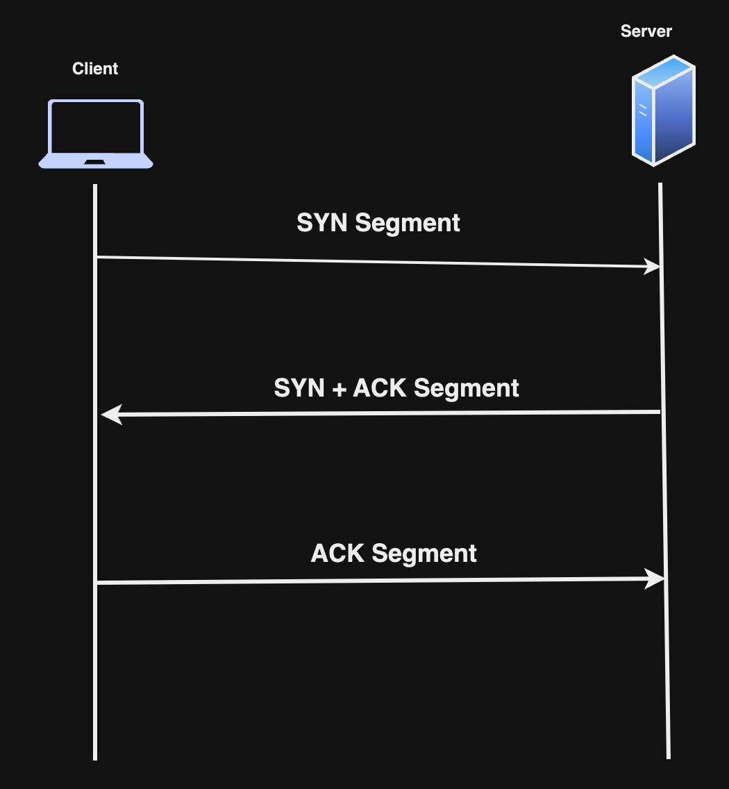
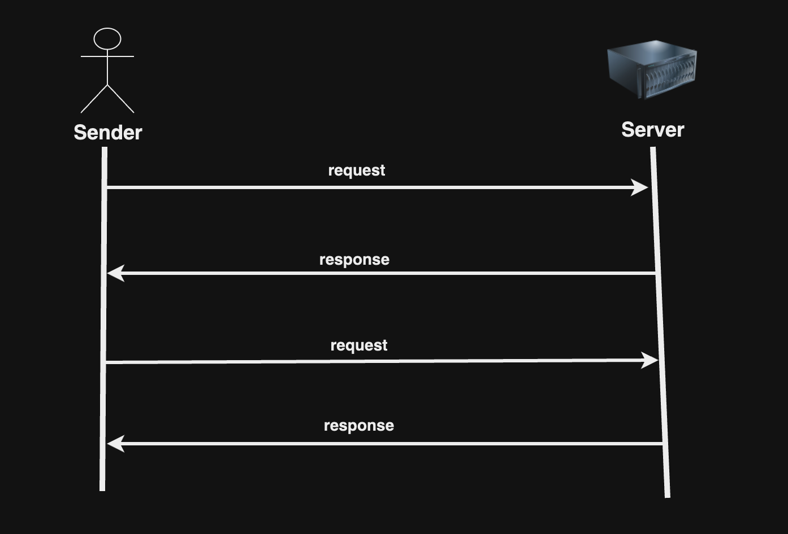
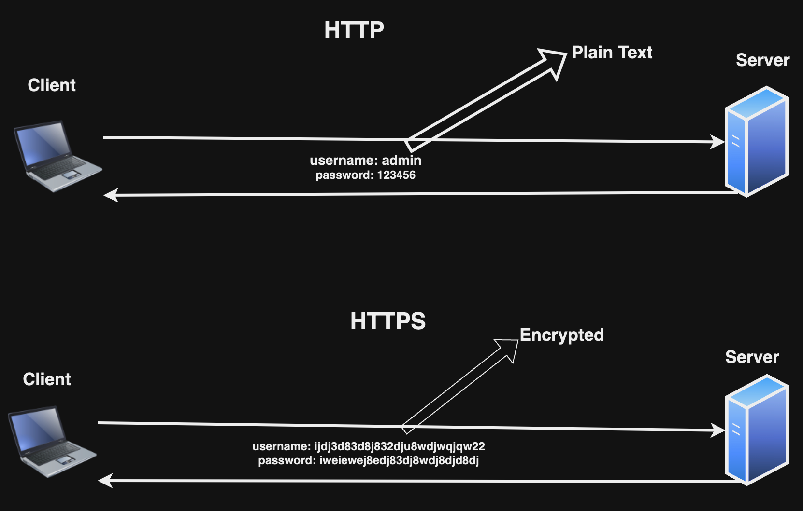
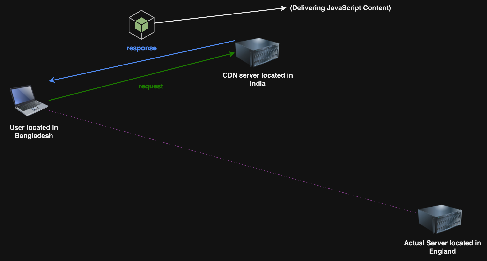
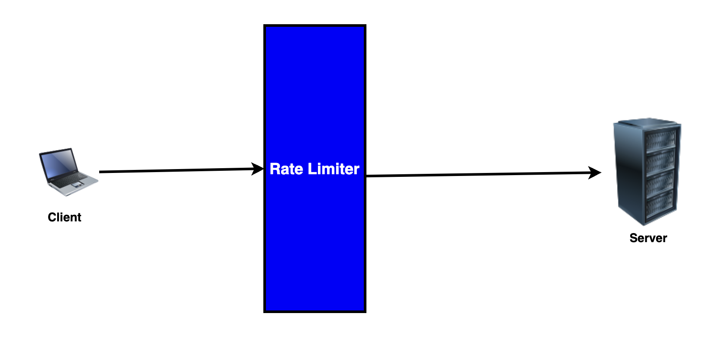
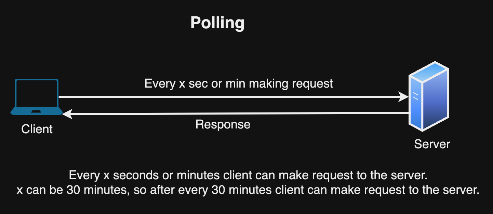
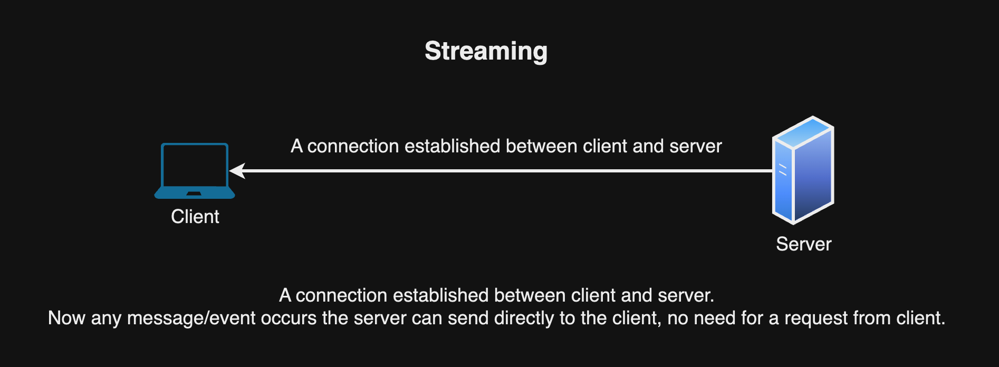
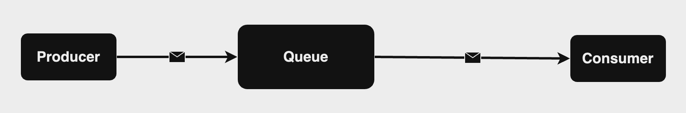
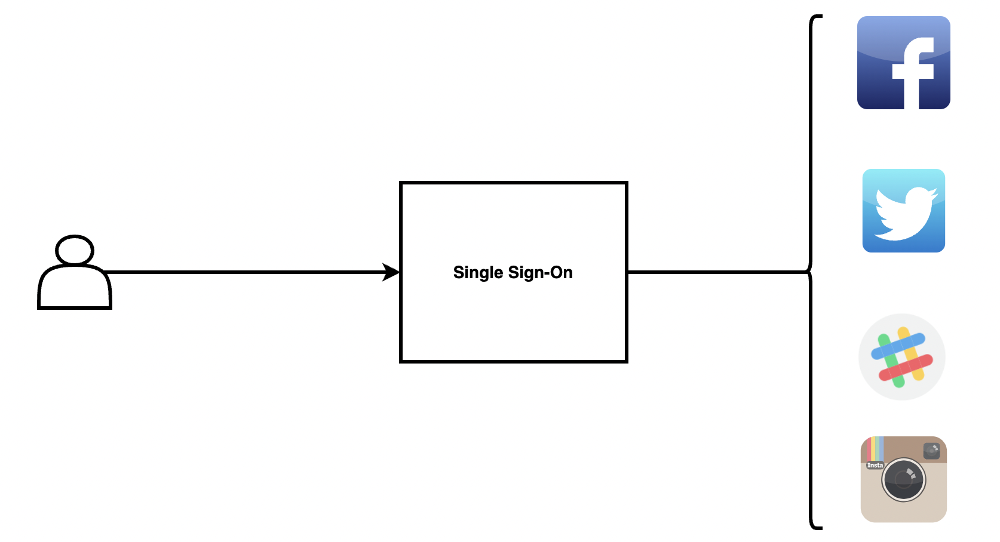
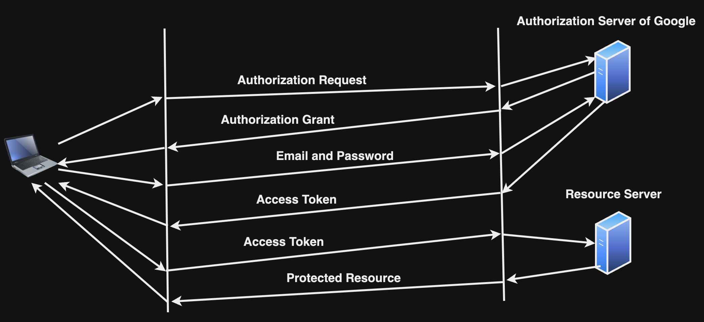

# সিস্টেম ডিজাইন বাংলা

এটি একটি রিপোজিটরি যেখানে সিস্টেম ডিজাইন এর মৌলিক জিনিসগুলো নিয়ে আলোচনা করা হয়েছে।

**আমি সাজেস্ট করবো যখন আমার সব টপিক লেখা হয়ে যাবে তখন আপনারা চাইলে কান্ট্রিবিউটে করবেন**

এই টিউটোরিয়াল এর উদ্দেশ্য আপনাকে মৌলিক জিনিসগুলোর ধারণা দেয়া। ভালো লাগলে star, watch কিংবা fork ক্লিক করে রাখতে পারেন।

<p align="center">
  
</p>

[আপনার যদি এই কনটেন্ট পড়ে ভালো লাগে, আপনি চাইলে আমাকে কফি স্পনসর করতে পারেন, https://www.buymeacoffee.com/lahin31]

### সূচিপত্র

- [Section 1: System Design](#section-1-system-design)
- [Section 2: Database - SQL and NoSQL](#section-2-database---sql-and-nosql)
- [Section 3: Client Server Architecture](#section-3-client-server-architecture)
- [Section 4: Reliability](#section-4-reliability)
- [Section 5: Performance Metrics](#section-5-performance-metrics)
- [Section 6: Distributed System](#section-6-distributed-system)
- [Section 7: Domain Name System](#section-7-domain-name-system)
- [Section 8: Transmission Control Protocol](#section-8-transmission-control-protocol)
- [Section 9: User Datagram Protocol](#section-9-user-datagram-protocol)
- [Section 10: HTTP and HTTPS](#section-10-http-and-https)
- [Section 11: Functional and Non Functional Requirements](#section-11-functional-and-non-functional-requirements)
- [Section 12: Back Of the Envelope Estimation](#section-12-back-of-the-envelope-estimation)
- [Section 13: Authentication and Authorization]
- [Section 14: Stateful and Stateless Architecture](#section-14-stateful-and-stateless-architecture)
- [Section 15: Proxy](#section-15-proxy)
- [Section 16: REST API](#section-16-rest-api)
- [Section 17: Scalability](#section-17-scalability)
- [Section 18: Database Sharding](#section-18-database-sharding)
- [Section 19: Database Replication](#section-19-database-replication)
- [Section 20: Caching](#section-20-caching)
- [Section 21: Content Delivery Network](#section-21-content-delivery-network)
- [Section 22: Rate Limiter](#section-22-rate-limiter)
- [Section 23: CAP Theorem](#section-23-cap-theorem)
- [Section 24: Consistent Hashing] (চলমান)
- [Section 25: Polling and Streaming](#section-25-polling-and-streaming)
- [Section 26: Message Queue](#section-26-message-queue)
- [Section 27: rpc, gRpc] (চলমান)
- [Section 28: Single Sign-On](#section-28-single-sign-on)
- [Section 29: Elasticsearch](#section-29-elasticsearch)
- [Section 30: Bloom Filter](#section-30-bloom-filter)
- [Section 31: Load Balancing Algorithms] (চলমান)
- [Section 32: How Live Streaming works] (চলমান)
- [Section 33: How OAuth2 works](#section-33-how-oauth2-works)
- [Section 34: Serverless Architecture]
- [Section 35: High Availability best practices by Netflix](#section-35-high-availability-best-practices-by-netflix)
- [Section 36: Resources](#section-36-resources)

## Section 1: System Design

আমরা যখন কোন এপ্লিকেশন ডেভেলপ করতে যাই আমাদের একটি নির্দিষ্ট প্রকারের ডিজাইন মেনে চলতে হয়, তার কারণ হল আমাদের এপ্লিকেশনে কোন এক সময় থেকে যদি প্রচুর মানুষ ব্যবহার করা শুরু করতে থাকে, তখন আমাদের এপ্লিকেশন যাতে প্রচুর লোড ভালোভাবে নিতে পারে কোন প্রকারের কানেকশন নষ্ট বা পারফরমেন্স ডাউন হওয়া ছাড়া সেজন্য। সেই ডিজাইন কে বলা হয় সিস্টেম ডিজাইন।

(এই স্পেসিফিক সিস্টেম ডিজাইন মূলত ব্যাকএন্ড ইঞ্জিনিয়ারিং এর সাথে সম্পৃক্ত।)

## Section 2: Database - SQL and NoSQL

এপ্লিকেশন ডেভেলপ করার সময় আমাদের কাজ অনুযায়ী ডেটাবেস নির্বাচন করতে হয়। সাধারণত, আমরা প্রধান দুই ধরনের ডেটাবেস ব্যাবহার করে থাকি - SQL(রিলেশনাল) ডেটাবেস এবং NoSQL(নন-রিলেশনাল) ডেটাবেস। আমরা কেমন বা কোন ধরণের ডাটা ষ্টোর করতে চাই, কিভাবে ষ্টোর করতে চাই, আমাদের কাজের পদ্ধতি ইত্যাদি প্রয়োজন অনুযায়ী ডেটাবেস বাছাই করতে হয়। ডাটার ধরন অনুযায়ী ডেটাবেসগুলো আমাদের ভিন্ন ভিন্ন সুবিধা দিয়ে থাকে।

| SQL                                                                                                                                                   | NoSQL                                                                                               |
| ----------------------------------------------------------------------------------------------------------------------------------------------------- | --------------------------------------------------------------------------------------------------- |
| টেবিলের মধ্যে ডাটা স্টোর করা হয়, যেখানে প্রতিটি সারি একটি এন্টিটি এবং প্রতিটি কলাম একটি ডাটার বৈশিষ্ট্য নিদের্শন করে। টেবিলগুলোর মধ্যে relation থাকে। | কোন প্রকার relation ছাড়া ডাটা বিভিন্নভাবে ষ্টোর করে থাকে। যেমনঃ key-value, graph, document ইত্যাদি। |
| নির্দিষ্ট স্কিমা অনুযায়ী ডাটা স্টোর করা হয়। (ডাটাবেস পরিবর্তনের মাধ্যমে স্কিমা পরবর্তীতে পরিবর্তন করা যায়।)                                           | NoSQL ডাটাবেসে ডাইনামিক স্কিমা থাকে, অর্থাৎ স্কিমা পরিবর্তনযোগ্য।                                   |

🔗 [**আরও পড়ুন: ডেটাবেস**](./sections/database/README.md)

## Section 3: Client Server Architecture

ক্লায়েন্ট রিকুয়েস্ট করবে সার্ভারকে কিছু স্পেসিকিফ রিসোর্স এর জন্য, সার্ভার সেই রিকুয়েস্ট পাওয়ার পর সে তার যাবতীয় প্রসেস শেষ করে ক্লায়েন্টকে রেসপন্স দিয়ে দিবে, এটি ক্লায়েন্ট সার্ভার আর্কিটেকচার।

<p align="center">
  
</p>

আমাদের সব উদাহরণ থাকবে ক্লায়েন্ট সার্ভার আর্কিটেকচারের উপর ভিত্তি করে।

## Section 4: Reliability

সিস্টেম যদি কোনো প্রকারের Fault/Error থাকার পরও ভালোভাবে কাজ করতে পারে কিংবা সিস্টেমটি যদি বন্ধ না হয়, তবে সেই সিস্টেমটি Reliable। আমাদের মনে রাখতে হবে এক বা একাধিক Fault এর কারণে সিস্টেম Failure হতে পারে।

Fault এরকম হতে পারে কোনো user সিস্টেমটি কে এমনভাবে ব্যবহার করেছে যাতে কোনো Failure হয়ে গেল, সেটা ইচ্ছাকৃত বা অনিচ্ছাকৃতভাবেও হতে পারে, তখন যদি সিস্টেমটি বন্ধ না হয়ে কোনো প্রকারের Warning message দেখালো তখন সেই সিস্টেমটিকে আমরা Reliable বলতে পারি।

🔗 [**আরও পড়ুন: রিলাইবিলিটি**](./sections/reliability/README.md)

## Section 5: Performance Metrics

### Throughput

একটি নির্দিষ্ট সময়ের ভিত্তিতে কোনো সিস্টেম যতটুকু কাজ সম্পাদন করতে পারে সেটি হচ্ছে Throughput। যেমন, প্রতি ১০ সেকেন্ড এ সিস্টেম যদি ৫০ টি API request সম্পন্ন করতে পারে তাহলে তার Throughput হবে ৫০/১০ = ৫।

### Time to First Byte

ক্লায়েন্ট Resource জন্য যখন সার্ভারকে Request করে এবং ক্লায়েন্ট সার্ভার থেকে FIRST BYTE of Response যখন গ্রহণ করে তার মধ্যকার সময়টুকু (Request করা থেকে শুরু করে এবং FIRST BYTE গ্রহণ করার সময় পর্যন্ত) হল Time to First Byte।

🔗 [**আরও পড়ুন: পারফরম্যান্স ম্যাট্রিক্স**](./sections/performance-metrics/README.md)

## Section 6: Distributed System

একাধিক কম্পিউটার (বা কম্পোনেন্ট) একসাথে কাজ করার ফলে কোন কাজ শেষ হয় এবং End User এর কাছে একটি কম্পিউটার (বা কম্পোনেন্ট) হিসেবে আসে, সেই সিস্টেমটি হল ডিস্ট্রিবিউটেড সিস্টেম। এই মেশিনগুলোতে শেয়ার্ড স্টেট(Shared State) থাকে, কঙ্কারেন্টলি (Concurrently) কাজ করতে পারে, প্রতিটি সিস্টেম একে অপরের সাথে Information শেয়ার করতে পারবে।

বর্তমান সময়ে Distributed System এর উদাহরণ হল YouTube।

YouTube কেন?

- সার্ভার User থেকে রিকুয়েস্ট পায় Video Upload কিংবা Video Watch করার জন্য।
- ভিডিও এনকোড।
- ডাটাবেস সিস্টেম।

এগুলো সবকিছু মিলে Distributed System YouTube তৈরি করে।

## Section 7: Domain Name System

Domain Name System কিংবা DNS একটি নির্দিষ্ট Human Readable Domain (যেমন www.google.com) কে একটি নির্দিষ্ট IP-তে রূপান্তর করে।

আপনি যখন ব্রাউজারে URL টাইপ করেন (যেমন www.google.com)। DNS সাধারণত আপনার দেয়া URL এর IP Address বের করবে এবং সেই IP Address এ আপনার রিকুয়েস্ট প্রসেস হবে।

এই রূপান্তর করার পদ্ধতিটা শুরু হয় DNS Resolver দিয়ে,

- DNS Resolver মূলত Human Readable Domain কে নির্দিষ্ট IP-তে রূপান্তর করে থাকে। এর ৩টি পার্ট আছে,
  - Root Server, এই সার্ভার মূলত .com, .org, .net ইত্যাদির তথ্য রাখে এবং সেগুলোর IP সেই DNS Resolver কে দিয়ে থাকে যেমন .com এর জন্য .com এর IP, .org এর জন্য .org এর IP
  - Top Level Domain Server, এই সার্ভার মূলত প্রতিটি Top Level Domain (www.google.com এর TLD হল .com) এর Authoritative Server এর তথ্য নিজের মধ্যে রাখে।
  - Authoritative Server, এই সার্ভারের মধ্যে সেই Human Readable Domain (যেমন www.google.com) এর IP পাওয়া যায়।

<p align="center">
  
</p>

## Section 8: Transmission Control Protocol

Transmission Control Protocol অথবা TCP হচ্ছে একটি নেটওয়ার্ক প্রোটোকল যেখানে একাধিক Device একে অপরের সাথে মেসেজ আদান-প্রধান করতে পারে।

TCP কে Reliable বলা হয় কারণ যতক্ষণ পর্যন্ত ডিভাইসগুলো একে অপরের সাথে মেসেজ অদান-প্রধান শেষ হবে না ততক্ষন connection বন্ধ হবে না।

Transmission শুরু হওয়ার পূর্বে TCP 3-way-handshake ব্যবহার করে connection established করে। এটি ৩টি স্টেপে হয়ে থাকে,

- SYN (synchronize): এই flag দ্বারা TCP কানেকশন establish করার রিকোয়েস্ট করা হয়।
- SYN-ACK (synchronize-acknowledge): এই flag কানেকশন establish করতে ব্যবহার করা হয়।
- ACK (acknowledge): এই flag দ্বারা কানেকশন establish সম্পন্ন হওয়ার acknowledge করা হয়।

এই 3-way-handshake নিশ্চিত করে Device'গুলো(ক্লায়েন্ট-সার্ভার) একে অপরের সাথে মেসেজ আদান-প্রধান করতে পারবে কি না।

TCP Reliability নিশ্চিত করে সাধারণত Acknowledgments এবং Retransmissions পদ্ধতি ব্যবহার করে। TCP তে মূলত যখন ক্লায়েন্ট ডেটা send করে সার্ভার রিকোয়েস্ট টি কে Acknowledge করে। ক্লায়েন্ট যদি Acknowledge না পায় তখন ক্লায়েন্ট আবার রিকোয়েস্ট Retransmission করবে। এরকম Reliability নিশ্চিত হয়ে থাকে।

<p align="center">
  
</p>

TCP মূলত Networking এর OSI Model এর Practical Form। এটি Transport Layer থেকে শুরু হয় এবং Application Layer এ কাজ করে।

HTTP, Web Socket, FTP ইত্যাদি মূলত TCP তে চলে।

## Section 9: User Datagram Protocol

UDP মূলত OSI Model এর Transport Layer-এ অবস্থান করে। TCP এর মত এটি reliable না। এতে কোনো 3-way handshake তৈরী হয় না। এটি মূলত Low Latency এবং unreliable connection তৈরী করে।

UDP Process to Process communication establish করে।

TCP তে যেহেতু 3-way handshake তৈরীর মাধ্যমে reliable connection তৈরী হয়, কিন্তু এই 3-way handshake তৈরী করতে সময়ের প্রয়োজন হয় সেজন্য performance কম পাওয়া যায়। Performance এর কথা বিবেচনা করলে UDP একটি better choice।

UDP তে কোনো Error checking হয় না।

<p align="center">
  
</p>

## Section 10: HTTP and HTTPS

HTTP অর্থাৎ Hyper Text Transfer Protocol, HTTP এক প্রকারের বৈশিষ্ট প্রদান করে থাকে, যার মাধ্যমে Web Browser এবং Web Server নিজেদের ভিতর communication করে থাকে। এটি এক প্রকারের set of rules যা ডেটা ক্লায়েন্ট থেকে সার্ভারে পাঠানো সাহায্য করে। ডেটা হতে পারে Text, Image ইত্যাদি। ক্লায়েন্ট এবং সার্ভারের ভিতর ডেটা আদান প্রধান plain-text এ হয়ে থাকে, এর ফলে HTTP secured না।

HTTPS অর্থাৎ Hyper Text Transfer Protocol Secure, এটি নিজে HTTP এর সকল বৈশিষ্ট বহন করে শুধু SSL/TLS যোগ করে ক্লায়েন্ট এবং সার্ভারের মধ্যে ডেটা ট্রান্সফার Encrypted হয়ে থাকে।

<p align="center">
  
</p>

🔗 [**আরও পড়ুন: এইচটিটিপি এবং এইচটিটিপি'এস**](./sections/http-and-https/README.md)

## Section 11: Functional and Non Functional Requirements

### Functional Requirements

একটি সিস্টেম কি কি কাজ করে সেটি Functional Requirement উল্লেখ করে থাকে। উদাহরণ বলা যায়, সোশ্যাল মিডিয়া সিস্টেমে,

- পোস্ট করা যায়
- পোস্টে লাইক করা যায়
- পোস্টে কমেন্ট করা যায়
- পোস্টে ডিলিট করা যায়

প্রতিটা হচ্ছে এক একটি Functional Requirement।

### Non Functional Requirements

এটি মূলত একটি সিস্টেমের গুণমান বৈশিষ্ট্যতা (Quality Characteristics), উদাহরণ:

- Performance
- Security
- Cost
- Scalability
- Reliability

প্রতিটা হচ্ছে এক একটি Non Functional Requirement।

## Section 12: Back Of the Envelope Estimation

এটি একটি টেকনিক যা আমাদেরকে সিস্টেম ডিজাইন এর Load Balancer, CDN ইত্যাদি ব্যবহার করবো কি না তার আনুমানিক ধারনা হিসাব করে বলে দিতে পারে।

🔗 [**আরও পড়ুন: ব্যাক অফ দা এনভেলপ এস্টিমেশন**](./sections/back-of-the-envelop-estimation/README.md)

## Section 14: Stateful and Stateless Architecture

### Stateful

এই আর্কিটেকচারে ডেটা Store এবং Maintain Application সার্ভারে হয়ে থাকে। FTTP হল Stateful।

বাস্তব জীবনে Stateful আর্কিটেকচার এর উদাহরণ হল Web Socket। Web Socket মূলত bidirectional, full-duplex protocol। এখানে Server ডেটা store করে রাখে, যাতে Client সবসময় Server থেকে ডেটা পায়।

### Stateless

এই আর্কিটেকচারে ডেটা Store এবং Maintain Application সার্ভারে হয় না বরং কোনো Database বা Cache এ স্টোর এবং মেইনটেইন হয়। HTTP হল Stateless।

HTTP সবসময় Stateless Architecture, কারণ কোনো protected resource এর জন্য আপনাকে সবসময় request করার সময় cookie/token সাথে দিতে হয়। server কখনো cookie/token স্টোর করে রাখে না।

🔗 [**আরও পড়ুন: স্টেটলেস-স্টেটফুল আর্কিটেকচার**](./sections/stateless-stateful-architecture/README.md)

## Section 15: Proxy

ক্লায়েন্ট যখন সার্ভারকে রিকুয়েস্ট পাঠানোর সময় সরাসরি সার্ভারকে রিকুয়েস্ট না করে অন্য একটি সার্ভাররের মাধ্যমে রিকুয়েস্ট করলে, সেই প্রসেস হচ্ছে প্রক্সি এবং যে সার্ভার দিয়ে রিকুয়েস্ট করবে সেটা হচ্ছে প্রক্সি সার্ভার।

বাস্তব জীবনে প্রক্সির একটি উদাহরণ হচ্ছে NGINX।

🔗 [**আরও পড়ুন: প্রক্সি**](./sections/proxy/README.md)

## Section 16: REST Api

REST Api জানার পূর্বে আমাদের বুঝতে হবে রেস্ট(REST) মানে কি, REST মানে হল Representational State Transfer যার মানে দাড়ায় এটি একটি আর্কিটেকচারাল স্টাইল যা ব্যবহার করা হয় স্টেট ট্রান্সফার এর জন্য। এখন REST Api হল, এক প্রকারের এপিআই কনভেনশন যা ব্যবহার করা হয় দুটি এন্ড(যেমনঃ ক্লায়েন্ট এবং সার্ভার) এর মধ্যে স্টেট ট্রান্সফার করাকে নিশ্চিত করার জন্য।

স্টেট ট্রান্সফার নিশ্চিত করতে কিছু স্পেসিফিক HTTP Methods ব্যবহার করা হয়, GET, POST, PUT, PATCH & DELETE, প্রতিটি ম্যাথোডের ব্যবহার জানতে REST Api সেকশনে ক্লিক করুন।

🔗 [**আরও পড়ুন: রেস্ট এপিআই**](./sections/rest-api/README.md)

## Section 17: Scalability

স্কেলেবিলিটি সাধারণত সিস্টেমের ক্ষমতাকে বুঝায় যখন সিস্টেমে ট্রাফিকের পরিমাণ বাড়তে থাকে। উদাহরণ বলা যেতে পারে, একটি ওয়েবসাইটের ডাটাবেসে এখন একটি নির্দিষ্ট পরিমাণ রিকুয়েস্ট করা হচ্ছে কিন্তু আজ থেকে ৫ মাস পর রিকুয়েস্ট ২ গুণ হয়ে গেল তার ঠিক আরও ৫ মাস পর রিকুয়েস্ট ৪ গুণ হয়ে গেল, একটা সময় দেখা যেতে পারে ডাটাবেস সার্ভার এত পরিমাণ রিকুয়েস্ট লোড নিতে পারছে না, এই সমস্যার সমাধানের জন্য স্কেল করাকে স্কেলেবিলিটি বলে।

স্কেলেবিলিটি সাধারণত 2 প্রকারের, ভার্টিকাল স্কেলেবিলিটি (Vertical Scalability) এবং হরাইজন্টাল স্কেলেবিলিটি (Horizontal Scalability)।

🔗 [**আরও পড়ুন: স্কেলেবিলিটি**](./sections/scalability/README.md)

## Section 18: Database Sharding

Database Sharding হল টেবিল থেকে ডেটা পৃথক করা। উদাহরণ বলা যায়, ডাটাবেসের ডেটা/row যদি বাড়তে থাকে এবং এত পরিমাণ ডেটা/row বেড়ে গেল যার ফলে ডাটাবেস টেবিলে আর স্টোর করা যায় না তখন আমরা ডেটাগুলোকে মূল টেবিল থেকে পৃথক করে অন্যান্য shard টেবিলে distribute করে রাখি সেটাই Database Sharding। একাধিক সার্ভার এই ডিস্ট্রিবিউশন হবে।

<p align="center">
  
</p>

🔗 [**আরও পড়ুন: ডেটাবেস সাৰ্ডিং**](./sections/database-sharding/README.md)

## Section 19: Database Replication

Database Replication এক প্রকারের Strategy, যেখানে একটি Master Database এবং একটি কিংবা একাধিক Slave Database থাকবে। Master Database এর মধ্যে Insert, Delete এবং Update এর কাজ হবে এবং Slave Database মধ্যে Master Database এর ডেটাগুলোর Copy থাকবে এবং তার মধ্যে শুধু Read Operation হবে।

<p align="center">
  
</p>

Database Replication, SQL এবং NoSQL দুটি ডেটাবেসে করা যায়।

🔗 [**আরও পড়ুন: ডেটাবেস রেপ্লিকেশন**](./sections/database-replication/README.md)

## Section 20: Caching

Caching একটি কৌশল যা দ্বারা কোন Expensive Response'কে কোনো মেমোরিতে রাখা হয়, যাতে বার বার আসা সেই রেস্পন্সের রিকোয়েস্ট কে দ্রুত রেসপন্সটি দিতে পারি। মূল সার্ভারে (যেমন ডাটাবেস) হিট করার পরিবর্তে ক্যাশিং সার্ভারে রিকোয়েস্ট করবে। এতে করে যে সুবিধাটুকু হবে,

- Read API রিকোয়েস্ট Fast হবে
- Latency Reduce হবে
- Fault Tolarence এর ঝুঁকি কমবে

<p align="center">
  
</p>

🔗 [**আরও পড়ুন: ক্যাশিং**](./sections/caching/README.md)

## Section 21: Content Delivery Network

Content Delivery Network অথবা CDN, এটি একটি সিস্টেম যেখানে একাধিক সার্ভার আমাদের ভৌগোলিক এর আসেপাশে থাকে, যাতে আমরা খুব দ্রুত কন্টেন্ট পেতে পারি। কন্টেন্টটি হতে পারে JS, CSS, Images কিংবা Videos।

<p align="center">
  
</p>

আমাদের CDN সার্ভার যদি India তে থাকে আর আমরা Bangladesh থেকে content request করি তাহলে খুব তাড়াতাড়ি content পাব। কারণ তখন Latency কমে যাবে।
আর আমরা Bangladesh থেকে England-এ যেখানে মূল সার্ভার আছে, সেখানে কনটেন্ট এর জন্য request করলে Latency স্বাভাবিকভাবে বৃদ্ধি পাবে, যেহেতু দুই দেশের দূরত্ব বেশি।

যে যে লোকেশনে CDN সার্ভার আছে সেই লোকেশনগুলোকে Point of Presence বা PoP বলে। যে সার্ভার PoP এর ভিতরে থাকে তাকে Edge Server বলে।

🔗 [**আরও পড়ুন: কনটেন্ট ডেলিভারি নেটওয়ার্ক**](./sections/cdn/README.md)

## Section 22: Rate Limiter

Rate Limiter একটি প্রসেস, যেখানে ক্লায়েন্ট থেকে আসা রিকোয়েস্ট সার্ভারে যাওয়ার পূর্বে রিকোয়েস্টটি কন্ট্রোল করা হয়। একটি নির্দিষ্ট সময়ের মধ্যে একটি নির্দিষ্ট পরিমাণ রিকোয়েস্ট Rate Limiter এর মাধ্যমে সার্ভার রিকোয়েস্ট গ্রহণ করে থাকে। নির্দিষ্ট পরিমানের চেয়ে রিকোয়েস্ট বেশি হয়ে গেলে Rate Limiter রিকোয়েস্টগুলোকে block করে ফেলে, যার ফলে রিকোয়েস্টগুলো আর সার্ভারে যেতে পারে না।

এখানে মূল পয়েন্ট ২টি, নির্দিষ্ট সময় এবং নির্দিষ্ট পরিমাণ রিকোয়েস্ট।

<p align="center">
  
</p>

উপরের ছবিতে দেখা যাচ্ছে, রিকোয়েস্ট এবং রেস্পন্সের মধ্যে middleware হিসেবে rate limiter আছে।

🔗 [**আরও পড়ুন: রেইট লিমিটার**](./sections/rate-limiter/README.md)

## Section 23: CAP Theorem

এটি একটি কনসেপ্ট বা থিওরি যা দ্বারা বুজা যায়, একটি Distributed System এ উল্লিখিত তিনটি প্রোপার্টি থেকে দুইটি প্রোপার্টি সবসময় মেনে চলবে।

- C মানে Consistency
- A মানে Availability
- P মানে Partition Tolerance

Consistency হচ্ছে একটি ট্রান্সেকশন (Transection) শেষ হওয়ার পর সব নোডে সবসময় consistent বা একই value থাকবে।

Availability মানে হচ্ছে প্রতিটি read এবং write রিকোয়েস্ট হয় প্রসেস(process) হবে না হয় কোনো message পাবে যে অপারেশন(request) প্রসেস(process) হচ্ছে না।

Partition Tolerance হচ্ছে একাধিক নোড একে অপরের সাথে কানেকশন(connection) নষ্ট হলেও, read এবং write অপারেশন ঠিকভাবে প্রসেস হবে।

🔗 [**আরও পড়ুন: ক্যাপ থিওরাম**](./sections/cap-theorem/README.md)

## Section 25: Polling and Streaming

Polling মানে হচ্ছে client regular interval এ server কে বার বার ডেটার জন্য রিকোয়েস্ট করবে। যেমন, ক্লায়েন্ট প্রতি ৫ সেকেন্ড পর পর সার্ভার কে রিকোয়েস্ট করবে আর সার্ভার তার রেসপন্স দিবে।

<p align="center">
  
</p>

Polling এর সবচেয়ে বড় সমস্যা হচ্ছে অতিরিক্ত Bandwidth ব্যবহার হওয়া।

Streaming(অথবা pushing) মানে হচ্ছে Socket এর মাধ্যমে সার্ভার এবং ক্লায়েন্ট এর মধ্যে একটি কানেকশন তৈরী হবে যা ক্লায়েন্ট যতক্ষন পর্যন্ত disconnect না হচ্ছে ততক্ষন পর্যন্ত কানেকশন থাকবে। ক্লায়েন্ট এখানে সার্ভারকে বার বার রিকোয়েস্ট করা লাগবে না, যেহেতু কানেকশন আছে ক্লায়েন্ট এবং সার্ভার এর মধ্যে সেহেতু কোনো প্রকারের event সার্ভারে সংঘটিত হলে সার্ভার এর রেসপন্স ক্লায়েন্টকে পাঠিয়ে দিবে। Streaming টেকনোলজি ব্যবহার করে Chat Application বানানো যায়।

<p align="center">
  
</p>

Streaming কিংবা Pushing এ সার্ভার এবং ক্লায়েন্টের মধ্যে একটি কানেকশন তৈরী হয়, অর্থাৎ সার্ভারের ভিতর ক্লায়েন্টের কিছু ইনফরমেশন থাকতে হবে যাতে সার্ভার ক্লায়েন্টকে ট্র্যাক করতে পারে। এজন্য এটিকে Stateful Architecture বলা হয়।

🔗 [**আরও পড়ুন: পোলিং স্ট্রিমিং**](./sections/polling-and-streaming/README.md)

## Section 26: Message Queue

এটি একটি প্রসেস যেখানে এক বা একাধিক Producer থাকবে, যাদের কাজ হচ্ছে Message(এখানে message মানে রিকোয়েস্ট) Queue এর মধ্যে send করা এবং queue সেই রিকোয়েস্টগুলোকে প্রসেস করে বিভিন্ন consumer এর কাছে পাঠিয়ে দেয়।

<p align="center">
  
</p>

সিস্টেমের Throughput বৃদ্ধি করার জন্য Message Queue ব্যবহার করা হয়।

Message Queue প্রতিটা Task কে Asynchronously প্রসেস করে থাকে, মানে একটি Task প্রসেস হয় তখন অন্য task এর উপর নির্ভর করে না।

পপুলার Streaming Service Netflix, Airbnb ইত্যাদি Message Queue ব্যবহার করে। Agoda তাদের Analytical Data, Real-time Monitoring এর Solution এর জন্য Message Queue ব্যবহার করে আসছে, 1.8 trillion events প্রতি দিন Message Queue এর মাধ্যমে প্রসেস করে আসছে।

আমরা যে কোনো Food Delivery সিস্টেমের কথা চিন্তা করি যদি, যেখানে একজন Delivery boy এর লাইভ লোকেশন আমরা যদি Pooling এর মাধ্যমে ৫ সেকেন্ড পর পর নিয়ে থাকি এবং কোন সময়ে কোন লোকেশনে ছিল সেটি ডাটাবেসের মধ্যে স্টোর করে রাখি। একজন ইউজার এর জন্য চিন্তা করলে আমাদের সিস্টেম ঠিকমতো কাজ করবে, ডাটাবেস স্টোর করে রাখবে।

কিন্তু আমাদের সিস্টেম একজন মানুষ ব্যবহার করবে না। হাজার হাজার Delivery boy এর লাইভ লোকেশন আমরা যদি সরাসরি ডাটাবেসে স্টোরে করে রাখি, তাহলে আমাদের সিস্টেম ক্র্যাশ করবে। কারণ ডাটাবেসের Throughput কম।

এই সমস্যার সমাধান আমরা Message Queue এর মাধ্যমে করতে পারব। ২ টি জনপ্রিয় Message Queue হচ্ছে,

- Kafka
- RabbitMQ

🔗 [**আরও পড়ুন: মেসেজ কিউ**](./sections/message-queue/README.md)

## Section 28: Single Sign-On

Single Sign-On কিংবা SSO হল একটি Authentication Mechanism। যা user কে একাধিক প্লাটফর্ম (গুগল, ফেইসবুক, টুইটার) দিয়ে Authenticate করে দেয়, একটি নির্দিষ্ট credential মাধ্যমে।

<p align="center">
  
</p>

(বিস্তারিত চলমান)

## Section 29: Elasticsearch

এটি একটি NoSQL ভিত্তিক ডেটাবেস। মূলত এটিকে Distributed Search এবং Aggregation Engine হিসেবে ব্যবহার করা হয়। Elasticsearch এর ভিতর structured এবং unstructured data স্টোর করে রাখা যায়।

🔗 [**আরও পড়ুন: ইলাস্টিকসার্চ**](./sections/elasticsearch/README.md)

## Section 30: Bloom Filter

Bloom Filter একটি Probabilistic Data Structure। Hashing টেকনিক ব্যবহার করে এখানে ডেটা insert করা হয়। এটি খুবই Faster এবং মেমোরি Efficient।

Bloom Filter এর ব্যাপারে জানার পূর্বে Hashing কি জানা নেয়া যাক। একটি Hash Function নিজের প্যারামিটারে input নিয়ে থাকে এবং সেই input কে প্রসেস করে একটি ফিক্সড length এর unique identifier রিটার্ন করে।

উদাহরণ, ইনপুট 'david' হলে আউটপুট হবে 5

```js
// hash function
function generateHash(table_size, user) {
  let index;
  let user_length = user.length;

  index = user_length % table_size;
  return index;
}

generateHash(10, "david"); // 5
```

Bloom Filter Data Structure এ Hash function ব্যবহার করে আমরা set এর মধ্যে specific position এ element insert করতে পারি। তারপর set এর মধ্যে specific element সার্চ করতে পারি।

এর মধ্যে যখন আমরা নির্দিষ্ট element সার্চ করি তখন আমরা দুটি জিনিসের মধ্যে একটি পাবো,

- হয় possibly yes - মানে element, set এর মধ্যে থাকবে তবে না থাকার সামান্য কিছু সম্ভাবনা আছে।

- না হয় no - মানে element, set এর মধ্যে নাই।

এজন্য তাকে Probabilistic Data Structure বলা হয়।

🔗 [**আরও পড়ুন: ব্লুম ফিল্টার**](./sections/bloom-filter/README.md)

## Section 33: How OAuth2 works

OAuth2 হল এক প্রকারের Authorization Grant Technique। এটি Google, Facebook এর মত ওয়েবসাইট থেকে নির্দিষ্ট information আনতে পারে কোনো প্রকারের password এবং অন্যান্য sensitive information ছাড়া। এই নির্দিষ্ট information এ একটি Access Token থাকে যা দ্বারা আমরা নির্দিষ্ট রিসোর্স(হতে পারে কোনো ওয়েবসাইট এ Login) ব্যবহার করতে পারবো।

এটি যেভাবে কাজ করে,

ধরুন আপনি কোনো ওয়েবসাইটে লগইন করছেন। সেজন্য আপনি Continue with Google বাটন ক্লিক করলেন,

- প্রথমে website (মানে ক্লায়েন্ট) Authorization Request পাঠাবে Google এর Authorization সার্ভারে।
- Google response পাঠিয়ে বলবে Email এবং Password দেয়ার জন্য।
- Client Email এবং Password টাইপ করে গুগলের Authorization সার্ভারে রিকোয়েস্ট করবে।
- Google এই Email এবং Password কে চেক করবে যদি ঠিক হয় তাহলে google একটি Access Token response আকারে রিটার্ন করবে।
- তারপর client Access Token request এর header এর সাথে attach করে নির্দিষ্ট রিসোর্স সার্ভারে রিকোয়েস্ট করতে পারবে।

<p align="center">
  
</p>

## Section 35: High Availability best practices by Netflix

Netflix High Availability নিশ্চিত করার জন্য কিছু টিপস শেয়ার করেছিল(যেগুলো এরা নিজে follow করে থাকে) যা আমাদের অনেক সিস্টেমের কাজে লাগবে,

- Regional deployment over global ones: Deployment আমরা region by region করবো, যাতে region এ impact টি observe করতে পারি। কোনো প্রকারের সমস্যা হলে আমরা Rollback করে পূর্বের স্টেট এ চলে যেতে পারবো, তখন অন্য region এর উপর কোনো নেগেটিভ ইমপ্যাক্ট পরবে না।

- Use Blue/Green deployment strategy: এই strategy তে Deploy করার সময় সিস্টেমের দুটি ভার্সন থাকে, Blue হল বর্তমান ভার্সন এবং green হল নতুন ভার্সন। Green ভার্সন টেস্ট করা হয়ে গেলে, সবকিছু ঠিক থাকলে আমরা Blue ভার্সন থেকে সবকিছু Green ভার্সনে নিয়ে যাব।

- Use deployment windows: Deployment আমরা office hour এবং off-peak এর সময় করব।

- Enable Chaos Monkey: এটি একটি Tool যা আমাদের production সার্ভারকে ক্র্যাশ করে দিতে পারে। এতে করে আমরা নিশ্চিত হতে পারব আমাদের সিস্টেমটি কত resilience।

- Deploy exactly what you tested to production: যে পার্ট এর টেস্টিং করা হয় সেই পার্ট Deploy করা হবে।

Original Post: https://netflixtechblog.medium.com/tips-for-high-availability-be0472f2599c

## Section 36: Resources

- <a href="https://github.com/donnemartin/system-design-primer" target="_blank">System Design Primer by Donne Martin (free)</a>
- <a href="https://www.amazon.com/Designing-Data-Intensive-Applications-Reliable-Maintainable/dp/1449373321" target="_blank">Designing Data Intensive Applications (paid)</a>
- <a href="amazon.com/System-Design-Interview-Insiders-Guide/dp/1736049119" target="_blank">System Design Interview by Alex Xu (paid)</a>
