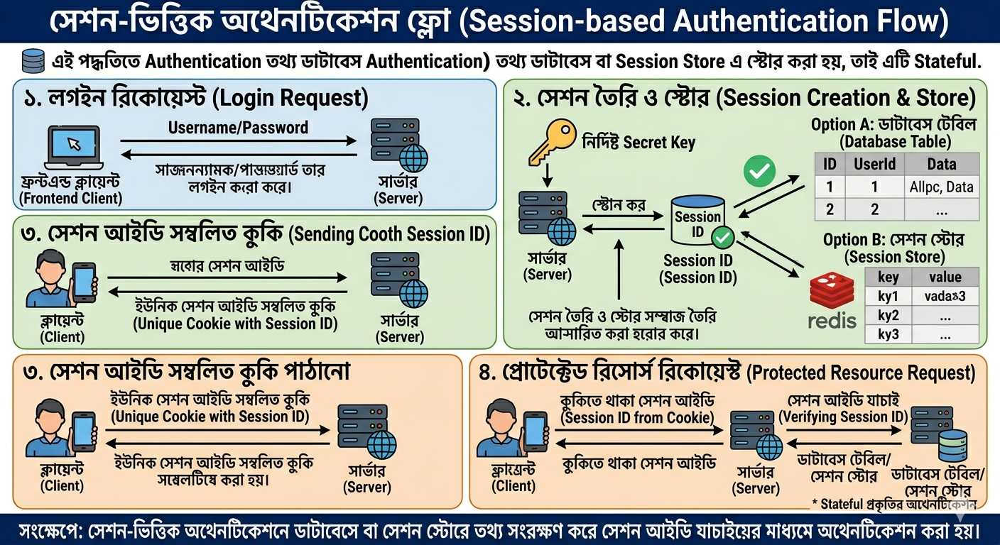
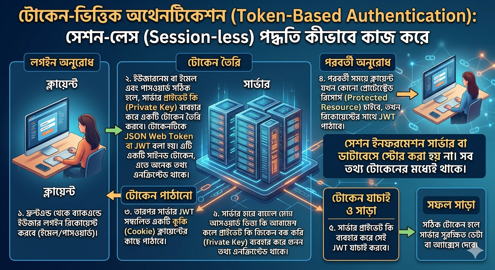

# Session vs Token Authentication: একটা গল্প দিয়ে শুরু করি

ধরুন আপনি একটা ক্লাবে ঢুকলেন। দুইভাবে এন্ট্রি ভেরিফাই হতে পারে:

- **Session ভিত্তিক:** দরজায় আপনার নাম একটা খাতায় লেখা হলো, আর আপনাকে একটা নাম্বার দেওয়া হলো। ভেতরে ঢোকার সময় গার্ড সেই নাম্বার খাতায় মিলিয়ে দেখে আপনি আসলেই লিস্টে আছেন কিনা।
- **Token ভিত্তিক:** আপনাকে একটা স্ট্যাম্প/ব্রেসলেট দেওয়া হলো যেটার মধ্যেই গোপন কালিতে লেখা আছে "এই লোক ভেতরে ঢুকতে পারবে, validity রাত ১২টা"। গার্ড শুধু ব্রেসলেটটা চেক করে — কোনো খাতা দেখার দরকার নেই।

## Session based Authentication

এক্ষেত্রে Authentication করার সময় session ইনফরমেশন/তথ্য ডাটাবেসে কিংবা Session Store এ রাখা হয়। কিভাবে কাজ করে?

- ফ্রন্টএন্ড থেকে ব্যাকএন্ড এ user লগইন রিকোয়েস্ট করবে।
- username কিংবা email এবং password যখন সঠিক হবে, সার্ভার তখন Session তৈরী করে থাকে একটি নির্দিষ্ট Secret Key এর মাধ্যমে। তারপর সেই Session কোনো ডাটাবেস টেবিলে কিংবা Session Store এ স্টোর করে রেখে দেয়।
- তারপর সার্ভার একটি unique Session ID সম্বলিত cookie ক্লায়েন্ট এর কাছে পাঠাবে।
- পরবর্তী সময় ক্লায়েন্ট যখন কোনো প্রোটেক্টেড রিসোর্স এর জন্য সার্ভারের কাছে রিকোয়েস্ট পাঠাবে, তখন সার্ভার সেই রিকোয়েস্ট এর মধ্যে থাকা Session ID কে যাচাই করবে(তা হতে পারে কোনো ডাটাবেস টেবিল থেকে কিংবা কোনো Session Store থেকে)।

### মূল পয়েন্ট

- সার্ভারই মনে রাখে কে লগইন করেছে — ক্লায়েন্ট শুধু একটা টোকেন (session ID) বহন করে।
- কাউকে লগআউট করাতে চাইলে শুধু সার্ভার থেকে সেই session ডিলিট করে দিলেই হয় — কাজ তাৎক্ষণিক।
- Horizontal scaling করতে গেলে session store-টা শেয়ার্ড হতে হবে (Redis/Memcached) — নাহলে এক সার্ভারে লগইন করা ইউজার আরেক সার্ভারে hit করলে "unauthenticated" দেখাবে। Sticky session দিয়েও সমাধান করা যায়, কিন্তু এটা load balancer-এর জটিলতা বাড়ায় এবং fault-tolerance কমায়।
- প্রতিটা রিকোয়েস্টে একটা extra lookup/network hop লাগে (DB বা cache hit), যা latency-তে যোগ হয়।
- Session store নিজেই একটা single point of failure হতে পারে যদি ঠিকমতো replicate/cluster করা না হয়।

যেহেতু Session কোনো স্থানে স্টোর করে রাখা হয় সেজন্য Session based Authentication কে Stateful বলা হয়।

  

## Token based Authentication

এক্ষেত্রে Authentication করার সময় session ইনফরমেশন/তথ্য ডাটাবেসে কিংবা Session Store এ রাখা হয় না। কিভাবে কাজ করে?

- ফ্রন্টএন্ড থেকে ব্যাকএন্ড এ user লগইন রিকোয়েস্ট করবে।
- username কিংবা email এবং password যখন সঠিক হবে, সার্ভার তখন Private Key এর মাধ্যমে একটি Token তৈরী করবে। Token টি কে সাধারণত JSON Web Token বলে। এটি মূলত একটি Signed Token।
- তারপর সার্ভার JWT সম্বলিত cookie ক্লায়েন্ট এর কাছে পাঠাবে।
- পরবর্তী সময় ক্লায়েন্ট যখন কোনো প্রোটেক্টেড রিসোর্স এর জন্য সার্ভারের কাছে রিকোয়েস্ট পাঠাবে, তখন সার্ভার সেই রিকোয়েস্ট এর মধ্যে থাকা JWT কে যাচাই করবে সেই Private Key এর মাধ্যমে।

### মূল পয়েন্ট

- টোকেনের ভেতরেই সব তথ্য থাকে — সার্ভারকে আলাদা করে কিছু মনে রাখতে হয় না, শুধু signature চেক করলেই হয়।
- টোকেন decode করলে যে কেউ এর ভেতরের তথ্য পড়তে পারবে (এটা encrypted না, শুধু signed) — তাই sensitive তথ্য (password, secret) কখনোই JWT payload-এ রাখা উচিত না।
- Revocation একটা আসল সমস্যা। যেহেতু সার্ভার কোনো state রাখে না, একটা ইস্যু করা টোকেন ইচ্ছামতো invalidate করা যায় না — expiry না হওয়া পর্যন্ত সেটা valid থাকে। সমাধান হিসেবে blacklist/denylist রাখা যায়, কিন্তু সেটা করলে আবার আংশিকভাবে statefulness ফিরে আসে।
- সাধারণত এই সমস্যা সামলাতে short-lived access token + long-lived refresh token প্যাটার্ন ব্যবহার করা হয় — access token কয়েক মিনিট valid থাকে, refresh token দিয়ে নতুন access token ইস্যু করা হয়, আর refresh token-কে সার্ভারে track/revoke করা সহজ হয়।
- Horizontal scaling-এ সুবিধা — যেকোনো সার্ভার ইনস্ট্যান্স independently টোকেন ভেরিফাই করতে পারে, কোনো shared store লাগে না।

  

যেহেতু Session কোনো স্থানে স্টোর করে রাখা হয় না সেজন্য Token based Authentication কে Stateless বলা হয়।

### Session vs Token-based Authentication পার্থক্য 

### Session vs Token-based Authentication পার্থক্য

| বিষয়                   | Session-based (সেশন-ভিত্তিক)                 | Token-based (JWT + Refresh) (টোকেন-ভিত্তিক)    |
|-----------------------|-------------------------------------------|---------------------------------------------|
| Scalability (স্কেলেবিলিটি) | শেয়ার্ড স্টোর (Redis) প্রয়োজন                   | চমৎকার (Stateless)                           |
| Revocation (রিভোকেশন) | সহজ (সেশন ডিলিট করলেই হয়)                   | কঠিন (Short TTL + Blacklist)                 |
| Latency (লেটেন্সি)    | প্রতি রিকোয়েস্টে অতিরিক্ত DB/Cache লুকআপ             | কোনো লুকআপ লাগে না (শুধু Signature চেক)                  
| Best For (কোন ক্ষেত্রে ভালো) | Monolith, Server-rendered অ্যাপ             | API, SPA, Microservices, Mobile অ্যাপ        |
| Security Control      | সার্ভার-সাইডে শক্তিশালী নিয়ন্ত্রণ           | ইমপ্লিমেন্টেশনের উপর নির্ভর করে            |

**নতুন প্রজেক্টের জন্য → Token-based (JWT + Refresh Token + HttpOnly Cookie)** ব্যবহার করা যায়।  

তবে সবসময় নিচের বিষয়গুলো মাথায় রাখবেন:
- Access Token খুব ছোট সময়ের জন্য (5-15 মিনিট)
- Refresh Token নিরাপদ জায়গায় সংরক্ষণ করুন (HttpOnly Cookie)
- Sensitive ডেটা কখনো JWT payload-এ রাখবেন না

**এবার আসল প্রশ্ন: Authentication-এর পরে কী হয়?**

উপরের পুরো আলোচনাটা ছিল Authentication নিয়ে — "আপনি কে, সেটা প্রমাণ করুন।" কিন্তু session/token যাচাই হয়ে যাওয়ার পরে একটা দ্বিতীয় ধাপ আছে, যেটা Authorization:

Authentication = আপনি কে?
Authorization = আপনি কী করতে পারবেন?

ক্লাবের উদাহরণে ফিরি — গার্ড আপনার ব্রেসলেট/নাম্বার চেক করে নিশ্চিত হলো আপনি ভেতরে ঢুকতে পারবেন (Authentication)। কিন্তু VIP লাউঞ্জে ঢুকতে পারবেন কিনা, সেটা আরেকটা আলাদা চেক — হয়তো ব্রেসলেটের রং আলাদা, বা একটা আলাদা স্ট্যাম্প লাগবে (Authorization)। দুটো সম্পূর্ণ আলাদা কনসার্ন, কিন্তু একটা ছাড়া আরেকটার কোনো মানে নেই।

# Authorization কীভাবে কাজ করে

ইউজার ভেরিফাই হওয়ার পরে, প্রতিটা protected রিকোয়েস্টে সার্ভারকে একটা অতিরিক্ত প্রশ্নের উত্তর দিতে হয়: এই ইউজারের কি এই নির্দিষ্ট resource-এ এই নির্দিষ্ট action করার permission আছে?

এই permission ডেটা কোথা থেকে আসে, সেটা নির্ভর করে আপনি session-based না token-based ব্যবহার করছেন তার উপর:

- Session-based সিস্টেমে: role/permission ডেটা session object-এর ভেতরেই server-side রাখা থাকে। প্রতিবার session lookup করার সময় এটাও সাথে চলে আসে।

- Token-based সিস্টেমে: JWT-এর payload-এ role, permissions, বা scope claim হিসেবে এনকোড করা থাকে (OAuth2-এর scope প্যাটার্ন এখানে জনপ্রিয় — যেমন read:orders, write:invoices)। প্রতিটা route-এ middleware claim চেক করে।

