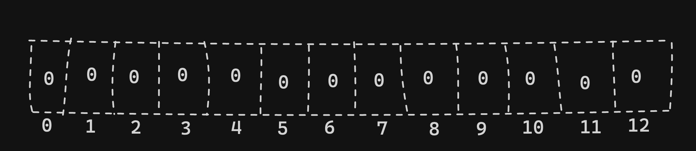
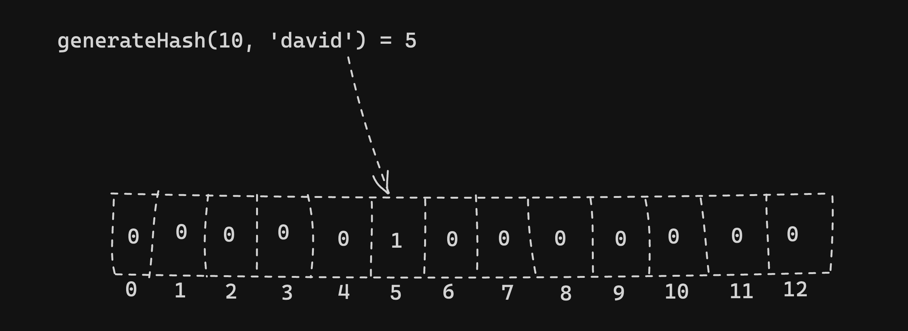
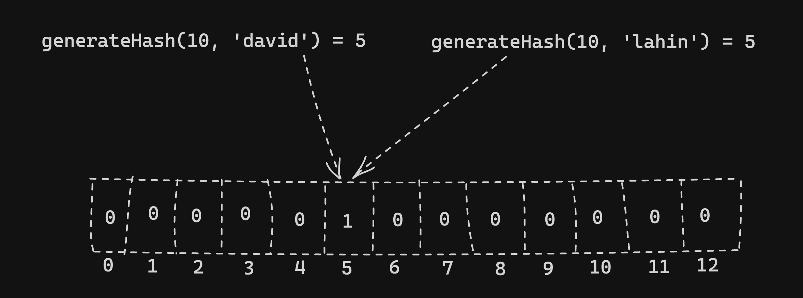

## ব্লুম ফিল্টার এ insertion কিভাবে কাজ করে?

- শুরুতে bucket এর সব index এর ভ্যালু 0।

  

- `generateHash(10, 'david')` এর রিটার্ন ভ্যালু 5, index 5 এর ভ্যালু 0 থেকে 1 বানানো হল, david এর একটি রেফারেন্স index 5 এ রাখবে।

  

- `generateHash(10, 'lahin')` এরও রিটার্ন ভ্যালু 5, index 5 এ এখন ২ টি রেফারেন্স থাকবে।

  

## ব্লুম ফিল্টার-এ সার্চ

আমরা যদি lahin সার্চ করতে যাই, `generateHash(10, 'david')` 5 রিটার্ন করবে। এখন index 5 এ কিন্তু david, lahin দুটি আছে এখানে Bloom Filter accurately বলতে পারবে না, সেজন্য বলবে থাকতেও পারে আবার নাও থাকতে পারে।

কিন্তু আমরা যদি john সার্চ করি তাহলে `generateHash(10, 'john')` 4 রিটার্ন করবে। যেহেতু index 4 এর ভ্যালু 0 সেজন্য Bloom Filter accurately বলতে পারবে john পাওয়া যায়নি।

## ব্লুম ফিল্টার-এ ডিলিট

যেহেতু index 5 এ দুটি ভ্যালুর রেফারেন্স আছে সেহেতু এখানে কোনো ভ্যালু Delete করা যাবে না।

## ব্লুম ফিল্টার এর সুবিধাগুলো

- constant time complexity
- constant space complexity
- no false negative
