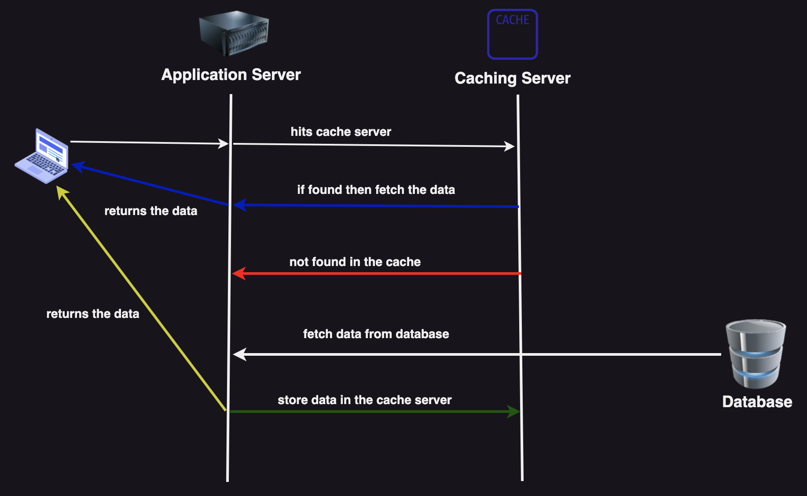
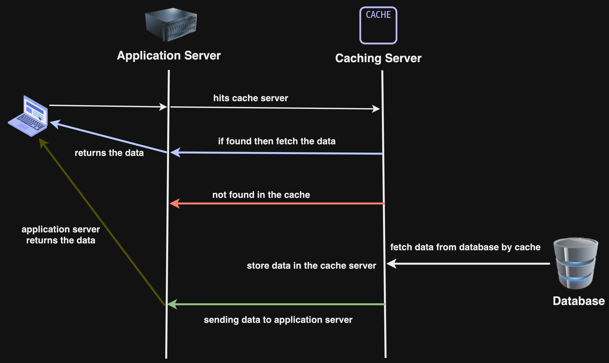

## Cache Invalidation

আমরা ক্যাশিং সার্ভারে সবসময়ের জন্য ডেটা স্টোর করে রাখতে পারবো না, একটি নির্দিষ্ট সময় পর ক্যাশিং সার্ভারের ডেটা খালি করে, নতুন ডেটা ক্যাশিং সার্ভারে স্টোর করে রাখতে হবে, এই পদ্ধতি হল Cache Invalidation।

আমরা যদি Cache Invalidation না করি তাহলে আমরা ক্যাশিং সার্ভারে Stale ডেটা পাব, কারণ ডাটাবেসে যদি নতুন ডেটা থাকে তখন ক্যাশিং সার্ভারে পুরোতন ডেটা থাকবে। যার ফলে ক্লায়েন্ট সবসময় পুরোনো ডেটা পাবে। এই জিনিসটি avoid করতে Cache Invalidation করা হয়।

Invalidate করার একটি পদ্ধতি হল, একটি নির্দিষ্ট সময়সীমা সেট করে দেয়া এই নির্দিষ্ট সময়সীমার পর ডেটা ক্যাশিং সার্ভার থেকে ডিলিট হয়ে যাবে, এই নির্দিষ্ট সময়সীমাকে TTL(Time to live) বলে। আরেকটি পদ্ধতি হল, যখনই নতুন রিকোয়েস্ট আসবে তখন ডাটাবেস আপডেট হওয়ার পাশাপাশি আমরা ক্যাশিং সার্ভারে Cache Invalidation করব।

## Cache Eviction

এটি একটি প্রসেস যার মাধ্যমে ক্যাশিং সার্ভার থেকে ডেটা বাদ দেয়া হয় যাতে করে নতুন ডেটা সংরক্ষণ করতে পারে। ক্যাশিং সার্ভারে সবসময় একটি Limited Capacity থাকে, যখন ক্যাশিং সার্ভার সম্পূর্ণভাবে ভরে যায় তখন এই Cache Eviction পদক্ষেপ নেয়া লাগে, যাতে করে নতুন ডেটা ক্যাশিং সার্ভারে সংরক্ষন করা যায়।

### Cache Eviction Policy

- Least Recently Used (LRU): এই স্ট্রাটেজিতে সম্প্রতি ব্যবহৃত না হওয়া ডেটাগুলোকে ক্যাশিং সার্ভারে থেকে বাদ দেয়া হয়।
- First-in-first-out (FIFO): এই স্ট্রাটেজিতে যে ডেটা ক্যাশিং সার্ভারে প্রথমে প্রবেশ করবে সেই ডেটা প্রথমে বাদ যাবে।
- Least Frequently Used (LFU): এই স্ট্রাটেজিতে যে ডেটা যত কমবার ব্যবহৃত হয়েছে সেই ডেটাগুলোকে ক্যাশিং সার্ভারে থেকে বাদ দেয়া হয়।

## Distributed Cahing

এটি একটি সিস্টেম যেখানে একাধিক ক্যাশিং সার্ভার থাকবে এবং কোনো নেটওয়ার্কের একাধিক নোডে বার বার আসা সেই রেস্পন্সের রিকোয়েস্টকে দ্রুত রেসপন্সটি একাধিক নোডে ডিস্ট্রিবিউট করতে পারে।

  

### কেন আমাদের Distributed Cahing এর প্রয়োজন?

আমাদের সিস্টেমকে স্কেল করতে। আমাদের ক্যাশিং সিস্টেমকে Resilient/Fault Tolerant করতে আমাদের Distributed Cahing প্রয়োজন।

## Caching Strategy

৫ প্রকারের Caching Strategy বিদ্যমান।

### Cache-aside:

- প্রথমে Client Application সার্ভারে request করবে, তারপর Application সার্ভার প্রথমে ক্যাশিং সার্ভারকে হিট করবে,,
- যদি ডেটা ক্যাশিং সার্ভারে বিদ্যমান থাকে তাহলে ক্যাশিং সার্ভার সেই ডেটা Application সার্ভারকে দিবে এবং Application সার্ভার সেই ডেটা Client কে দিবে।
- যদি ডেটা ক্যাশিং সার্ভারে বিদ্যমান না থাকে তাহলে Application সার্ভার Database হিট করবে এবং ডেটা সংগ্রহ করে ক্যাশিং সার্ভারে রাখবে এবং তারপর সেই ডেটা ইউজার কে রিটার্ন করবে।

  

#### Pros of cache-aside

- read-heavy application এর জন্য উত্তম।
- Cache server ডাউন থাকলেও request ব্যর্থ হওয়ার সুযোগ নাই, যেহেতু তখন ডাটাবেসে থেকে ডেটা নিবে।

#### Cons of cache-aside

- নতুন ডেটা Read এর ক্ষেত্রে সবসময় cache miss হবে।

Memcached এবং Redis, cache-aside caching strategy follow করে।

### Read-through:

- প্রথমে Client Application সার্ভারে request করবে, তারপর Application সার্ভার প্রথমে ক্যাশিং সার্ভারকে হিট করবে,
- যদি ডেটা ক্যাশিং সার্ভারে বিদ্যমান থাকে তাহলে ক্যাশিং সার্ভার সেই ডেটা Application সার্ভারকে দিবে এবং Application সার্ভার সেই ডেটা Client কে দিবে।
- যদি ডেটা ক্যাশিং সার্ভারে বিদ্যমান না থাকে তাহলে ক্যাশিং সার্ভার Database হিট করবে এবং ডেটা সংগ্রহ করে ক্যাশিং সার্ভারে রাখবে এবং তারপর সেই ডেটা Application সার্ভারকে রিটার্ন করবে।
- তারপর Application সার্ভার সেই ডেটা'টি ক্লায়েন্টকে দিবে।

  

#### Pros of Read-through

- read-heavy application এর জন্য উত্তম।
- Application Server এ কোনো প্রকারের Data Fetching হবে না।

#### Cons of Read-through

- নতুন ডেটা Read এর ক্ষেত্রে সবসময় cache miss হবে।

(বিস্তারিত চলমান)
