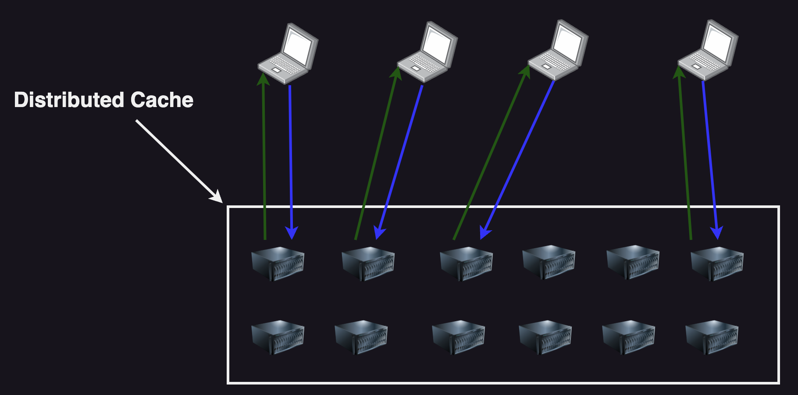

## Distributed Cahing

এটি একটি সিস্টেম যেখানে একাধিক ক্যাশিং সার্ভার থাকবে এবং কোনো নেটওয়ার্কের একাধিক নোডে বার বার আসা সেই রেস্পন্সের রিকোয়েস্টকে দ্রুত রেসপন্সটি একাধিক নোডে ডিস্ট্রিবিউট করতে পারে।

  

### কেন আমাদের Distributed Cahing এর প্রয়োজন?

আমাদের সিস্টেমকে স্কেল করতে। আমাদের ক্যাশিং সিস্টেমকে Resilient/Fault Tolerant করতে আমাদের Distributed Cahing প্রয়োজন।
