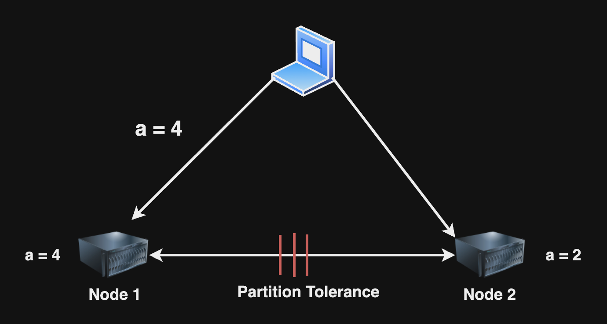
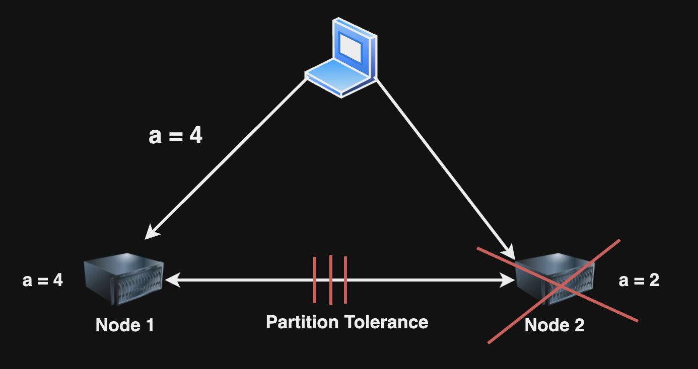

## Consistency, Availability & Partition Tolerance in Distributed System

কোনো Distributed System এ Consistency, Availability এবং Partition Tolerance সব একসাথে মিলে কাজ করতে পারবে না, হয় আপনাকে Consistency কিংবা Availability কিংবা Partition Tolerance secrifice করতে হবে। তারমানে যা দাড়ালো, সিস্টেমে 

* Consistency আর Availability থাকবে।
* Consistency আর Partition Tolerance থাকবে।
* Availability আর Partition Tolerance থাকবে।

এই তিনটি থেকে যেকোনো একটি মেনে চলবে।

### যদি সিস্টেমে Consistency আর Availability মেনে চলে

Distributed System এ Consistency আর Availability মেনে চলি তারমানে সিস্টেমের সব নোডে সবসময় Consistent Value থাকবে এবং প্রতিটি নোড সবসময় Available থাকবে। 

  

এখন যদি দুটি নোডের মধ্যে Partition Tolerance হয়,

  

Node 1 এ কোনো ভ্যালু আপডেট হলে সেটি আর Node 2 এর সাথে sync হতে পারবে না। তাহলে consistency আর থাকবে না। এখন সিস্টেমের consistency আর availability একসাথে Maintain রাখতে হলে তখন আমাদের সিস্টেম বন্ধ রাখতে হবে।

### যদি সিস্টেমে Consistency আর Partition Tolerance মেনে চলে

Distributed System এ Consistency আর Partition Tolerance মেনে চলি তারমানে সিস্টেমের সব নোডে সবসময় Consistent Value থাকবে এবং Partition Tolerance হলে অন্য নোড আর available থাকবে না।

  

Node 1 এবং Node 2 এর মধ্যে Partition Tolerance হওয়ার কারণে Node 2 এর ভ্যালু মানে a এর মানের কোনো পরিবর্তন হয় নাই। তখন consistency বজায় রাখার জন্য Node 2 সাময়িক সময়ের জন্য বন্ধ করতে হবে, মানে Node 2 এর availability secrifice করা। 

  

### যদি সিস্টেমে Availability আর Partition Tolerance মেনে চলে

Distributed System এ Availability আর Partition Tolerance মেনে চলি তারমানে সিস্টেমের সব নোডে সবসময় Consistent Value থাকা লাগবে না সিস্টেমের সব নোড Available থাকতে হবে যদি Partition Tolerance হয়ে থাকে। তারমানে এখানে consistency সেক্রিফাইস করতে হবে। 

  

সুতরাং যেকোনো ডিস্ট্রিবিউটেড সিস্টেমে একসাথে Consistency, Availability, Partition Tolerance চলবে না। 