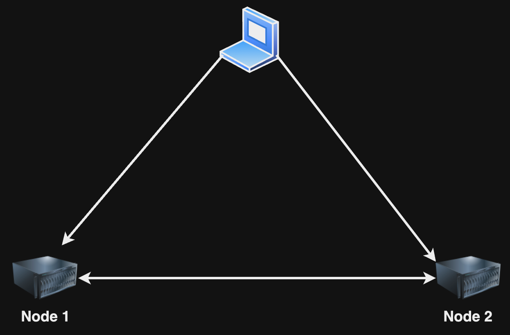
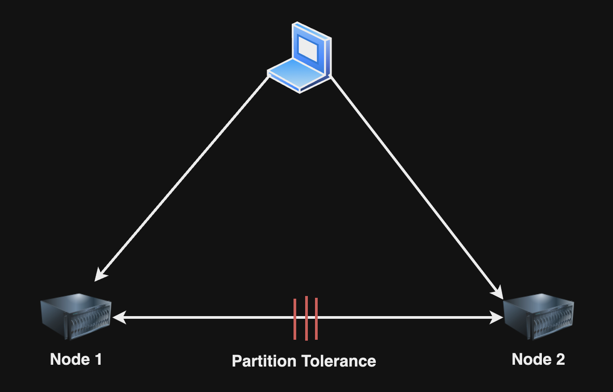

## Consistency, Availability & Partition Tolerance in Distributed System

কোনো Distributed System এ Consistency, Availability এবং Partition Tolerance সব একসাথে মিলে কাজ করতে পারবে না, হয় আপনাকে Consistency কিংবা Availability কিংবা Partition Tolerance secrifice করতে হবে। তারমানে যা দাড়ালো, সিস্টেমে 

* Consistency আর Availability থাকবে।
* Consistency আর Partition Tolerance থাকবে।
* Availability আর Partition Tolerance থাকবে।

এই তিনটি থেকে যেকোনো একটি মেনে চলবে।

### যদি সিস্টেমে Consistency আর Availability মেনে চলে

Distributed System এ Consistency আর Availability মেনে চলি তারমানে সিস্টেমের সব নোডে সবসময় Consistent Value থাকবে এবং প্রতিটি নোড সবসময় Available থাকবে। 

  

এখন যদি দুটি নোডের মধ্যে Partition Tolerance হয়,

  

Node 1 এ কোনো ভ্যালু আপডেট হলে সেটি আর Node 2 এর সাথে sync হতে পারবে না। তাহলে consistency আর থাকবে না। এখন সিস্টেমের consistency আর availability একসাথে Maintain রাখতে হলে তখন আমাদের সিস্টেম বন্ধ রাখতে হবে। 

তারমানে consistency আর availability এর জন্য Partition Tolerance বাদ দিতে হবে।