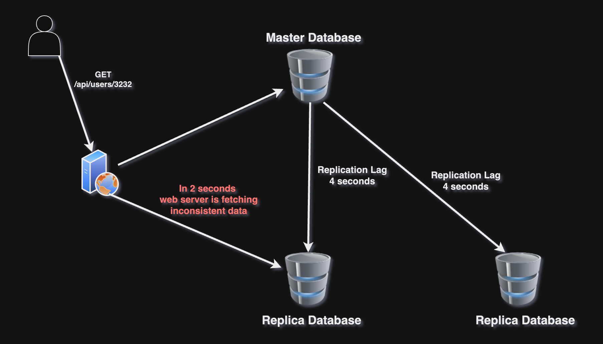
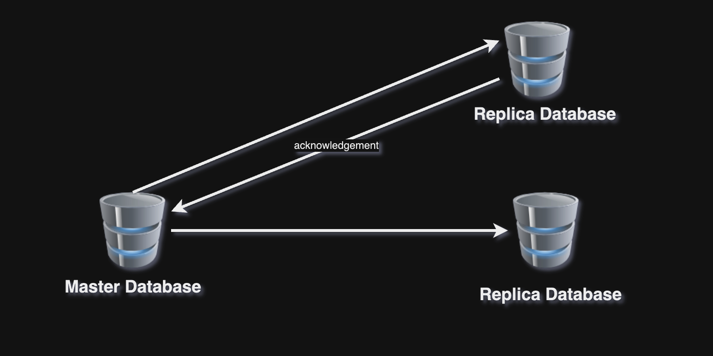
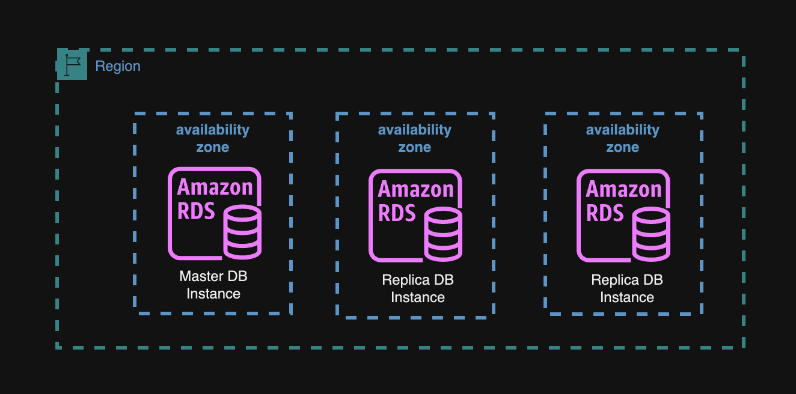

## Replication Lag

সর্বমোট যত সময় Master Database এর update কিংবা insert গুলোকে Replica ডাটাবেসগুলোতে replicate করতে লাগে, সেই সময়টি হচ্ছে Replication Lag।

Replication Lag এর জন্য একটি সমস্যা তৈরী হয়। যেমন, Master Database এ update কিংবা insert হলে তা replica ডাটাবেসগুলোতে replicate করতে গেলে যদি Replication Lag এর সময় বেশি হয়, তাহলে replicate করার সময় যদি read (replica database এ) read request আসে তখন different value অর্থাৎ inconsistent data রিড করার সুযোগ থাকে। 

  

## Consistency Model

### Synchronous Replication

নতুন কোনো write অপারেশন যখন Master ডাটাবেসে প্রয়োগ করা হয়, তখন Master ডাটাবেস প্রথমে সেই ভ্যালু নিজের মধ্যে আপডেট করবে, তারপর (read) replica ডাটাবেসগুলোতে write অপারেশন প্রয়োগ করতে বলবে, replica ডাটাবেসগুলোতে write অপারেশন হয়ে গেলে তখন এরা Master ডাটাবেসকে acknowledgement পাঠাবে, তখন Master ডাটাবেস নিশ্চিত হবে সব replica ডাটাবেসে consistent ভ্যালু আছে।

  

কোনো কারণে ভ্যালু update করার সময় কোনো replica ডাটাবেস নষ্ট কিংবা বন্ধ হয়ে গেলে, master database যখন দেখবে সেই নষ্ট হওয়া ডাটাবেস থেকে কোনো acknowledgement আসছে না তখন সেই ভ্যালুর আপডেট নিজের এবং বাকি replica ডাটাবেসগুলোতে করবে না কিংবা রিভার্ট করা হতে পারে।

### Asynchronous Replication

(চলমান)

## Benefits of Database Replication

Database Replication এর সুবিধা,

- Performance: যেহেতু সবধরনের Write, Update and Delete Master Database এ হবে এবং সবধরনের Read Slave Database এ হবে সেহেতু একাধিক Query Parallely সংঘটিত হবে যার ফলে Performance Better হবে। 

- Reliability: যদি কোনো Database Server নষ্ট হয়ে যায় তবুও আমরা সেই ডেটা অন্য কোনো Database Server এ পাব। ডেটা নষ্ট হওয়ার কোনো সুযোগ নেই।

- Availability: কোনো Database Server নষ্ট হয়ে যায় তখন আমরা অন্য Database Server থেকে ডেটা নিয়ে আমাদের System/Website কে সচল রাখতে পারি।

- Reduce Latency: একাধিক Database Server(Slave Database) থাকার ফলে Latency Time reduce হয়। 

## Some facts

- কোনো কারণে যেকোনো Slave Database নষ্ট হয়ে গেলে অন্য Slave Database থেকে ডেটা নেয়া যায়।

- Master Database নষ্ট হয়ে গেলে, কোনো Slave Database সেই নষ্ট Master Database কে Replace করবে। পরে নতুন Slave Database তৈরি হয়ে পুরনো Slave Database কে Replace করবে।

## How does AWS RDS multi az read replicas works to recover disaster?

ডাটাবেস সিস্টেমকে disaster recover করতে আমরা AWS RDS এর multi-az read replica feature ব্যবহার করতে পারি। 

একই region এর মধ্যে আমরা একাধিক Availability Zone থাকবে এবং তাদের ভিতর আমরা Database Instance রাখতে পারি। একটি Availability Zone এ আমরা Master Database রাখবো এবং বাকিগুলোতে Read Replica Database থাকবে। 

  

AWS RDS Synchronous Replication করে থাকে। কোনো কারণে Read Replica নষ্ট/বন্ধ হয়ে গেলে, AWS RDS নতুন Read রেপ্লিকা তৈরী করে নষ্ট কিংবা বন্ধ হয়ে যাওয়া Replica ডাটাবেসকে replace (প্রতিস্থাপন) করবে। 