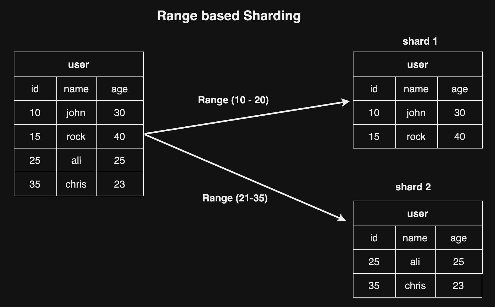
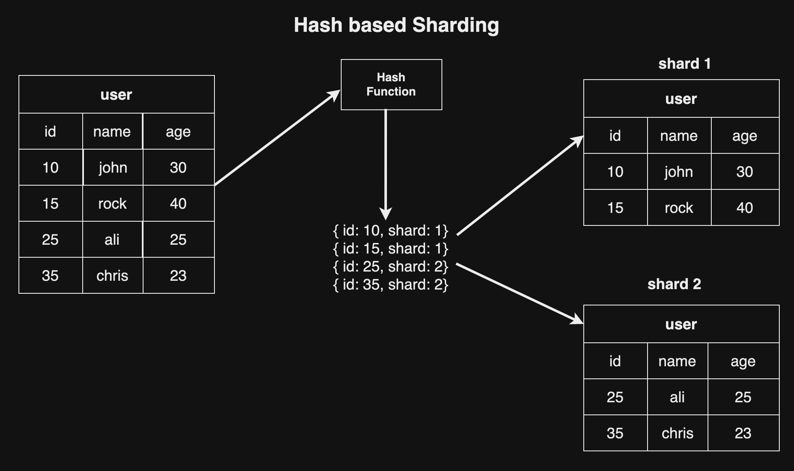

## Database Sharding এর সুবিধাগুলো

- **improve response time**: ডেটা retrive করা অনেক ফাস্ট হয়ে থাকে। একসাথে লক্ষ্য লক্ষ্য row থেকে ডেটা retrive করতে যত সময় লাগবে, ছোট ছোট সার্ড টেবিল থেকে ডেটা retrive করতে আরো কম সময় লাগবে। এভাবে response time ইম্প্রোভ করা যায়।

- **effective scaling**: মাল্টিপল সার্ড টেবিলে ডিস্ট্রিবিউট করার ফলে scalability ensure হয়ে থাকে।

- **database resiliency**: মাল্টিপল সার্ড টেবিলে ডিস্ট্রিবিউট করার ফলে প্রতিবার যখন নতুন ডেটা insert হয় database resiliency বজায় থাকে।

## Sharding Techniques

### Range Based Sharding

Range Based Sharding এ মূলত একটি নির্দিষ্ট রেঞ্জ এর ভিত্তিতে ডেটা বিভিন্ন সার্ড-এ ডিস্ট্রিবিউট হয়ে থাকে।

  

### Hash Based Sharding

Hash Based Sharding এ মূলত একটি **হ্যাশ ফাংশন** থাকবে যা বলে দিবে কোন row এর ডেটা কোন সার্ড এ যাবে।

  

