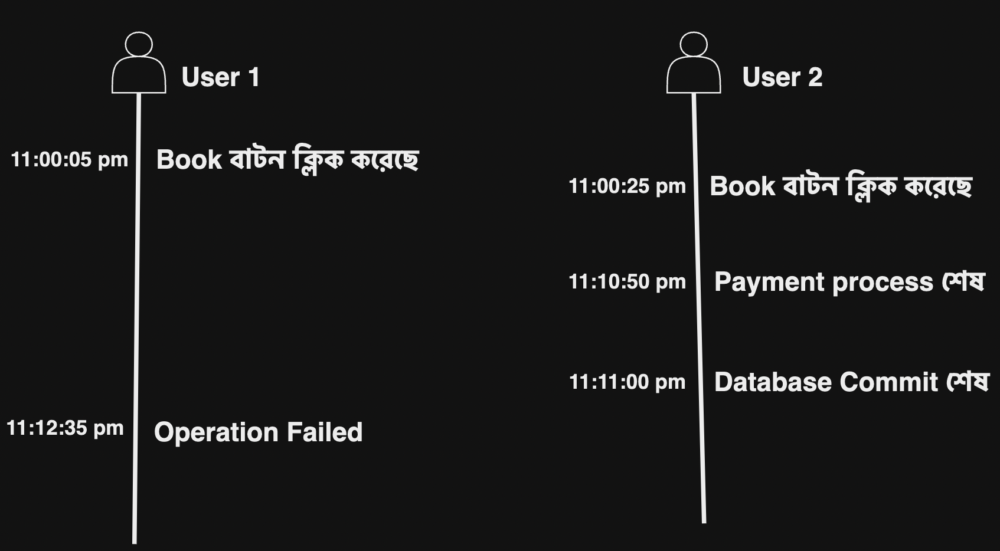
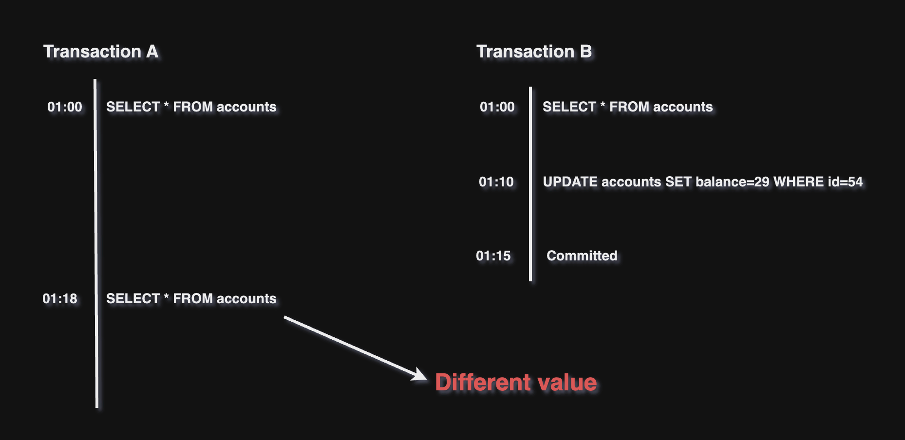
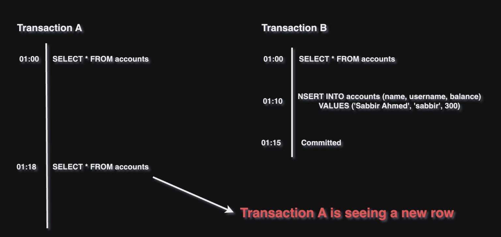

## Database Transaction

### Atomic update এবং Database Transaction

কোনো একদিন একজন user X একটি নির্দিষ্ট হোটেল রুম রিসার্ভ(reserve) করার চেষ্টা করছে। ঠিক একই সময় আরেকজন user Y একই রুম রিসার্ভ(reserve) করার চেষ্টা করছে।

ঠিক রাত ১১:০০:১২ ঘটিকায়, ২টি user একই সময় ফর্ম fill-up করেছে এবং "Reserve" বাটন ক্লিক করেছে।

এখন ২টি user এর ভিতর Race Condition তৈরী হবে।

ডাটাবেস ইঞ্জিন এর ভিতর Serialization ঘটবে, যাতে কোয়েরিগুলো একটি serial মেইনটেইন করে।

এখন Atomic update কিভাবে হবে?

- ধরে নি, user A এর রিকোয়েস্ট প্রথমে প্রসেস হচ্ছে,

```sql
UPDATE reservations SET status = 'booked', user_id = 1 WHERE room_number = 10;
```

User A এর জন্য রুম রিসার্ভ হয়ে গেলো।

- এখন, user B এর জন্য রিকোয়েস্ট প্রসেস হচ্ছে,

```sql
UPDATE reservations SET status = 'booked', user_id = 2 WHERE room_number = 10;
```

যেহেতু রুম নম্বর ১০ ইতিমধ্যে user_id = 1 এর দ্বারা রিসার্ভ হয়ে গেছে, সেহেতু user_id = 2 এর এই query কিছু করবে না।

**এই আচরণটি(behavior) Atomic Update নামে পরিচিত**। যা নিশ্চিত করে কমপক্ষে একটি query সফলভাবে রেকর্ড মোডিফাই করতে পারে।

এখন প্রশ্ন হচ্ছে Atomic Update থাকার পরেও আমাদের কেনো Transaction প্রয়োজন পড়ে?

ধরে নি, আমাদের সিস্টেম নিম্নলিখিত কাজগুলো করবে,

- প্রথমে user balance চেক করবে, reservation এর পূর্বে।
- রুম এর ভাড়ার পরিমান অনুযায়ী ব্যালান্স কেটে ফেলবে।
- রুম'টা রিসার্ভ করবে, ডাটাবেস এর reservation টেবিল এর মধ্যে।

**ট্রানসাকশান ছাড়া**,

— ১) user এর ব্যালান্স যাচাই করা —

```sql
SELECT balance FROM users WHERE id = 1;
```

— ২) ব্যালান্স কেটে নিলে —

```sql
UPDATE users SET balance = balance - 100 WHERE id = 1;
```

— ৩) reservations টেবিলে রুম বুক করা —

```sql
UPDATE reservations SET status = 'booked', user_id = 1 WHERE room_number = 10;
```

সমস্যা: যদি ব্যালান্স কেটে নেয়া হয়ে যায়, তখন অন্য কোনো user তার নিজের জন্য স্টেপ ৩ প্রসেস করে ফেলে তাহলে প্রথম user এর জন্য ব্যালান্স কেটে নেয়া হয়েছে কিন্তু তার জন্য রুম বরাদ্ধ করা হয় নি।

**এই সমস্যার সমাধান করে থাকে Database Transaction**।

### কখন ট্রানসাকশান ব্যবহার করতে পারি?

- Financial এবং Banking Application। কেনো? কারণ এগুলোতে Money Transfers এবং Withdrawals হয়ে থাকে।
- E-Commerce এবং Online Marketplace। কেনো? কারণ এগুলোতে Order, Payment এবং Inventory তে Consistency বজায় রাখা লাগে।

Transaction মূলত আমাদেরকে ৪'টি features দিয়ে থাকে।

- Atomicity
- Consistency
- Isolation
- Durability

### Atomicity

যখন কোনো(/একটি) ক্লায়েন্ট একাধিক WRITE অপারেশন চালাতে যায় অর্থাৎ যদি ৪ টি WRITE অপারেশন এর মধ্যে ২ টি WRITE অপারেশন successfully চালানোর পর কোনো Fault সংগঠিত হয়, (যেমন- process crushes, network communication interrupt হলে কিংবা ডিস্ক সাইজ full হয়ে গেলে।) তখন successfully সংগঠিত হওয়া অপারেশনগুলোকে রিভার্ট করে দিবে। কারণ তখন ৪ টি অপারেশন একটি সিঙ্গেল লজিকাল ইউনিট এর ভিতর থাকবে।

Atomicity ছাড়া কোন query সাকসেস কিংবা fail হয়েছে তা বের করা অসম্ভব।

### Consistency

ACID এর প্রপার্টিগুলোর মধ্যে Consistency অন্যতম গুরুত্বপূর্ণ টপিক। যার মানে হচ্ছে ট্রান্সেকশন শুরু হওয়ার পূর্বে এবং ট্রান্সেকশন শেষ হওয়ার পরে যোগফল সবসময় একই থাকবে।

উদাহরণ বলা যায়, আপনি ATM থেকে কিছু টাকা বের করতে গিয়েছেন। আপনার Account এ সর্বমোট ১০,০০০ টাকা আছে, আপনি ATM মেশিন এ ৫,০০০ টাকা বের করার জন্য আপনার PIN number দিয়ে রিকোয়েস্ট করলেন।

আপনি ৫,০০০ টাকা পেয়ে গেলেন। তাহলে এখন আপনার account এ (১০,০০০ - ৫,০০০) মানে ৫,০০০ টাকা আছে এবং ATM থেকে আপনার হাতে পেলেন ৫,০০০। (বর্তমানে একাউন্ট এ) ৫,০০০ + (নিজের হাতে) ৫,০০০ = ১০,০০০, ট্রান্সেকশন শুরু হওয়ার পূর্বে account এ ছিল ১০,০০০ এবং ট্রান্সেকশন শেষ হওয়ার পরে ১০,০০০। তাহলে আমরা বলতে পারি Consistency মেইনটেইন করা আছে।

এখন যদি ATM কোনো একটা সমস্যার কারণে আপনাকে ৫,০০০ টাকা না দিয়ে আপনার মোবাইলে SMS আসে আপনার account এ বর্তমানে ৫,০০০ আছে তাহলে তখন Consistency মেইনটেইন থাকা হলো না।

### Isolation

Isolation বাকিগুলোর মত খুবই গুরুত্বপূর্ণ বিষয়। যা আমাদেরকে নিশ্চিত করে একাধিক concurrent ট্রান্সেকশন স্বাধীনরূপে কাজ করবে, যাতে Data Integrity বজায় থাকে।

একাধিক ট্রান্সেকশন থাকার ফলে Race Condition সমস্যা তৈরী হয়। Isolation এর কাজ তা সমাধান করা, যাতে একাধিক ট্রান্সেকশন একে অপরের সাথে কোনো হস্তক্ষেপ না করে স্বাধীনভাবে কাজ করে।

Race Condition এর একটি বাস্তবধর্মী উদাহরণ হল, একটি হোটেল বুকিং ওয়েবসাইটে একজন user(1) রুম বুক করছে। পেমেন্ট প্রসেস সম্পন্ন করার পূর্বে অন্য আরেকজন user(2) এসে একই রুম বুক করার চেষ্টা করতে পারে।

এখন user(2) সব payment প্রসেস শেষ করে Database Commit(মানে স্থায়ীভাবে ডিস্কে ইন্সার্ট হবে) করে ফেললো, তারপর user(1) যখন payment প্রসেস করতে যাবে তখন Operation Failed কিংবা কোনো error মেসেজ (যেমন, রুম বুক করা হয়ে গেছে অন্য কারো দ্বারা) দেখাবে।

<p align="center">
  
</p>

এটি হচ্ছে Race Condition। এই প্রকারের সমস্যা আমরা সরাসরি কিভাবে Database Locking ব্যবহার করে সমাধান করতে পারি তা সামনে আমরা দেখবো। Isolation মূলত নির্ধারণ করে, যে একাধিক Transaction এর ফলে সৃষ্টি হওয়া সমস্যা কিভাবে দেখাবে। অন্যদিকে Locking mechanism ব্যবহার করে আমরা সেই সমস্যা সমাধান করতে পারি।

এসব সমস্যা সমাধানের পূর্বে আমাদের Isolation Level বুঝতে হবে। ৫ প্রকারের Isolation Level আছে যা বুঝা অত্যন্ত প্রয়োজনীয়।

- Read Uncommitted
- Read Commited
- Repeatable Read
- Snapshot
- Serializable

এই ৫ প্রকারের Isolation Level এর কারণে ৩ প্রকারের Anomalie তৈরী হয়।

- Dirty Read
- Non-Repeatable Read
- Phantom Read

Isolation Level বুঝার পূর্বে ৩ প্রকারের Anomalie বুঝতে হবে।

#### Dirty Read

যখন কোনো ট্রান্সেকশন UnCommitted ভ্যালু read করে তখন তাই হচ্ছে Dirty Read।

উদাহরণ, Transection A একটি নির্দিষ্ট Row এর Column আপডেট করে দিল কিন্তু এখন পর্যন্ত Commit করা হলো না। এখন Transection B একই Column read করলো। তারপর Transection A যে Column টি আপডেট করেছিল তা Rolled Back করে দিলো।

তারমানে দাঁড়ালো Transection B Dirty Read করেছে। নিচের ছবি দেখলে আমরা উদাহরণ বুঝতে পারবো।

<p align="center">
  
</p>

Transaction A এর দ্বারা Rollback হওয়ার কারণে, ০১:১৫ ঘটিকার সময় Transaction B এর দ্বারা Read query-টি Dirty Read হয়ে গিয়েছে।

#### Non-Repeatable Read

যখন একটি Transaction একই ডাটা read দুবার করে, কিন্তু দুবার read করার মধ্যবর্তী সময়ে ডাটা পরিবর্তন হয়ে যায়, অন্য কোনো Transaction এর কারণে, তখন সেটাই হচ্ছে Non-Repeatable Read।

উদাহরণ বলা যায়, Transaction A, accounts টেবিল read করলো। একই সময়ে Transaction B accounts টেবিল read করলো। তখন দুই Transaction একই ডাটা দেখবে। এখন ১০ মিনিট পর Transaction B একটি নির্দিষ্ট row এর balance-column এর ভ্যালু ২৯ দ্বারা পরিবর্তন করে দিলো। আর ৫ মিনিট পর Transaction B তা commit করে দিলো।

এখন Transaction B দ্বারা commit হওয়ার ৩ মিনিট পর, Transaction A আবার accounts টেবিল read করলো। এখন Transaction A পরিবর্তিত ডাটা দেখবে, যা তার পূর্বের read query সাথে সাদৃশ্য থাকবে না।

এই সাদৃশ্য না থাকার বিষয়টি হচ্ছে Non-Repeatable Read।

<p align="center">
  
</p>

#### Phantom Read

একটি উদাহরণ দিয়ে বুঝানো যাক, একটি Transaction একটি টেবিল এর মধ্যে read query চালানোর ফলে কিছু ডাটা পাওয়া গেলো। এখন কিছু সময় পর অন্য আরেকটি Transaction এসে টেবিল এর একটি row ইন্সার্ট করে দিয়ে দিলো। তার কিছু সময় পর তা commit করা হলো। এখন পূর্বের transaction আবার read query করলে এখন ভিন্ন ডাটা দেখবে। এই বৈসাদৃশ্য এর ব্যাপারটাই হচ্ছে Phantom Read।

<p align="center">
  
</p>

যেকোনো Data Modification Operations মানে Insert, Update কিংবা Delete এর কারণে Phantom Read anomalie হতে পারে।

এখন আমরা Isolation Level বুঝবো সাথে তাও বুঝবো কোন Isolation Level কোন Anomalie তৈরী করে।

#### Read Uncommitted

একে Lowest Isolation Level হিসেবে বিবেচনা করা হয়। একে Lowest বলার কারণ হচ্ছে, Transaction ডাটা read করতে পারে যা অন্য Transaction এর দ্বারা manipulate হয়েছে, এমনকি সেই Transaction committed না হলেও।

তাই এই লেভেলে Dirty Read anomalie থাকতে পারে। কারণ কোনো transaction এমন কোনো ডাটা read করতে পারে যা অন্য transaction সেই manipulate হওয়া এবং যে Transaction manipulate করেছে সেই Transaction নিজ থেকে Rolled Back করে দিতে পারে।

এই লেভেলে মূলত Consistency কে গুরুত্ব দেয়া হয় নি।

#### Read Committed

এতে কোনো Transaction মনে করুন, Transaction-A যখন read করবে তখন সবসময় সে Committed ভ্যালু দেখবে। যার ফলে Dirty Read হওয়ার সুযোগ থাকে না। অন্য Transaction-B দ্বারা তৈরী কোনো Data Modification Operations যতক্ষণ না পর্যন্ত commit হচ্ছে ততক্ষন সেই Transaction-A কোনো Read করতে পারবে না।

Database Table read block করা থাকবে Transaction-A এর জন্য।

আমরা বলতে পারি, Read Committed এ Non-Repeatable Read anomalie হতে পারে।

PostgreSQL এর default Isolation Level হচ্ছে Read Committed।

#### Repeatable Read

যখন কোনো Transaction-A যতবার read query চালাবে ততবার Transaction-A একই ডাটা দেখবে, এমনকি অন্য কোনো Transaction-B দ্বারা ডাটা মোডিফাই করে থাকলেও। কিন্তু অন্য Transaction-B দ্বারা কোনো row insert হলে কিংবা delete হলে তা যখন একবার কমিট হয়ে যাবে তখন Transaction-A তা দেখতে পারবে।

Repeatable Read মূলত Row-level consistency বজায় রাখে। সেজন্য নতুন row insert কিংবা row delete হলে তা দেখা যায়।

তাহলে আমরা বলতে পারি, Repeatable Read এ Dirty Read এবং Non-Repeatable Read হবে না তবে Phantom Read anomalie হতে পারে।

MySQL database এর default Isolation Level হচ্ছে Repeatable Read।

(যদিও MySQL এর InnoDB "next-key locking" algorithm ব্যবহার করে যাতে Phantom Read anomalie না হয়।)

#### Snapshot

এই Isolation Level-এ, প্রতিটি Transaction একটি Database Snapshot এর সাথে কাজ করা হয়, যা Transaction শুরু হওয়ার সময় নিয়ে থাকে। Snapshot মূলত Database এর এক প্রকারের কপি। প্রতিটি Transaction নিজ নিজ অপারেশন স্বাধীনভাবে চালাতে পারে।

যতক্ষণ না পর্যন্ত changes কমিট করা হচ্ছে অন্য transaction দ্বারা changes কখনো দেখতে পারবে না।

এতে করে আমরা Dirty Read, Non-repeatable Read এবং Phantom Read anomalie থেকে বিরত থাকতে পারবো।

#### Serializable

একে Highest Level এর Isolation হিসেবে গণ্য করা হয়। এতে প্রতিটা Transaction গুলোর ফলাফল সিরিয়াল (একটি একটি করে) এক্সেকিউশন এর মতো দেখানো হয়ে থাকে।

এতে করে আমরা Dirty Read, Non-repeatable Read এবং Phantom Read anomalie থেকে বিরত থাকতে পারবো।

কেন আমরা কোনো Anomalie পাবো না?

- Dirty Read: কোনো Transaction আরেকটির Transaction দ্বারা তৈরী হওয়া uncommitted data পড়তে পারে না।
- Non-repeatable Read: একই query multiple times চালালে একি ডেটা রিটার্ন হয়।
- Phantom Read: নতুন বা মুছে ফেলার Transaction মধ্যে ভিন্ন ফলাফল দেখায় না।

যেহেতু Transaction গুলোর ফলাফল serially দেখানো হবে সেহেতু এই Isolation Level এ Conflict হতে পারে। দুটি কিংবা তার থেকে বেশি Concurrent Transaction একই ডেটার উপর কাজ করার চেষ্টা করে তাহলে conflict হওয়ার সুযোগ খুব বেশি। তখন,

- একটি Transaction কে rollback করা হয়।
- অথবা একটি Transaction কে wait করতে বাধ্য করা হয়।

<p align="center">
  
</p>

- Transaction 2 এর SELECT স্টেটমেন্ট 2000 দেখতে পাবে কারণ Transaction 1 এখনও COMMIT করেনি।
- Transaction 2 এর UPDATE Conflicts করবে কারণ Transaction 1 COMMIT করার পরে balance এর মান 1950 হয়ে যায়।
- (one-after-another) অর্ডার মেইনটেইন করলে, Transaction 2 ROLLBACK হবে।
- Balance হবে 1950।

একটি গুরুত্বপূর্ণ প্রশ্ন রয়ে যায়,

Transaction 2 update অপারেশন চালানোর সময় কেনো Transaction 1 এর দ্বারা কমিট করা ভ্যালু দেখতে পায় না?

প্রতিটা Transaction তাদের Transaction এর শুরুতে টেবিলের একটি consistent snapshot capture করে এবং read queries এই snapshot থেকে কাজ করে। এজন্য read queries অন্য Transaction দ্বারা commit করা ভ্যালু দেখতে পায় না। তবে write queries এর ক্ষেত্রে ডাটাবেস serializability বজায় রাখার জন্য conflict detection প্রয়োগ করে।

যদি Transaction 2 কনফ্লিক্টের কারণে Rollback করা হয়, তবে Transaction 2 এর সব মধ্যবর্তী পরিবর্তন বাতিল হয়ে যাবে। যখন Transaction 2 restart হবে তখন সে নতুন consistent snapshot দেখবে যা Transaction 1 এর দ্বারা পরিবর্তিত।

এখন একাধিক Transaction এর জন্য আমরা practically কিভাবে consistency বজায় রাখতে পারবো?

আমাদের কাছে ২ টি option আছে,

- Pessimistic Locking
- Optimistic Locking

## Pessimistic Locking

Pessimistic Locking এ যখন কোনো ডাটা access কিংবা update করা হয় তখন সেই row কিংবা সেই ডাটাকে lock করে রাখা হয়, যাতে অন্য Transaction তা কোনো প্রকারের মোডিফাই করতে না পারে।

### Pessimistic Locking এবং Serializable Isolation level

যদিও Serializable isolation level নিশ্চিত করে Serializability, তবুও আমাদের Locking Mechanism ব্যবহার করা লাগে।

যেমন: একটি Transaction নির্দিষ্ট row এর উপর কাজ চলাকালীন, অন্য Transaction সেই row read করতে না পারে সেজন্য Pessimistic Locking কাজে আসবে।

MySQL এ আমরা যেভাবে Isolation Level Serializable বাছাই করে Pessimistic Locking ব্যবহার করতে পারি।

```sql
SET TRANSACTION ISOLATION LEVEL SERIALIZABLE;
START TRANSACTION;

SELECT balance FROM accounts WHERE id=1 FOR UPDATE;

UPDATE accounts SET balance=balance-50 WHERE id=1;

COMMIT;
```

(চলমান...)
