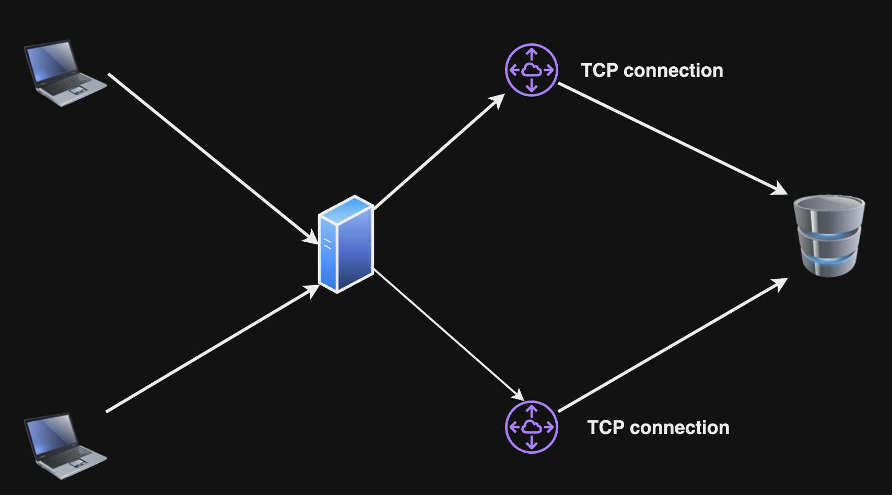
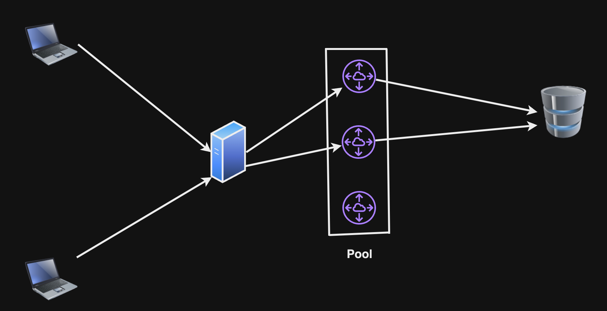
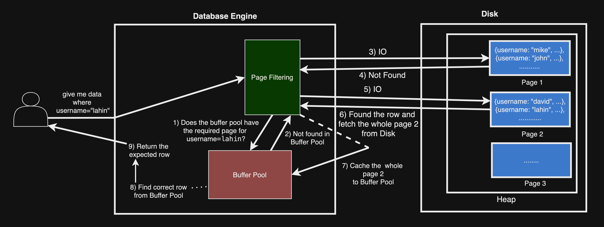

## কখন SQL কিংবা NoSQL ব্যবহার করব?

কোন প্রকারের ডাটাবেস নির্বাচন করব সেজন্য আমাদের সিস্টেম নিয়ে নিচের বিষয়গুলোর উত্তর জানা দরকার,

- ডাটাবেস দিয়ে প্রয়োজনীয় Query চালাতে পারবো কি না?
- ডাটাবেসের Table কি প্রয়োজনীয় সংখ্যক ডাটা store করে রাখতে পারবে কি না?
- কয়টি নোড থাকতে পারবে?
- Maintenance কি রকম হবে, মানে schema বদলাবে কি না?

এখন SQL এবং NoSQL এর কিছু বৈশিষ্ট্য আছে যা আমাদের সাহায্য করবে কোন ডাটাবেস নির্বাচন করব,

- Predetermined Schema: SQL দিয়ে আমরা কোনো operation (read, insert, update, delete) চালানোর আগে আমাদের টেবিলের schema Predetermined থাকতে হবে। টেবিলের schema Predetermined বলতে বুজানো হচ্ছে একটি টেবিল যেমন user table এখানে schema হবে,

  - id
  - name
  - email
  - password
  - (ইত্যাদি)

এইগুলো Predetermined মানে পূর্বনির্ধারিত থাকলে, আমরা SQL ভিত্তিক RDBMS Database যেমন MySQL, PostgreSQL ইত্যাদি ব্যবহার করতে পারব।

অপরপক্ষে schema যদি Predetermined না থাকে তাহলে NoSQL ব্যবহার করা যায়। NoSQL এর ডেটা সাধারণত key-value, Document, Graph আকারে ডিস্কে স্টোর হয়ে থাকে, সেজন্য schema ফিক্সড হওয়া লাগে না।

- Scalability: ডেটা অনেক বেশি হয়ে গেলে SQL ভিত্তিক Database গুলোতে ভার্টিকাল স্কেলিং করা হয় মানে storage এর capacity বৃদ্ধি করা। (তাছাড়া Database Sharding-ও করা হয়ে থাকে)

আর NoSQL ভিত্তিক হরাইজন্টাল স্কেলিং করা হয় মানে সার্ভারের Capacity বৃদ্ধি করার পরিবর্তে নতুন সার্ভার যোগ করাই হল হরাইজন্টাল স্কেলিং।

এখন আমাদের সিস্টেম এ কোন রকমের scaling করলে আমাদের system চালাতে পারব তার উপর ভিত্তি করে সিদ্ধান্ত নিব।

- ACID: SQL ভিত্তিক Database সাধারণত ACID property follow করে থাকে। যেখানে A মানে Atomicity, C মানে Consistency, I মানে Isolation এবং D মানে Durability। এগুলোর উদ্দেশ্য হল Data Integrity এবং Consistency বজায় রাখা। যেমন Banking Software/ATM Vendor Machine এগুলোর জন্য ACID খুব গুরুত্বপূর্ণ।

ACID খুবই গুরুত্বপূর্ণ বিষয়। ACID বুজতে হলে আমাদেরকে **Transaction** বুঝতে হবে।

**Transaction বুজতে হলে এখানে [ক্লিক করুন](https://github.com/lahin31/system-design-bangla/blob/master/sections/database/transaction/README.md)।**

NoSQL ভিত্তিক Database, BASE মানে (Basically Available, Soft state, Eventual consistency) সাপোর্ট করে।

এখন আমাদের সিস্টেমে Data Integrity/Consistency(Strong Consistency) বজায় রাখতে চাইলে আমরা **SQL ভিত্তিক Database ব্যবহার করব**, না হয় **NoSQL ভিত্তিক Database**।

## Database Performance

Database Performance সিস্টেম ডিজাইনে খুবই গুরুত্বপূর্ণ বিষয়।

### Database Indexing

Database Indexing একটি সাধারণ টেকনিক যা আমাদের Database Query কে দ্রুত সম্পন্ন করে থাকে।

সাধারণত ডেটা Disk-এ সংরক্ষন হয়ে থাকে। যখন ডেটা বেড়ে যায় তখন সেই ডেটাগুলো থেকে Query করতে অনেক সময় লাগে, এই সময় কমানোর জন্য আরেকটি টেবিল Disk-এ তৈরী হয় যাকে Index Table বলে। এই Index Table-এ মূলত আমাদের মূল টেবিল এর row(s) এর সাথে একটি লিংক করা থাকে, সেটি key-value আকারেও থাকতে পারে। যখন নতুন row কিংবা entry ডেটাবেস টেবিলে insert হয়, Index Table-এ সেই নতুন ডেটার সাথে একটি লিংক তৈরী হয় (সেজন্য আমাদের write operation slow হয়ে যেতে পারে আর read operation fast হয়)।

পরবর্তী সময়ে যখন কেউ নির্দিষ্ট ডেটা query করবে, তখন Index Table বলে দিবে কোন এড্ড্রেসে বা কোন ব্লকে ডেটা আছে।

বিস্তারিত জানতে চাইলে আমার ব্লগ দেখতে পারেন,

- https://codemacaw.com/database-indexing-makes-db-query-faster/
- https://codemacaw.com/what-is-b-tree-b-tree-in-dbms/

### Query Optimization

Query লিখার সময় আমরা Query Optimize ভাবে লিখলে আমরা Query Execution Time কমাতে পারবো। কিছু উদাহরণ,

- নির্দিষ্ট ফিল্ড (যেমন, SELECT name, username FROM users) সিলেক্ট করা SELECT \* এর পরিবর্তে।
- SELECT DISTINCT সম্ভব হলে avoid করা।
- WHERE ব্যবহার করা HAVING এর পরিবর্তে।
- LIMIT ব্যবহার করা।
- INNER JOIN ব্যবহার করা।
- Number of Sub-queries কমানো।
- Complex Query এর জন্য Stored Procedure ব্যবহার করা। এতে করে আমরা Network Traffic কমাতে পারি।
- WHERE clause এর ভিতর Scaler Function ব্যবহার না করা। WHERE clause এর ভিতর Scaler Function ব্যবহার করলে Query Optimizer, Index কে ব্যবহার করতে পারে না।
- Normalize অথবা Denormalize অনুযায়ী Schema Design করা।
- n+1 query execute না করা।

### Database Sharding

Database Sharding হল টেবিল থেকে ডেটা পৃথক করা। উদাহরণ বলা যায়, ডাটাবেসের ডেটা/row যদি বাড়তে থাকে এবং এত পরিমাণ ডেটা/row বেড়ে গেল যার ফলে ডাটাবেস টেবিলে আর স্টোর করা যায় না তখন আমরা ডেটাগুলোকে মূল টেবিল থেকে পৃথক করে অন্যান্য shard টেবিলে distribute করে রাখি সেটাই Database Sharding। একাধিক সার্ভার এই ডিস্ট্রিবিউশন হবে।

<p align="center">
  
</p>

### Connection Pool

সাধারণত ডেটাবেসে কোনো ক্লায়েন্ট যখন রিকোয়েস্ট করে তখন তার জন্য একটি dedicated tcp connection তৈরী হয়ে থাকে, যখন ক্লায়েন্ট এর কাজ শেষ হয়ে যাবে তখন tcp connection শেষ হয়ে যাবে। ।

<p align="center">
  
</p>

এরকম প্রতিটি ক্লায়েন্ট এর ক্ষেত্রে নতুন connection তৈরী হয়। এখন হাজার হাজার ক্লায়েন্ট ডেটাবেসে connection তৈরী করার চেষ্টা করে তখন Latency বৃদ্ধি পায়। এটি এড়াতে Connection Pool ব্যবহার করা হয়।

এটি একটি pool যেখানে একাধিক connection open হয়ে থাকবে, যখন কোনো ক্লায়েন্ট রিকোয়েস্ট আসবে তখন একটি connection সেই ক্লায়েন্ট ব্যবহার করতে পারবে। এতে করে বার বার connection তৈরী হওয়া এবং নষ্ট হওয়া থেকে এড়াতে পারব। আমরা specifically বলে দিতে পারব কয়টি connection, pool এর ভিতর থাকবে। ক্লায়েন্ট রিকোয়েস্ট pool এর connection এর চেয়ে বেশি হয়ে গেলে client কে wait করা লাগবে।

<p align="center">
  
</p>

Connection Pool এর size randomly সেট করা যাবে না। Concurrent Users এর সংখ্যা নিয়ে চিন্তা করতে হবে। উদাহরণস্বরূপ, যদি আপনার অ্যাপ্লিকেশনে ২০০০ concurrent users থাকে, তবে সব ২০০০ ব্যবহারকারী একসঙ্গে ডেটাবেসে আঘাত করবে না। তাই কত শতাংশ ব্যবহারকারী একযোগে ডেটাবেস request করবে তা estimate করুন এবং সেই অনুযায়ী Connection Pool এর size নির্ধারণ করুন।

### Buffer Pool (InnoDB অনুসারে)

এটি মূল মেমোরি বা RAM এর ভিতরের একটি এলাকা, যেখানে InnoDB (MySQL ইঞ্জিন) টেবিল এবং ইনডেক্স ডেটা ক্যাশ করে রাখে যখন তা access করা হয়। ডেটা সরাসরি বাফার পুল থেকে অ্যাক্সেস করার মাধ্যমে আমরা query processing এর সময়কে দ্রুততর করতে পারি।

Buffer Pool বিভিন্ন pages এর সমন্বয়ে গঠিত, এবং প্রতিটি page-এ ডেটার সারি (rows of data) থাকে। এটি মূলত লিংকড লিস্ট ডেটা স্ট্রাকচার অনুযায়ী সাজানো থাকে।

সাধারণত ডিস্ক থেকে ডাটা fetch করে আনা, সময় সাপেক্ষ ব্যাপার। এক্ষেত্রে Buffer Pool অনেক উপকারী।

ডেটার জন্য ডিস্ক এর মধ্যে সার্চ করার পরিবর্তে, বাফার পুল থেকে সার্চ করে ডাটা নেয়া হয়। যদি বাফার পুল এর মধ্যে ডাটা না পাওয়া যায় তাহলে disk এর ভিতর সার্চ করে ডাটা নেয়া হবে, তারপর ডাটাকে বাফার পুলের ভিতর cache করে রেখে দেয়া হয়।

InnoDB ডাটাবেস ইঞ্জিন এর Default buffer pool এর size হচ্ছে ১২৮ এমবি, যা মূলত ডেভেলপমেন্ট environment এর জন্য, প্রোডাকশন environment এর জন্য এর size নির্ভর করে কিছু বিষয়ের উপর।

বাফার পুলের size, innodb_buffer_pool_chunk_size \* innodb_buffer_pool_instances এর হয় সমান থাকবে কিংবা multiple থাকবে।

- innodb_buffer_pool_chunk_size: এটি মূলত বাফার পুলের chunk size কত তা বলে দেয়। MySQL এর InnoDB storage engine এর ভিতর বাফার পুল chunk হিসেবে ভাগ করা থাকে। প্রতিটি chunk একটি নির্দিষ্ট মেমোরি সাইজ দ্বারা নির্ধারিত হয়, যা innodb_buffer_pool_chunk_size দ্বারা configure করা হয়।

```sql
SHOW VARIABLES LIKE 'innodb_buffer_pool_chunk_size';
```

উপরের SQL command দ্বারা আমরা জানতে পারবো, বাফার পুল কয়টি chunk এ ভাগ করা হয়েছে।

- innodb_buffer_pool_instances: এটি দ্বারা বুঝা যায়, প্রতিটা বাফার পুলকে কয়টি instance এ ভাগ করা হয়েছে।

```sql
SHOW VARIABLES LIKE 'innodb_buffer_pool_instances';
```

উপরের SQL command দ্বারা আমরা জানতে পারবো, প্রতিটা বাফার পুলকে কয়টি instance এ ভাগ করা হয়েছে।

মনে করি,

- innodb_buffer_pool_chunk_size = 128MB
- innodb_buffer_pool_instances = 4

তাহলে innodb_buffer_pool_size হতে পারে,

- 128MB × 4 = 512MB
- 128MB × 4 × 2 = 1024MB = 1GB

আমরা যেকোন একটি নির্বাচন করতে পারি। তবে আমাদের সিস্টেমের RAM এর প্রতি খেয়াল রাখতে হবে।

ধরে নি, innodb_buffer_pool_size = ১ GB

RAM যদি ৮ GB হয়?

তাহলে ১ GB মানে, ১২.৫% শুধু বাফার পুলের জন্য বাকি ৮৭.৫% অন্যান্য প্রসেসিং এর জন্য বরাদ্ধ করা হয়, যা সাধারণত acceptable।

RAM যদি ৪ GB হয়?

তাহলে ১ GB মানে, ২৫% শুধু বাফার পুলের জন্য বাকি ৭৫% অন্যান্য প্রসেসিং এর জন্য বরাদ্ধ করা হয়, যা সাধারণত acceptable।

### Hardware এবং Infrastructure

আমাদের ডাটাবেস এর পারফরমেন্স ভালো করতে পারে সেজন্য আমাদের requirements অনুযায়ী Hardware এবং Infrastructure নেয়া।

## Write/Update অপারেশন এর জন্য Performance Optimization

- অপ্রোজনীয় কলাম ইনডেক্সিং না করা। কারণ যখন নতুন row ইন্সার্ট হবে তবে ইনডেক্স টেবিলেও রেফারেন্স ইন্সার্ট হবে যা write অপারেশন slow করে দিতে পারে।
- Requirements অনুযায়ী Hardware নির্বাচন করা।
- innodb_buffer_pool_size সেট করা। কারণ প্রতিটি write অপারেশন সরাসরি ডিস্ক এ গিয়ে স্টোর হয় না, বরং বাফার পুল এর ভিতর অবস্থান করে প্রথমে। তাই বাফার পুলের size enough থাকলে write অপারেশন fast হবে।

## Read query, indexing ছাড়া কিভাবে execute হয়?

<p align="center">
  
</p>

ছবিটি বিশ্লেষণ করলে,

* User একটি GET query রিকুয়েস্ট করলো। শর্ত username="lahin"।
* Page Filtering নামক অংশটি প্রথমে Buffer Pool এর ভিতর খুঁজবে username=lahin সম্বলিত page আছে কি না। যদি থাকে তাহলে, সেই page থেকে row কে filter করে user এর কাছে পাঠিয়ে দিবে। অন্যথায় Disk এর pages এর মধ্য one-by-one করে I/O request চালাবে।
* যখন username=lahin সম্বলিত row পেয়ে যাবে তখন তা সম্পূর্ণ page কে Buffer Pool এ Cache করে রেখে দিবে।
* তারপর সেই page থেকে ফিল্টার হয়ে নির্দিষ্ট row; user এর রিটার্ন করবে।
