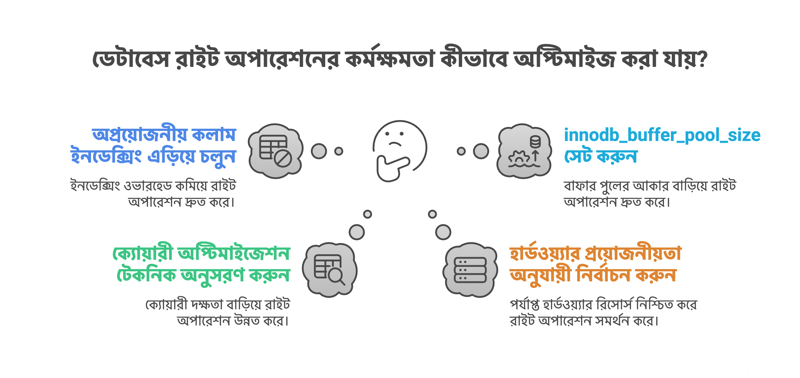

## কখন SQL কিংবা NoSQL ব্যবহার করব?

কোন প্রকারের ডাটাবেস নির্বাচন করব সেজন্য আমাদের সিস্টেম নিয়ে নিচের বিষয়গুলোর উত্তর জানা দরকার,

- ডাটাবেস দিয়ে প্রয়োজনীয় Query চালাতে পারবো কি না?
- ডাটাবেসের Table কি প্রয়োজনীয় সংখ্যক ডাটা store করে রাখতে পারবে কি না?
- কয়টি নোড থাকতে পারবে?
- Maintenance কি রকম হবে, মানে schema বদলাবে কি না?

এখন SQL এবং NoSQL এর কিছু বৈশিষ্ট্য আছে যা আমাদের সাহায্য করবে কোন ডাটাবেস নির্বাচন করব,

- Predetermined Schema: SQL দিয়ে আমরা কোনো operation (read, insert, update, delete) চালানোর আগে আমাদের টেবিলের schema Predetermined থাকতে হবে। টেবিলের schema Predetermined বলতে বুঝানো হচ্ছে একটি টেবিল যেমন user table এখানে schema হবে,

  - id
  - name
  - email
  - password
  - (ইত্যাদি)

এইগুলো Predetermined মানে পূর্বনির্ধারিত থাকলে, আমরা SQL ভিত্তিক RDBMS Database যেমন MySQL, PostgreSQL ইত্যাদি ব্যবহার করতে পারব।

অপরপক্ষে schema যদি Predetermined না থাকে তাহলে NoSQL ব্যবহার করা যায়। NoSQL এর ডেটা সাধারণত key-value, Document, Graph আকারে ডিস্কে স্টোর হয়ে থাকে, সেজন্য schema ফিক্সড হওয়া লাগে না।

- Scalability: ডেটা অনেক বেশি হয়ে গেলে SQL ভিত্তিক Database গুলোতে ভার্টিকাল স্কেলিং করা হয় মানে storage এর capacity বৃদ্ধি করা। (তাছাড়া Database Sharding-ও করা হয়ে থাকে)

আর NoSQL ভিত্তিক হরাইজন্টাল স্কেলিং করা হয় মানে সার্ভারের Capacity বৃদ্ধি করার পরিবর্তে নতুন সার্ভার যোগ করাই হল হরাইজন্টাল স্কেলিং।

এখন আমাদের সিস্টেম এ কোন রকমের scaling করলে আমাদের system চালাতে পারব তার উপর ভিত্তি করে সিদ্ধান্ত নিব।

- ACID: SQL ভিত্তিক Database সাধারণত ACID property follow করে থাকে। যেখানে A মানে Atomicity, C মানে Consistency, I মানে Isolation এবং D মানে Durability। এগুলোর উদ্দেশ্য হল Data Integrity এবং Consistency বজায় রাখা। যেমন Banking Software/ATM Vendor Machine এগুলোর জন্য ACID খুব গুরুত্বপূর্ণ।

ACID খুবই গুরুত্বপূর্ণ বিষয়। ACID বুঝতে হলে আমাদেরকে **Transaction** বুঝতে হবে।

**Transaction বুঝতে হলে Section-3 দেখতে পারেন**

NoSQL ভিত্তিক Database, BASE মানে (Basically Available, Soft state, Eventual consistency) সাপোর্ট করে।

এখন আমাদের সিস্টেমে Data Integrity/Consistency(Strong Consistency) বজায় রাখতে চাইলে আমরা **SQL ভিত্তিক Database ব্যবহার করব**, না হয় **NoSQL ভিত্তিক Database**।

## Database Performance

Database Performance সিস্টেম ডিজাইনে খুবই গুরুত্বপূর্ণ বিষয়।

### Database Indexing

Database Indexing একটি সাধারণ টেকনিক যা আমাদের Database Query কে দ্রুত সম্পন্ন করে থাকে।

সাধারণত ডেটা Disk-এ সংরক্ষন হয়ে থাকে। যখন ডেটা বেড়ে যায় তখন সেই ডেটাগুলো থেকে Query করতে অনেক সময় লাগে, এই সময় কমানোর জন্য আরেকটি টেবিল Disk-এ তৈরী হয় যাকে Index Table বলে। এই Index Table-এ মূলত আমাদের মূল টেবিল এর row(s) এর সাথে একটি লিংক করা থাকে, সেটি key-value আকারেও থাকতে পারে। যখন নতুন row কিংবা entry ডেটাবেস টেবিলে insert হয়, Index Table-এ সেই নতুন ডেটার সাথে একটি লিংক তৈরী হয় (সেজন্য আমাদের write operation slow হয়ে যেতে পারে আর read operation fast হয়)।

পরবর্তী সময়ে যখন কেউ নির্দিষ্ট ডেটা query করবে, তখন Index Table বলে দিবে কোন এড্ড্রেসে বা কোন ব্লকে ডেটা আছে।

বিস্তারিত জানতে চাইলে আমার ব্লগ দেখতে পারেন,

- https://codemacaw.com/database-indexing-makes-db-query-faster/
- https://codemacaw.com/what-is-b-tree-b-tree-in-dbms/

### আমরা কি সব কলামে INDEX যোগ করে দিবো?

উত্তর হলো, না। আমরা কার্ডিনালিটির (Cardinality) উপর গুরুত্ব দিব। কার্ডিনালিটি সাধারণত কোনো নির্দিষ্ট কলামে ডেটার মানের অনন্যতা (uniqueness) নির্দেশ করে।

উদাহরণস্বরূপ, একটি অর্ডার (orders) টেবিল বিবেচনা করুন, যার নিম্নলিখিত attribute রয়েছে:

- id

- customer_id

- status

এখানে,

- id এবং customer_id এর কার্ডিনালিটি বেশি (high cardinality) কারণ এগুলো unique। টেবিলের আকার যত বড় হবে, এই কলামগুলোর মান তত বেশি অনন্য হবে, ফলে কার্ডিনালিটিও বাড়বে।

- status এর কার্ডিনালিটি কম (low cardinality) কারণ এর মান সীমিত, যেমন: "pending", "processing", বা "delivered"। অর্থাৎ, একাধিক সারিতে একই মান থাকতে পারে।

ইন্ডেক্সিং এবং কার্ডিনালিটি:

উচ্চ কার্ডিনালিটির (high cardinality) কলামে ইন্ডেক্সিং করলে:

- টেবিল স্ক্যান (table scan) কম হয়।

- unique মান খোঁজা দ্রুত হয় (যেমন, customer_id)।

নিম্ন কার্ডিনালিটির (low cardinality) কলামে ইন্ডেক্সিং করলে:

- টেবিল স্ক্যান (table scan) বেশি হয়।

- কারণ কলামের মান unique নয়, যা কার্যকারিতা (efficiency) কমিয়ে দেয়।

### Query Optimization

Query লিখার সময় আমরা Query Optimize ভাবে লিখলে আমরা Query Execution Time কমাতে পারবো। কিছু উদাহরণ,

- নির্দিষ্ট ফিল্ড (যেমন, SELECT name, username FROM users) সিলেক্ট করা SELECT \* এর পরিবর্তে।
- SELECT DISTINCT সম্ভব হলে avoid করা।
- WHERE ব্যবহার করা HAVING এর পরিবর্তে।
- LIMIT ব্যবহার করা।
- INNER JOIN ব্যবহার করা।
- Number of Sub-queries কমানো।
- Complex Query এর জন্য Stored Procedure ব্যবহার করা। এতে করে আমরা Network Traffic কমাতে পারি।
- WHERE clause এর ভিতর Scaler Function ব্যবহার না করা। WHERE clause এর ভিতর Scaler Function ব্যবহার করলে Query Optimizer, Index কে ব্যবহার করতে পারে না।
- Normalize অথবা Denormalize অনুযায়ী Schema Design করা।
- n+1 query execute না করা।

### id কি auto-increment না UUID/ULID হিসেবে ব্যবহার করবো?

System Design করার সময় আমাদের এই ব্যপারে সিদ্ধান্ত নিতে হয়, আমাদের টেবিল এর id (primary key) কে কি auto-increment রাখবো না কি random string মানে UUID/ULID রাখবো।

নির্ভর করে।

- auto-increment অনুমানযোগ্য। UUID/ULID অনুমানযোগ্য নয়।

- auto-increment এর সাইজ ৪ বাইট (৩২-বিট ইন্টিজার) বা ৮ বাইট (৬৪-বিট ইন্টিজার)। UUID/ULID এর সাইজ ১৬ বাইট।

এগুলো দুইটি প্রধান বিবেচ্য বিষয়। আপনি যেকোনো একটিকে বেছে নিতে পারেন বা হাইব্রিড পদ্ধতিও ব্যবহার করতে পারেন।

তবে পারফরম্যান্সের দিক থেকে ULID, UUID এর তুলনায় ভালো কাজ করে। কারণ ULID-এ ৪৮-বিট timestamp এবং ৮০-বিট random ভ্যালু থাকে, তাই এর প্রথম অংশ টাইমস্ট্যাম্প হওয়ায় এটি লেক্সিকোগ্রাফিকভাবে (lexicographically) সাজানো যায়।

এই সাজানো প্রকৃতি ULID-কে B+ Tree ডাটা স্ট্রাকচারের সাথে ইন্ডেক্সিং, খোঁজা (finding), ইনসার্ট (insertion) ও ডিলিট (deletion) অপারেশনে আরও কার্যকরী করে।

অন্যদিকে, UUID v4 সম্পূর্ণ random হওয়ায় এটি B+ Tree ইন্ডেক্সিংয়ে বেশি ফ্র্যাগমেন্টেশন তৈরি করে এবং reebalancing প্রয়োজন হয়, যা পারফরম্যান্স কমিয়ে দেয়। তাই ULID অনেক ক্ষেত্রে UUID-এর তুলনায় দ্রুততর হয়।

<p align="center">
  
</p>

### Database Sharding

Database Sharding হল টেবিল থেকে ডেটা পৃথক করা। উদাহরণ বলা যায়, ডাটাবেসের ডেটা/row যদি বাড়তে থাকে এবং এত পরিমাণ ডেটা/row বেড়ে গেল যার ফলে ডাটাবেস টেবিলে আর স্টোর করা যায় না তখন আমরা ডেটাগুলোকে মূল টেবিল থেকে পৃথক করে অন্যান্য shard টেবিলে distribute করে রাখি সেটাই Database Sharding। একাধিক সার্ভার এই ডিস্ট্রিবিউশন হবে।

<p align="center">
  
</p>

### Connection Pool

সাধারণত ডেটাবেসে কোনো ক্লায়েন্ট যখন রিকোয়েস্ট করে তখন তার জন্য একটি dedicated tcp connection তৈরী হয়ে থাকে, যখন ক্লায়েন্ট এর কাজ শেষ হয়ে যাবে তখন tcp connection শেষ হয়ে যাবে। ।

<p align="center">
  
</p>

এরকম প্রতিটি ক্লায়েন্ট এর ক্ষেত্রে নতুন connection তৈরী হয়। এখন হাজার হাজার ক্লায়েন্ট ডেটাবেসে connection তৈরী করার চেষ্টা করে তখন Latency বৃদ্ধি পায়। এটি এড়াতে Connection Pool ব্যবহার করা হয়।

এটি একটি pool যেখানে একাধিক connection open হয়ে থাকবে, যখন কোনো ক্লায়েন্ট রিকোয়েস্ট আসবে তখন একটি connection সেই ক্লায়েন্ট ব্যবহার করতে পারবে। এতে করে বার বার connection তৈরী হওয়া এবং নষ্ট হওয়া থেকে এড়াতে পারব। আমরা specifically বলে দিতে পারব কয়টি connection, pool এর ভিতর থাকবে। ক্লায়েন্ট রিকোয়েস্ট pool এর connection এর চেয়ে বেশি হয়ে গেলে client কে wait করা লাগবে।

<p align="center">
  
</p>

Connection Pool এর size randomly সেট করা যাবে না। Concurrent Users এর সংখ্যা নিয়ে চিন্তা করতে হবে। উদাহরণস্বরূপ, যদি আপনার অ্যাপ্লিকেশনে ২০০০ concurrent users থাকে, তবে সব ২০০০ ব্যবহারকারী একসঙ্গে ডেটাবেসে আঘাত করবে না। তাই কত শতাংশ ব্যবহারকারী একযোগে ডেটাবেস request করবে তা estimate করুন এবং সেই অনুযায়ী Connection Pool এর size নির্ধারণ করুন।

কিভাবে PostgreSQL এ Connection Pool ডিফাইন করবেন,

```js
const { Pool } = require("pg");

const pool = new Pool({
  user: "your_user",
  host: "localhost",
  database: "your_db",
  password: "your_password",
  port: 5432,
  max: 10, // Maximum number of connections in the pool
  idleTimeoutMillis: 30000, // Close idle connections after 30s
  connectionTimeoutMillis: 2000, // Timeout if connection takes too long
});

// Usage
async function queryDatabase() {
  const client = await pool.connect();
  try {
    const result = await client.query("SELECT * FROM users");
    console.log(result.rows);
  } finally {
    client.release(); // Return client to the pool
  }
}

queryDatabase();
```

কিভাবে MySQL এ Connection Pool ডিফাইন করবেন,

```js
const mysql = require("mysql2");

// Create a pool of connections
const pool = mysql.createPool({
  host: "localhost",
  user: "your_user",
  password: "your_password",
  database: "your_db",
  waitForConnections: true, // Allow waiting for available connection
  connectionLimit: 10, // Maximum number of connections in the pool
  queueLimit: 0, // Unlimited queued connections
});

// Query the database
pool
  .execute("SELECT * FROM users")
  .then(([rows, fields]) => {
    console.log(rows);
  })
  .catch((err) => {
    console.error(err);
  });
```

আপনি চাইলে MySQL কনফিগারেশন ফাইলে Connection Pool সেটআপ করতে পারবেন,

আপনি লিনাক্স ব্যবহার করলে, `/etc/mysql/my.cnf`

```
[mysqld]
max_connections = 200       # Maximum number of connections allowed
wait_timeout = 600           # Timeout for waiting for client data
interactive_timeout = 600    # Timeout for interactive connections
```

### Buffer Pool (InnoDB অনুসারে)

এটি মূল মেমোরি বা RAM এর ভিতরের একটি এলাকা, যেখানে InnoDB (MySQL ইঞ্জিন) টেবিল এবং ইনডেক্স ডেটা ক্যাশ করে রাখে যখন তা access করা হয়। ডেটা সরাসরি বাফার পুল থেকে অ্যাক্সেস করার মাধ্যমে আমরা query processing এর সময়কে দ্রুততর করতে পারি।

Buffer Pool বিভিন্ন pages এর সমন্বয়ে গঠিত, এবং প্রতিটি page-এ ডেটার সারি (rows of data) থাকে। এটি মূলত লিংকড লিস্ট ডেটা স্ট্রাকচার অনুযায়ী সাজানো থাকে।

সাধারণত ডিস্ক থেকে ডাটা fetch করে আনা, সময় সাপেক্ষ ব্যাপার। এক্ষেত্রে Buffer Pool অনেক উপকারী।

ডেটার জন্য ডিস্ক এর মধ্যে সার্চ করার পরিবর্তে, বাফার পুল থেকে সার্চ করে ডাটা নেয়া হয়। যদি বাফার পুল এর মধ্যে ডাটা না পাওয়া যায় তাহলে disk এর ভিতর সার্চ করে ডাটা নেয়া হবে, তারপর ডাটাকে বাফার পুলের ভিতর cache করে রেখে দেয়া হয়।

InnoDB ডাটাবেস ইঞ্জিন এর Default buffer pool এর size হচ্ছে ১২৮ এমবি, যা মূলত ডেভেলপমেন্ট environment এর জন্য, প্রোডাকশন environment এর জন্য এর size নির্ভর করে কিছু বিষয়ের উপর।

বাফার পুলের size, innodb_buffer_pool_chunk_size \* innodb_buffer_pool_instances এর হয় সমান থাকবে কিংবা multiple থাকবে।

- innodb_buffer_pool_chunk_size: এটি মূলত বাফার পুলের chunk size কত তা বলে দেয়। MySQL এর InnoDB storage engine এর ভিতর বাফার পুল chunk হিসেবে ভাগ করা থাকে। প্রতিটি chunk একটি নির্দিষ্ট মেমোরি সাইজ দ্বারা নির্ধারিত হয়, যা innodb_buffer_pool_chunk_size দ্বারা configure করা হয়।

```sql
SHOW VARIABLES LIKE 'innodb_buffer_pool_chunk_size';
```

উপরের SQL command দ্বারা আমরা জানতে পারবো, বাফার পুল কয়টি chunk এ ভাগ করা হয়েছে।

- innodb_buffer_pool_instances: এটি দ্বারা বুঝা যায়, প্রতিটা বাফার পুলকে কয়টি instance এ ভাগ করা হয়েছে।

```sql
SHOW VARIABLES LIKE 'innodb_buffer_pool_instances';
```

উপরের SQL command দ্বারা আমরা জানতে পারবো, প্রতিটা বাফার পুলকে কয়টি instance এ ভাগ করা হয়েছে।

মনে করি,

- innodb_buffer_pool_chunk_size = 128MB
- innodb_buffer_pool_instances = 4

তাহলে innodb_buffer_pool_size হতে পারে,

- 128MB × 4 = 512MB
- 128MB × 4 × 2 = 1024MB = 1GB

আমরা যেকোন একটি নির্বাচন করতে পারি। তবে আমাদের সিস্টেমের RAM এর প্রতি খেয়াল রাখতে হবে।

ধরে নি, innodb_buffer_pool_size = ১ GB

RAM যদি ৮ GB হয়?

তাহলে ১ GB মানে, ১২.৫% শুধু বাফার পুলের জন্য বাকি ৮৭.৫% অন্যান্য প্রসেসিং এর জন্য বরাদ্ধ করা হয়, যা সাধারণত acceptable।

RAM যদি ৪ GB হয়?

তাহলে ১ GB মানে, ২৫% শুধু বাফার পুলের জন্য বাকি ৭৫% অন্যান্য প্রসেসিং এর জন্য বরাদ্ধ করা হয়, যা সাধারণত acceptable।

যেসব জিনিসগুলো মনে রাখতে হবে,

- বাফার পুল এর size নির্বাচন করার পূর্বে দেখতে হবে আমাদের সিস্টেম read-heavy নাকি write-heavy।

- বাফার পুল এর size বেশি বড় হয়ে গেলে, সার্ভার swapping করা শুরু করতে পারে। যার মানে অপারেটিং সিস্টেম ডিস্ক কে ভার্চুয়াল মেমরি হিসেবে বিবেচনা করবে। যা performance নামিয়ে দিতে পারে।

### Hardware এবং Infrastructure

আমাদের ডাটাবেস এর পারফরমেন্স ভালো করতে পারে সেজন্য আমাদের requirements অনুযায়ী Hardware এবং Infrastructure নেয়া।

## Write/Update অপারেশন এর জন্য Performance Optimization

- অপ্রোজনীয় কলাম ইনডেক্সিং না করা। কারণ যখন নতুন row ইন্সার্ট হবে তবে ইনডেক্স টেবিলেও রেফারেন্স ইন্সার্ট হবে যা write অপারেশন slow করে দিতে পারে।
- Query Optimization টেকনিক follow করা।
- Requirements অনুযায়ী Hardware নির্বাচন করা।
- innodb_buffer_pool_size সেট করা। কারণ প্রতিটি write অপারেশন সরাসরি ডিস্ক এ গিয়ে স্টোর হয় না, বরং বাফার পুল এর ভিতর অবস্থান করে প্রথমে। তাই বাফার পুলের size enough থাকলে write অপারেশন fast হবে।

<p align="center">
  
</p>

## Sequential Insert এবং Batch Insert

প্রথমে আমরা Sequential Insert দেখে ফেলি। মনে করুন, আপনার কাছে একটি ছোট ডাটাসেট আছে। এগুলো আপনি ডাটাবেস blogs টেবিলে insert করবেন।

(আমাদের উদাহরণের জন্য আমরা Prisma ব্যবহার করবো।)

```js
const datasets = [
  { id: 27817, title: ... },
  { id: 27818, title: ... },
  ...............48 more rows
]

for(let dataset of datasets) {
  await prisma.blogs.create(dataset);
}
```

এখানে মূলত কী হবে?

```
┌──────────────────┐
| Start for-loop   |
└──────────────────┘
      │
      ▼
┌─────────────┐
| Insert #1   |  <-- #1 এর insertion শেষ না হওয়ার পর্যন্ত অপেক্ষা করবে
└─────────────┘
      │
      ▼
┌─────────────┐
| Insert #2   |  <-- #1 এর insertion শেষ হয়ে গেলে #2 এর insertion শুরু হবে এবং অপেক্ষা করবে।
└─────────────┘
      │
      ▼
     ...
      │
      ▼
┌─────────────┐
| Insert #50  |  <-- #49 এর insertion শেষ হয়ে গেলে #50 এর insertion শুরু হবে এবং অপেক্ষা করবে।
└─────────────┘
      │
      ▼
┌────────────────┐
| Loop completed |
└────────────────┘
```

এটি হচ্ছে Sequential Insert। প্রতিটি insertion শেষ না হওয়া পর্যন্ত, পরবর্তী insertion হবে না।

এখন আপনি মনে করুন ডাটাসেটের সাইজ ২০০০ length এর। তখন ল্যাটেন্সি বেড়ে যাবে কারণ একটি একটি করে insertion শেষ হতে হবে আর যেহেতু এখানে ২০০০ length এর ডাটাসেট তার মানে অনেক সময় লাগবে স্বাভাবিক। তাছাড়া তখন বলা যায় ২০০০ insertion এর জন্য ২০০০ টি I/O রিকোয়েস্ট যাবে, যা expensive, এতে আপনার ডাটাবেস হোস্টিং খরচ বেড়ে যাওয়ার সম্ভাবনা আছে।

এই সমস্যার সমাধান আমরা Batch Insert দিয়ে করতে পারি।

```js
await prisma.blogs.createMany({ data: datasets });
```

```
┌──────────────────────────────────┐
|  Start all 2000 inserts at once  |
└──────────────────────────────────┘
  | | | | | | ... (2000 arrows)
  V V V V V V
┌─────────────────────────┐
| resolve/reject          |
└─────────────────────────┘
```

এটি হচ্ছে Batch Insert। ২০০০ insertion একসাথে শুরু হবে।

**এখন প্রশ্ন হচ্ছে এই ২০০০ insertion এর জন্য কতটি i/o রিকোয়েস্ট যাবে?**

উত্তর হলো তা নির্ভর করে max_allowed_packet এর ভ্যালু এর উপর।

```sql
SHOW VARIABLES LIKE 'max_allowed_packet';
```

[MySQL Documentation - max_allowed_packet](https://dev.mysql.com/doc/refman/8.4/en/server-system-variables.html#sysvar_max_allowed_packet)

- datasets এর length = ২০০০
- প্রতিটা row তে কলাম সংখ্যা ১০
- গড় bytes (প্রতিটা কলাম) ৫০

সর্বমোট size = ২০০০ × ১০ × ৫০ bytes = ১,০০০,০০০ bytes ≈ ১ এম.বি

max_allowed_packet ধরে নিলাম ৪ এম.বি।

আমাদের SQL statement ≈ ১ এম.বি < ৪ এম.বি

ফলাফল: Prisma একটি single INSERT পাঠাবে → single I/O call

**তাহলে কখন একাধিক i/o পাঠাবে?**

datasets এর length ২০০০ থেকে বেড়ে গেলে তখন সর্বমোট size টাও বেড়ে যাবে, মানে তখন ১ এম.বি থেকে আরো বেশি হবে, কোনো কারণে তা max_allowed_packet ৪ এম.বি চেয়ে বেশি হয়ে গেলে একাধিক i/o execute হবে।

## Read query, indexing ছাড়া কিভাবে execute হয়?

<p align="center">
  
</p>

ছবিটি বিশ্লেষণ করলে,

- User একটি GET query রিকুয়েস্ট করলো। শর্ত username="lahin"।
- Page Filtering নামক অংশটি প্রথমে Buffer Pool এর ভিতর খুঁজবে username=lahin সম্বলিত page আছে কি না। যদি থাকে তাহলে, সেই page থেকে row কে filter করে user এর কাছে পাঠিয়ে দিবে। অন্যথায় Disk এর pages এর মধ্য one-by-one করে I/O request চালাবে।
- যখন username=lahin সম্বলিত row পেয়ে যাবে তখন তা সম্পূর্ণ page কে Buffer Pool এ Cache করে রেখে দিবে।
- তারপর সেই page থেকে ফিল্টার হয়ে নির্দিষ্ট row; user এর রিটার্ন করবে।

[ইউটুবে দেখুন](https://youtu.be/fY-LGFSIkBw?si=f-R-W77xkFjxQ9_A)

## ডিস্ক থেকে CPU পর্যন্ত ডেটার যাত্রা

আমি হোসেইন নাসেরের একটা পোস্ট দেখেছিলাম,

- You cannot do much with data on disk until you read it to memory.

- You cannot do much with data on memory until it is read into the CPU L caches.

আমি খুঁজে দেখেছিলাম। চলুন প্রথম স্টেটমেন্টটা আমি যেমন বুঝেছি সেটা ব্যাখ্যা করি।

### প্রথম স্টেটমেন্ট - Disk Seek

সাধারণভাবে, যখন একটি Hard Disk Drive (HDD) কোনো ডেটা read বা write করে, তখন এর read/write head-কে ঘূর্ণায়মান ডিস্ক (platter)-এর সঠিক স্থানে যেতে হয়। এই নড়াচড়াকেই বলা হয় Seeking।

একবার platter সঠিকভাবে পজিশন হলে, তখন read বা write অপারেশন হয়।

<p align="center">
  
</p>

ধরা যাক, যদি একটা ডিস্কের প্রতি seek করতে 8 ms সময় লাগে, তাহলে সেকেন্ডে যতগুলো seek সম্ভব হবে:

```
1000 ms / 8 ms per seek = 125 seeks per second
```

এটাই সেই প্রধান কারণগুলোর একটি, যার জন্য Hard Disk Drive-কে ধীরগতির মনে করা হয়—বিশেষ করে যখন প্রচুর পরিমাণ ডেটা নিয়ে কাজ করতে হয়।

### দ্বিতীয় স্টেটমেন্ট - Memory Hierarchy

আমাদের Memory Hierarchy আছে,

- CPU Registry

- L1 cache -> L2 cache -> L3 cache

- RAM

- Disk

যখন CPU কোনো ডেটা প্রসেস করতে চায়, তখন প্রথমে এটা L1 cache-এ খোঁজে, যেটা সবচেয়ে দ্রুত কিন্তু সবচেয়ে ছোট। যদি ডেটা সেখানে না পাওয়া যায় (cache miss), তাহলে CPU যায় L2 cache-এ, যেটা আকারে বড় কিন্তু একটু ধীর। যদি এখনো ডেটা না মেলে, তাহলে CPU যায় L3 cache-এ, যেটা আরও বড় কিন্তু L2 থেকে ধীর।

যদি ডেটা কোনো cache-এই না পাওয়া যায়, তখন CPU সেটা RAM থেকে আনে, যেটার latency cache-এর তুলনায় অনেক বেশি।

আর যদি RAM-এ ডেটা না থাকে, তখন অপারেটিং সিস্টেম সেটাকে Disk (HDD/SSD) থেকে RAM এর ভেতর Buffer Pool-এ লোড করে (এটাকে page fault বা swapping বলা হয়)। এরপর CPU সেই ডেটা ব্যবহার করে।

## প্রোডাকশন environment এর মধ্যে কিভাবে ডাটাবেস error গুলো log করবো?

প্রোডাকশন environment এ যেকোনো সময় যেকোনো error চলে আসতে পারে। আমাদের সিস্টেম সচল রাখার জন্য এসব error এর লগ পড়ে বুঝতে হবে তারপর সমাধান(fix) করতে হবে। যত তাড়াতাড়ি আমরা সেই error গুলো পড়ে fix করতে পারবো, তা আমাদের সিস্টেমের জন্য ভালো।

ধরে নি, আমরা লিনাক্স(ubuntu) এর মধ্যে MySQL ব্যবহার করছি।

### Error Log

Linux এর ভিতর আমরা cd করলে,

```
ubuntu@ip-192-168-0-1:/$ cd /var/log/mysql
```

mysql ফোল্ডার এর ভিতর **error.log** নামক ফাইল থাকে। এই ফাইল cat করলে আমরা দেখতে পারবো,

- Server Startup ভিত্তিক Errors: MySQL যখন start হয় তখন এরকম কিছু error আসতে পারে,

```
[ERROR] Can't start server: Bind on TCP/IP port: Address already in use
```

এর মানে দাঁড়ায়, MySQL bind করতে পারছে না তার পোর্ট দিয়ে (সাধারণত ৩৩০৬)। সেই পোর্ট ইতিমধ্যে অন্য প্রসেস দ্বারা প্রসেস হচ্ছে।

কিংবা,

```
[ERROR] Fatal error: Can't open and lock privilege tables: Table 'mysql.user' doesn't exist
```

MySQL যখন তার privilege tables এক্সেস করতে না পারে তখন এই error আসে।

- Authentication এবং Access ভিত্তিক Errors: ভুল username কিংবা password কিংবা missing privileges ভিত্তিক এররগুলো দেখাবে।

```
[Warning] Access denied for user 'root'@'localhost' (using password: YES)
```

- Storage Engine ভিত্তিক Errors: Disk Failure, Power Outage কিংবা Forced Shutdown যা টেবিলকে corrupted করে ফেলে। আমরা এরকম এরর দেখতে পারি,

```
[ERROR] InnoDB: Page [page id] log sequence number [LSN] is in the future!
[ERROR] InnoDB: Database page corruption on disk or a failed file read
[ERROR] InnoDB: Table `mydb/mytable` is corrupted
[ERROR] InnoDB: Unable to read tablespace [file.ibd]
```

- Crash এবং Critical Errors: টেবিল corrupted থাকার কারণে কিংবা Disk full থাকার কারণে MySQL version এ বাগ থাকার কারণেও নিচের এররগুলো আসতে পারে,

```
[ERROR] mysqld got signal 11 (Segmentation fault)
[ERROR] InnoDB: Assertion failure
[ERROR] Fatal error: Can't open and lock privilege tables
```

Table Corruption কী? MySQL-এ টেবিল Corruption মানে হচ্ছে — কোনো ডেটাবেজ টেবিলের স্ট্রাকচার বা ডেটা ভেঙে গেছে বা খারাপ হয়ে গেছে, যেটার ফলে ওই টেবিল থেকে সঠিকভাবে ডেটা পড়া বা লেখা যায় না।

(আরো আসছে।)

## গুরুত্বপূর্ণ প্রশ্নগুলো

- Data Integrity কি?
- Schemaless কি?
- Database Indexing কি?
- কিভাবে ইনডেক্সিং query performance উন্নত করে?
- b tree এবং b+ tree এর মধ্যে পার্থক্য কি?
- Primary Key এবং Secondary Key এর মধ্যে পার্থক্য কি?
- Cluster Index কি?
- Unique এবং Non-unique index এর মধ্যে পার্থক্য কি?
- অপটিমাইজার কীভাবে scan পদ্ধতি নির্বাচন করে (Sequential Scan না Index Scan)?
- Composite Index কিভাবে কাজ করে?
- FULLTEXT index কি? কিভাবে কাজ করে?
- কোন কোন column ইনডেক্সিং করবো কি না তা কিভাবে নির্ধারণ করবো?
- INSERT, UPDATE, DELETE অপারেশনগুলোর ক্ষেত্রে ইনডেক্সিং এর প্রভাব কি?
- Covering Index কি?
- Connection Pool এর প্রয়োজনীয়তা কি?
- কি হবে যদি Connection Pool এর মধ্যে কানেকশনগুলো ব্যস্ত থাকে?
- Buffer Pool এর প্রয়োজনীয়তা কি?
- select \* কে কোনো slow বলা হয়?
- কিভাবে Soft Delete, Archival এবং Retention ডিসাইন করবো?
- Production ডাটাবেসে একটি schema migration মাঝপথে fail করে ডাটাবেস inconsistent হয়ে গেলে এবং অ্যাপ্লিকেশন down হয়ে গেলে, আপনি কীভাবে দ্রুত system recover করবেন এবং ভবিষ্যতে এমন সমস্যা এড়াতে migration strategy ডিজাইন করবেন?
- আপনি কীভাবে production MySQL ডাটাবেসে কোনো downtime ছাড়াই schema change safely apply করবেন?
