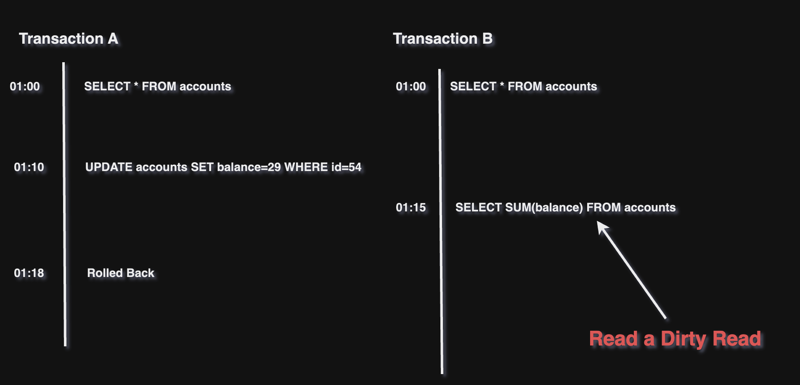

## Database Transactions

ডাটাবেজ ট্রানজাকশন এই সমস্ত প্রশ্ন বা সমস্যার সমাধান করতে পারে:

- ডাটাবেজ সফটওয়্যার বা হার্ডওয়্যার যে কোনো সময় fail হতে পারে। (write অপারেশনের মাঝখানেও)

- নেটওয়ার্কে বাধা আসতে পারে, যা অ্যাপ্লিকেশনকে ডাটাবেজ থেকে অপ্রত্যাশিতভাবে বিচ্ছিন্ন করতে পারে।

- একাধিক ক্লায়েন্ট একই এন্ট্রি আপডেট করার চেষ্টা করতে পারে, যার ফলে একে অপরের পরিবর্তনগুলি ওভাররাইট হতে পারে।

- একটি ক্লায়েন্ট ডাটাবেজ থেকে এমন তথ্য পড়তে পারে যা সম্পূর্ণরূপে Commit করা হয়নি, ফলে তথ্যটি অপ্রাসঙ্গিক বা অসংগতিপূর্ণ হতে পারে।

- ক্লায়েন্টদের মধ্যে concurrency বা race condition এর কারণে অপ্রত্যাশিত বাগ তৈরি হতে পারে।

উপরের পয়েন্টগুলোর উত্তর পেতে হলে নিচের টপিকগুলো বুজতে হবে।

### Transaction কী?

ডাটাবেস এ Transaction মানে হচ্ছে, একাধিক READ এবং WRITE অপারেশনগুলোকে একটি লজিকাল ইউনিট এর ভিতর রেখে দেয়া, যার মানে দাঁড়ায় সকল READ এবং WRITE অপারেশনগুলোকে একটি অপারেশন হিসেবে গণ্য করবে।

সাধারণত Transaction এভাবে শুরু হয়,

```sql
BEGIN

SELECT * FROM users
UPDATE users SET username=“lahin” WHERE id=224

COMMIT
```

Transaction মূলত ৪'টি features দিয়ে থাকে আমাদের।

- Atomicity
- Consistency
- Isolation
- Durability

#### Atomicity

যখন কোনো(/একটি) ক্লায়েন্ট একাধিক WRITE অপারেশন চালাতে যায় অর্থাৎ যদি ৪ টি WRITE অপারেশন এর মধ্যে ২ টি WRITE অপারেশন successfully চালানোর পর কোনো Fault সংগঠিত হয়, (যেমন- process crushes, network communication interrupt হলে কিংবা ডিস্ক সাইজ full হয়ে গেলে।) তখন successfully সংগঠিত হওয়া অপারেশনগুলোকে রিভার্ট করে দিবে। কারণ তখন ৪ টি অপারেশন একটি সিঙ্গেল লজিকাল ইউনিট এর ভিতর থাকবে।

Atomicity ছাড়া কোন query সাকসেস কিংবা fail হয়েছে তা বের করা অসম্ভব।

#### Consistency

ACID এর প্রপার্টিগুলোর মধ্যে Consistency অন্যতম গুরুত্বপূর্ণ টপিক। যার মানে হচ্ছে ট্রান্সেকশন শুরু হওয়ার পূর্বে এবং ট্রান্সেকশন শেষ হওয়ার পরে যোগফল সবসময় একই থাকবে।

উদাহরণ বলা যায়, আপনি ATM থেকে কিছু টাকা বের করতে গিয়েছেন। আপনার Account এ সর্বমোট ১০,০০০ টাকা আছে, আপনি ATM মেশিন এ ৫,০০০ টাকা বের করার জন্য আপনার PIN number দিয়ে রিকোয়েস্ট করলেন।

আপনি ৫,০০০ টাকা পেয়ে গেলেন। তাহলে এখন আপনার account এ (১০,০০০ - ৫,০০০) মানে ৫,০০০ টাকা আছে এবং ATM থেকে আপনার হাতে পেলেন ৫,০০০। (বর্তমানে একাউন্ট এ) ৫,০০০ + (নিজের হাতে) ৫,০০০ = ১০,০০০, ট্রান্সেকশন শুরু হওয়ার পূর্বে account এ ছিল ১০,০০০ এবং ট্রান্সেকশন শেষ হওয়ার পরে ১০,০০০। তাহলে আমরা বলতে পারি Consistency মেইনটেইন করা আছে।

এখন যদি ATM কোনো একটা সমস্যার কারণে আপনাকে ৫,০০০ টাকা না দিয়ে আপনার মোবাইলে SMS আসে আপনার account এ বর্তমানে ৫,০০০ আছে তাহলে তখন Consistency মেইনটেইন থাকা হলো না।

#### Isolation

Isolation বাকিগুলোর মত খুবই গুরুত্বপূর্ণ বিষয়। যা আমাদেরকে নিশ্চিত করে একাধিক concurrent ট্রান্সেকশন স্বাধীনরূপে কাজ করবে, যাতে Data Integrity বজায় থাকে।

একাধিক ট্রান্সেকশন থাকার ফলে Race Condition সমস্যা তৈরী হয়। Isolation এর কাজ তা সমাধান করা, যাতে একাধিক ট্রান্সেকশন একে অপরের সাথে কোনো হস্তক্ষেপ না করে স্বাধীনভাবে কাজ করে।

Race Condition এর একটি বাস্তবধর্মী উদাহরণ হল, একটি হোটেল বুকিং ওয়েবসাইটে একজন user(1) রুম বুক করছে। পেমেন্ট প্রসেস সম্পন্ন করার পূর্বে অন্য আরেকজন user(2) এসে একই রুম বুক করার চেষ্টা করতে পারে।

এখন user(2) সব payment প্রসেস শেষ করে Database Commit(মানে স্থায়ীভাবে ডিস্কে ইন্সার্ট হবে) করে ফেললো, তারপর user(1) যখন payment প্রসেস করতে যাবে তখন Operation Failed কিংবা কোনো error মেসেজ (যেমন, রুম বুক করা হয়ে গেছে অন্য কারো দ্বারা) দেখাবে।

<p align="center">
  
</p>

এটি হচ্ছে Race Condition। এই প্রকারের সমস্যা আমরা সরাসরি কিভাবে Database Locking ব্যবহার করে সমাধান করতে পারি তা সামনে আমরা দেখবো। Isolation মূলত নির্ধারণ করে, যে একাধিক Transaction এর ফলে সৃষ্টি হওয়া সমস্যা কিভাবে দেখাবে। অন্যদিকে Locking mechanism ব্যবহার করে আমরা সেই সমস্যা সমাধান করতে পারি।

এসব সমস্যা সমাধানের পূর্বে আমাদের Isolation Level বুঝতে হবে। ৫ প্রকারের Isolation Level আছে যা বুঝা অত্যন্ত প্রয়োজনীয়।

- Read Uncommitted
- Read Commited
- Repeatable Read
- Snapshot
- Serializable

এই ৫ প্রকারের Isolation Level এর কারণে ৩ প্রকারের Anomalie তৈরী হয়।

- Dirty Read
- Non-Repeatable Read
- Phantom Read

Isolation Level বুঝার পূর্বে ৩ প্রকারের Anomalie বুঝতে হবে।

##### Dirty Read

যখন কোনো ট্রান্সেকশন UnCommitted ভ্যালু read করে তখন তাই হচ্ছে Dirty Read।

উদাহরণ, Transection A একটি নির্দিষ্ট Row এর Column আপডেট করে দিল কিন্তু এখন পর্যন্ত Commit করা হলো না। এখন Transection B একই Column read করলো। তারপর Transection A যে Column টি আপডেট করেছিল তা Rolled Back করে দিলো।

তারমানে দাঁড়ালো Transection B Dirty Read করেছে। নিচের ছবি দেখলে আমরা উদাহরণ বুঝতে পারবো।

<p align="center">
  
</p>

##### Non-Repeatable Read

যখন একটি Transaction একই ডাটা read দুবার করে, কিন্তু দুবার read করার মধ্যবর্তী সময়ে ডাটা পরিবর্তন হয়ে যায়, অন্য কোনো Transaction এর কারণে, তখন সেটাই হচ্ছে Non-Repeatable Read।

উদাহরণ বলা যায়, Transaction A, accounts টেবিল read করলো। একই সময়ে Transaction B accounts টেবিল read করলো। তখন দুই Transaction একই ডাটা দেখবে। এখন ১০ মিনিট পর Transaction B একটি নির্দিষ্ট row এর balance-column এর ভ্যালু ২৯ দ্বারা পরিবর্তন করে দিলো। আর ৫ মিনিট পর Transaction B তা commit করে দিলো।

এখন Transaction B দ্বারা commit হওয়ার ৩ মিনিট পর, Transaction A আবার accounts টেবিল read করলো। এখন Transaction A পরিবর্তিত ডাটা দেখবে, যা তার পূর্বের read query সাথে সাদৃশ্য থাকবে না।

এই সাদৃশ্য না থাকার বিষয়টি হচ্ছে Non-Repeatable Read।

<p align="center">
  
</p>

##### Phantom Read

একটি উদাহরণ দিয়ে বুঝানো যাক, একটি Transaction একটি টেবিল এর মধ্যে read query চালানোর ফলে কিছু ডাটা পাওয়া গেলো। এখন কিছু সময় পর অন্য আরেকটি Transaction এসে টেবিল এর একটি row ইন্সার্ট করে দিয়ে দিলো। তার কিছু সময় পর তা commit করা হলো। এখন পূর্বের transaction আবার read query করলে এখন ভিন্ন ডাটা দেখবে। এই বৈসাদৃশ্য এর ব্যাপারটাই হচ্ছে Phantom Read।

<p align="center">
  
</p>

যেকোনো Data Modification Operations মানে Insert, Update কিংবা Delete এর কারণে Phantom Read anomalie হতে পারে।

(চলমান...)
