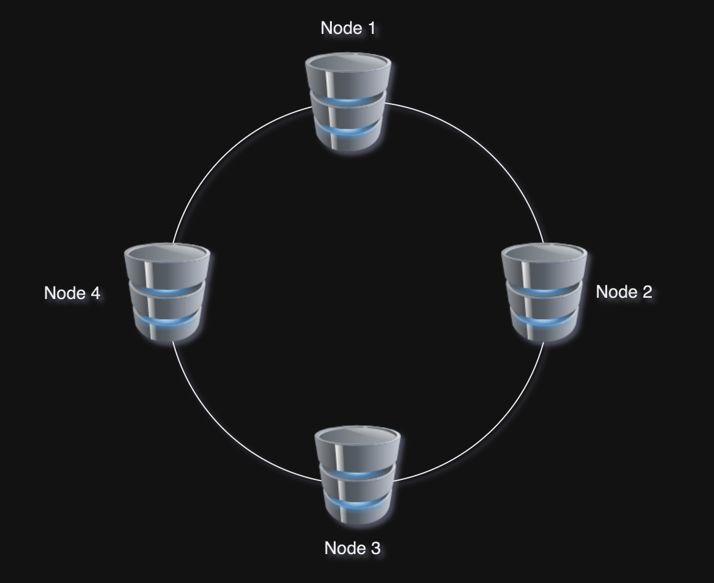

## Cassendra issue

Discord ২০১৭ সালে ১২ Cassandra নোড এর মধ্যে billions of messages স্টোরে করে রেখেছিলো। ২০২২ সালে নোডের সংখ্যা দাঁড়ায় ১৭৭। 

<p align="center">
  
</p>

তখন Latency খুব বেশি বেড়ে গেলো সাথে Operation maintain করাও খুব costly হয়ে গেলো। 

```cql
CREATE TABLE messages (
   channel_id bigint,
   bucket int,
   message_id bigint,
   author_id bigint,
   content text,
   PRIMARY KEY ((channel_id, bucket), message_id)
) WITH CLUSTERING ORDER BY (message_id DESC);
```

উপরের Cassendra Query Language দিয়ে তৈরী একটি messages টেবিল, যেখানে প্রতিটি ID এর জন্য Snowflake ব্যবহার করা হয়েছে, মূলত chronologically sorting করার জন্য(যা UUID একটি limitation)। Channel ID এবং Bucket দিয়ে discord team, messages table কে পার্টিশন করেছিল। যার মানে দাঁড়ায় একটি channel এর সব মেসেজগুলোকে একসাথে স্টোরে করা হয়। তারপর ৩টি নোডে replicate করা হয়।

(চলমান)