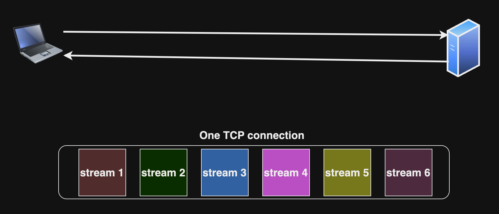

## HTTP 1

HTTP 1 ১৯৯৬ সালে এসেছে। এটি মূলত TCP এর উপর নির্ভর করে তৈরী করা হয়েছিল। এখানে প্রতিটি HTTP রিকোয়েস্ট এর জন্য ডেডিকেটেড TCP connection তৈরী হত।

## HTTP 1.1

HTTP 1.1 এ keep-alive mechanism তৈরী করা হয়েছিল যার মাধ্যমে একটি TCP কানেকশন কে একাধিক HTTP request এবং response এ reuse করা যেত, যাকে Pipelining বলে। Pipelining মূলত Sequentially হয়ে থাকে।

HTTP 1.1 এ CORS mechanism আনা হয়েছিল।

## HTTP 2

HTTP 2 তে STREAMS আনা হয়েছিল যেখানে একাধিক STREAMS of REQUESTS একটি TCP connection এর ভিতর transfer হতে পারে। HTTP এর জন্য TLS setup বাধ্যতামূলক, মানে HTTPS enable থাকতে হবে। 

  

HTTP 2 এর একটি feature হল HPACK। HPACK মূলত HTTP headers কে compress করে থাকে। HTTP 1 এ headers plain-text ফরম্যাটে send করা হত, HPACK efficiently headers transmit করে থাকে। 

## HTTP 3

(বিস্তারিত চলমান)
