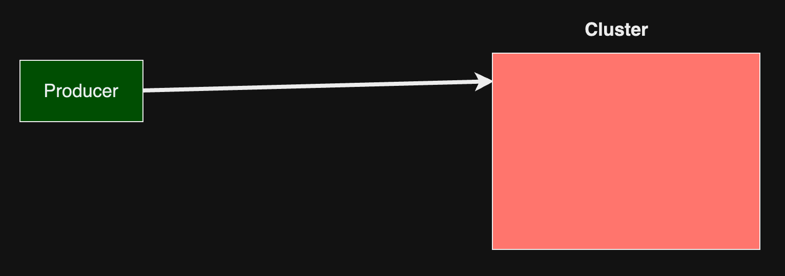
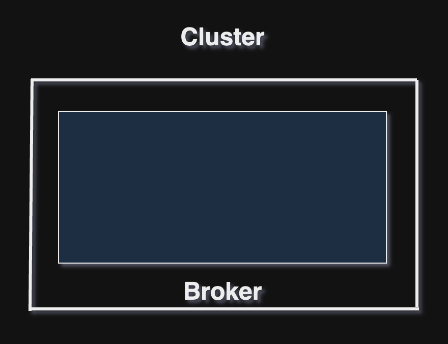
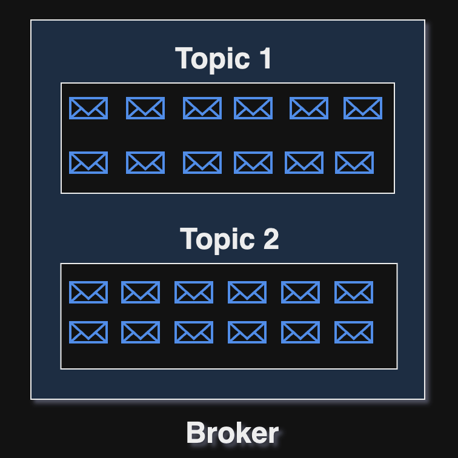
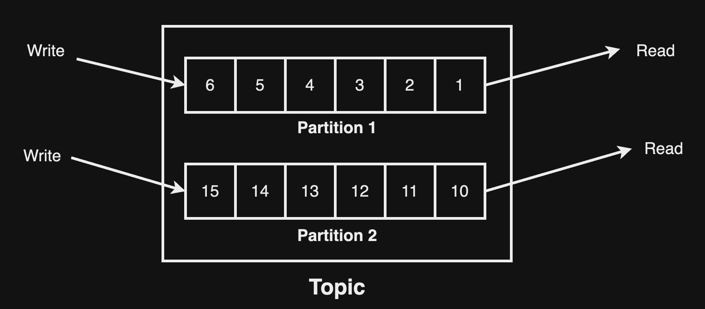
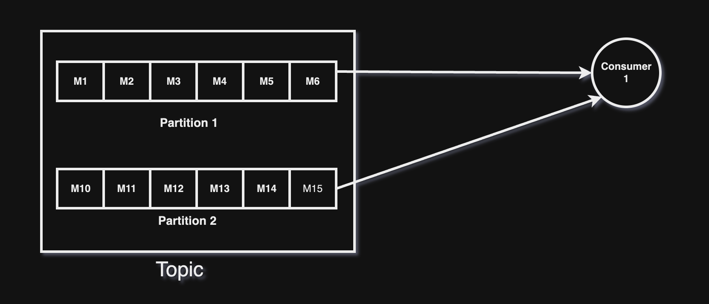
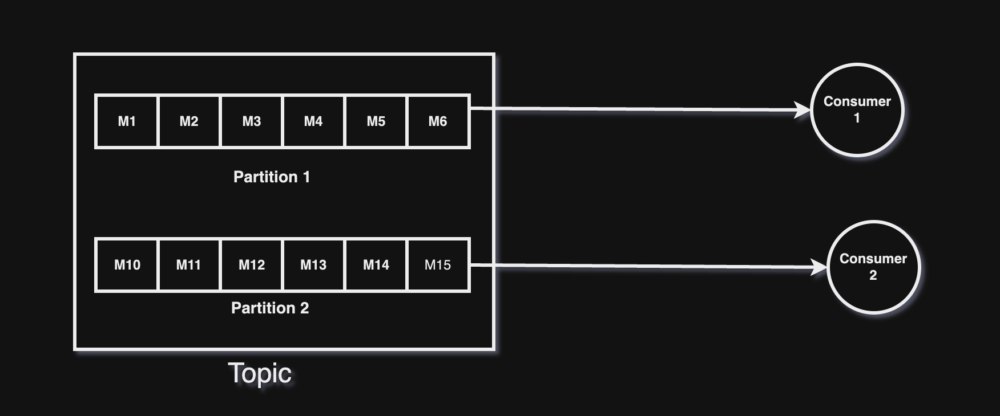
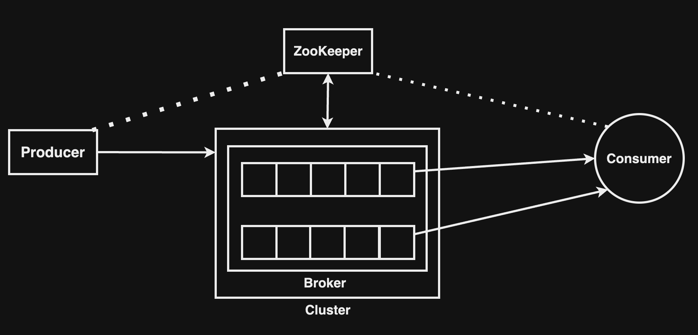

## Kafka

Kafka খুবই জনপ্রিয় Message Queue। High-performance data pipelines, streaming analytics, data integration, এবং mission-critical applications গুলোর জন্য Kafka ব্যবহার করা হয়। 

## Components of Kafka

- Producer: Producer কিংবা Publisher যার কাজ হচ্ছে message pass করা।

- Cluster: Producer message টি Cluster এ pass করবে। Cluster এর ভিতর Topics, Broker এবং ZooKeeper থাকবে।

  

- Broker: Cluster এর ভিতর Broker থাকে। এটি একটি সার্ভার যার কাজ হল message/data গ্রহণ এবং প্রসেস এর পর send করা। 

  

- Topic: Topic মূলত Broker এর একটি Core Section, যার কাজ হল মেসেজগুলোকে Organize করা। Broker এর ভিতর এক বা একাধিক Topic থাকবে।

  

Topic এর ভিতর Data Partitioning হয়ে থাকে। প্রতিটি Partition এ মূলত Set of Messages বিদ্যমান থাকে। প্রতিটি message identifie করা হয় partition এর offset দ্বারা। Messages গুলো partition এর শেষে যুক্ত হয় এবং অন্য দিক থেকে send করা হয়।

  

প্রতিটি মেসেজ একটি Dedicated Partition এ চলে যাবে।

- Consumer: Consumer মূলত Topic থেকে Message নিয়ে থাকে। Topic এর Partition থেকে Message Consumer এ যায়।

  

ছবিতে দুটি Partition এবং একটি Consumer আছে, Kafka এর আর্কিটেকচার অনুযায়ী একধিক Partition থেকে ডেটা consume করতে পারবে। 

  

এখানে দুটি Partition এবং দুটি Consumer আছে, Kafka এই দুটি Partition এবং দুটি Consumer কে সমানভাবে ডিস্ট্রিবিউট (Auto Balancing) করে দিবে।

  

যেহেতু ১টি Partition কে কেবল ১টি Consumer নিতে পারবে সেজন্য consumer 3 কিছু consume করতে পারবে না। 

- ZooKeeper: এটিতে মূলত Kafka Cluster এর information এবং Consumer এর details সংরক্ষন করা থাকে। এটি Active Broker এর একটি লিস্ট মেইনটেইন করে। যখন কোনো Broker নষ্ট হয়ে যায় কিংবা কোনো error হলে ZooKeeper একটি notification পাঠিয়ে দেয় Kafka'র কাছে। Kafka সার্ভারের জন্য ZooKeeper থাকা বাধ্যতামূলক।

  

## Real life Kafka use-cases

- Real-time Data Processing.
- Messaging System.
- Stream Processing.
- Event-driven Architecture.
- Log Aggregation.
