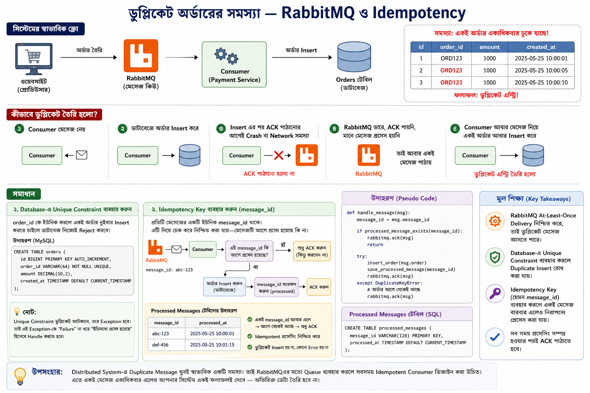
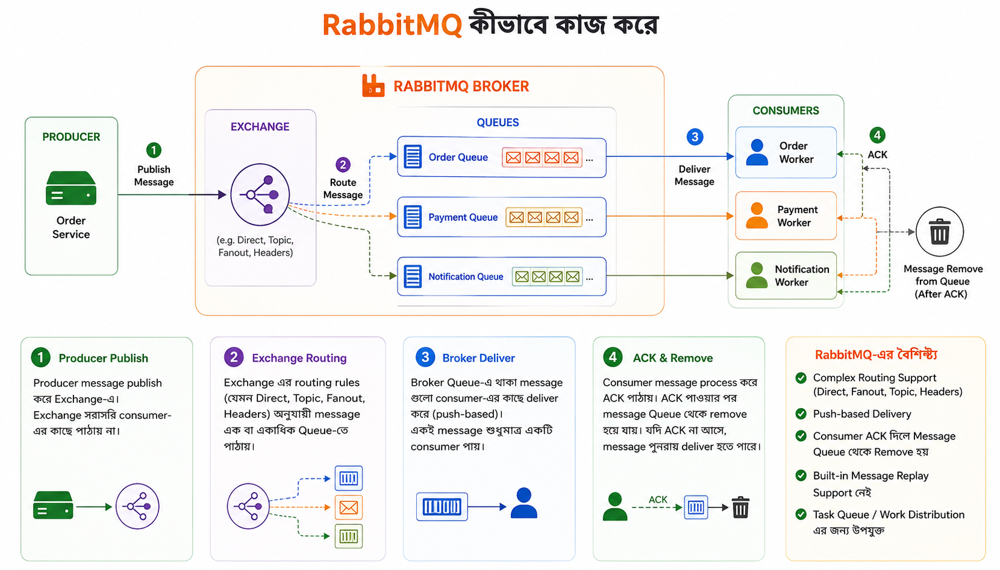
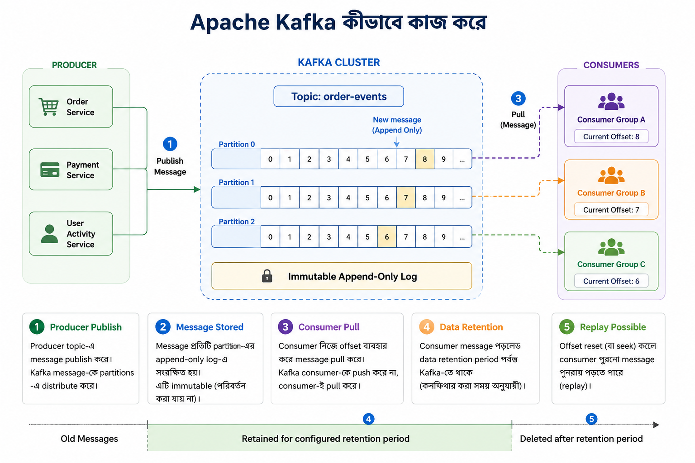

# RabbitMQ

এটি একটি জনপ্রিয় Message Broker যা Message Queue - implement করে থাকে।

Message Broker কি?

যে system - message routing, delivery, exchanges, queues, acknowledgements, retries ইত্যাদি manage করে তাই হচ্ছে Message Broker।

## RabbitMQ এর components

- Producer: Producer যার কাজ হচ্ছে message pass করা।

- Exchange: producer থেকে message নিয়ে routing rule অনুযায়ী queue-তে পাঠায়।

- Queue: যেখানে message store থাকে, যতক্ষণ না consumer তা receive করে।

- Broker: এটি মেসেজের ডিস্ট্রিবিউটর। এর কাজ শুধু মেসেজ সঠিক জায়গায় পৌঁছানো নিশ্চিত করা।

- Consumer: যে queue থেকে message পড়ে। প্রসেসিং করার মূল দায়িত্ব consumer এর।

- Acknowledgement: consumer message process এর পর ack (acknowledgement) পাঠায়। ack না পেলে broker ধরে নেয় message properly process হয়নি। তখন message requeue/retry হতে পারে। 

- Durability: আপনি যখন একটি কিউ (Queue) তৈরি করেন, তখন তাকে `durable: true` হিসেবে ডিক্লেয়ার করতে হয়। যার ফলে Broker restart দিলেও Queue টিকে থাকবে। ধরুন, আপনার একটি ই-কমার্স সাইট আছে। কাস্টমার অর্ডার করার পর আপনি একটি মেসেজ পাঠালেন। হঠাৎ করে RabbitMQ সার্ভারে পাওয়ার disconnect হলো। এখন `durable: true` থাকলে, সার্ভার চালু হওয়ার পর RabbitMQ ডিস্ক থেকে মেসেজগুলো reload করবে এবং কনজিউমার সেগুলো প্রসেস করতে পারবে।

- Prefetch: Prefetch হলো একটি কন্ট্রোল মেকানিজম, যা নির্ধারণ করে একজন Consumer-এর কাছে একসাথে কতগুলো মেসেজ পাঠানো হবে।

<p align="center">
  
</p>

## Message Delivery Semantics

মেসেজ কিউ নিয়ে কাজ করতে গেলে একটা প্রশ্ন বারবার সামনে আসে — মেসেজটা ঠিক কতবার পৌঁছাবে গ্রাহকের কাছে? উত্তরটা নির্ভর করে সিস্টেম কোন ডেলিভারি গ্যারান্টি বেছে নিচ্ছে তার উপর। মূলত তিনটা approach আছে, আর প্রতিটারই trade-off আলাদা।

### At-most-once: পাঠিয়ে দিলাম, ভুলে গেলাম

এখানে Producer-এর philosophy খুব সহজ — মেসেজ পাঠিয়ে দাও, আর কোনো ACK-এর জন্য বসে থেকো না। নেটওয়ার্কে কোনো সমস্যা হয়ে মেসেজ হারিয়ে গেলেও কেউ সেটা আবার পাঠানোর চেষ্টা করবে না। ফলে মেসেজ হারানোর ঝুঁকি থাকে, কিন্তু ডুপ্লিকেট হওয়ার কোনো সম্ভাবনাই নেই।

এটা কাজে লাগে যেখানে একটা-দুটো মেসেজ মিস হলে তেমন কিছু যায় আসে না — যেমন লাইভ স্ট্রিমিং-এর ফ্রেম, গেমে প্লেয়ারের পজিশন আপডেট, বা সাধারণ লগ লাইন। একটা লগ লাইন হারিয়ে গেলে দুনিয়া থেমে থাকে না, তাই এখানে এক্সট্রা reliability-র জন্য পারফরম্যান্স ছাড় দেওয়ার মানে হয় না।

### At-least-once: নিশ্চিত পৌঁছাবে, কিন্তু একাধিকবারও পৌঁছাতে পারে

এবার Producer একটু বেশি সতর্ক — মেসেজ পাঠানোর পর সে ACK-এর জন্য অপেক্ষা করে। কনজিউমার মেসেজ প্রসেস করার পর ACK পাঠাতে দেরি করলে, বা মাঝপথে কানেকশন ড্রপ হয়ে গেলে, Producer ধরে নেয় মেসেজটা পৌঁছায়নি। ফলাফল — সে আবার একই মেসেজ পাঠায়। কনজিউমার তখন একই মেসেজ দু'বার বা তার বেশিও পেয়ে যেতে পারে।

এই জায়গাটায় RabbitMQ নিয়ে কাজ করার সময় একটা জিনিস প্রায়ই চোখে পড়ে — manual acknowledgement (ack) সেট না করলে, অথবা কনজিউমার ক্র্যাশ করলে, একই মেসেজ queue-তে ফিরে এসে আবার deliver হয়। এটা bug না, এটাই at-least-once-এর স্বাভাবিক আচরণ।

### Exactly-once: না হারাবে, না ডুপ্লিকেট হবে

নাম শুনে মনে হতে পারে এটা একদম আলাদা কোনো mechanism, কিন্তু আসলে এটা at-least-once আর idempotency-র একটা কম্বিনেশন। সিস্টেম প্রতিটা মেসেজের জন্য একটা ইউনিক আইডি (যেমন UUID) রাখে। রিট্রাইয়ের কারণে একই মেসেজ দ্বিতীয়বার এলে, ব্রোকার বা কনজিউমার সেই আইডি দেখে বুঝে ফেলে — এটা আগেই প্রসেস হয়ে গেছে, তাই দ্বিতীয়টা সে চুপচাপ ড্রপ করে দেয়।

ব্যাংকিং ট্রানজ্যাকশন বা পেমেন্ট গেটওয়ের মতো জায়গায় এটা অপরিহার্য — একই পেমেন্ট দু'বার প্রসেস হয়ে যাওয়া মানে সরাসরি আর্থিক বিপর্যয়। 

তবে একটা কথা মনে রাখা ভালো: distributed systems-এ "সত্যিকারের" exactly-once অর্জন করা কঠিন এবং costly। বাস্তবে বেশিরভাগ সিস্টেম আসলে অর্জন করে "effectively-once" — অর্থাৎ at-least-once ডেলিভারি প্লাস ডি-ডুপ্লিকেশন লজিক, যা শেষ পর্যন্ত একই ফলাফল দেয় কিন্তু underlying mechanism-টা ভিন্ন।

**RabbitMQ broker নিজে কোনো "default" semantics enforce করে না**

সেটা পুরোপুরি নির্ভর করে কনজিউমার ack কীভাবে কনফিগার করছে তার উপর। **at-least-once** পেতে হলে আপনাকে explicitly manual ack ব্যবহার করতে হবে — অর্থাৎ `noAck: false` (যেটা client library-গুলোতে যেমন `amqplib`-এ default parameter হিসেবে থাকে)। এখানে কনজিউমার মেসেজ পায়, প্রসেস করে, তারপর নিজে থেকে `channel.ack()` কল করে। যদি কনজিউমার ক্র্যাশ করে, কানেকশন ড্রপ হয়, বা ack পাঠানোর আগেই কোনো এক্সেপশন হয় — broker ধরে নেয় মেসেজটা প্রসেস হয়নি, এবং সেটা আবার queue-তে redeliver করে (অথবা DLQ-তে পাঠায়, dead-letter কনফিগারেশন থাকলে)। ফলে একই message একাধিকবার deliver হওয়ার সম্ভাবনা থাকে, যেটা at-least-once সেমান্টিক্সের সংজ্ঞা অনুযায়ীই স্বাভাবিক।

RabbitMQ চাইলে **at-most-once** behave করতে পারে, যদি আপনি `noAck: true` সেট করেন - তখন message deliver হওয়া মাত্রই RabbitMQ সেটাকে "done" ধরে নেয়, Consumer আসলে প্রসেস করতে পারল কিনা সেটা নিয়ে আর মাথা ঘামায় না।

**Exactly-once** RabbitMQ নিজে থেকে গ্যারান্টি দেয় না — এটা পেতে হলে আপনাকে নিজেই idempotency লেয়ার বানাতে হবে (যেমন প্রতিটা মেসেজে একটা unique ID/UUID রেখে, প্রসেস করার আগে DB বা cache-এ চেক করা যে এই আইডি আগে প্রসেস হয়েছে কিনা)।

## Dead Letter Queue (DLQ)

একটা মেসেজ যখন স্বাভাবিকভাবে প্রসেস হতে পারে না — কনজিউমার বারবার রিজেক্ট করছে, একটা নির্দিষ্ট সংখ্যক রিট্রাইয়ের পরও fail করছে, কিংবা queue-তে নির্ধারিত সময়ের (TTL) চেয়ে বেশি বসে আছে — তখন সেই মেসেজটা চিরকাল main queue-তে আটকে থাকা বা বারবার redeliver হতে থাকা কোনো সমাধান না। এখানেই Dead Letter Queue-র দরকার পড়ে।

DLQ মূলত একটা আলাদা queue, যেখানে এমন failed মেসেজগুলো সরিয়ে রাখা হয় — যাতে সেগুলো main processing flow-কে ব্লক না করে, কিন্তু হারিয়েও না যায়।

**কখন একটা মেসেজ dead-letter হয়:**

- কনজিউমার মেসেজটা `nack` বা `reject` করে এবং `requeue: false` সেট করা থাকে
- মেসেজের retry count একটা নির্ধারিত সীমা ছাড়িয়ে যায়
- মেসেজের TTL (Time-To-Live) শেষ হয়ে যায়, কিন্তু কনজিউম হয়নি
- queue নিজেই তার max-length ছাড়িয়ে গেলে পুরনো মেসেজগুলো dead-letter হয়ে যেতে পারে

RabbitMQ-তে DLQ বলে আলাদা কোনো built-in feature নেই — বরং এটা normal exchange আর queue দিয়েই বানানো হয়। একটা queue declare করার সময় `x-dead-letter-exchange` argument সেট করে দিলে, সেই queue-র failed মেসেজগুলো ঐ exchange-এ পাঠানো হয়, যেটা পরে একটা আলাদা queue-তে route হয় (সেটাই কার্যত DLQ)।

```javascript
channel.assertQueue('orders', {
  arguments: {
    'x-dead-letter-exchange': 'orders.dlx',
    'x-message-ttl': 30000,
    'x-dead-letter-routing-key': 'orders.failed'
  }
});
```

**RabbitMQ-তে কীভাবে কাজ করে:**

## Basic Code Example

### Connection Manager

```js
// rabbitmq/connection.js
const amqp = require("amqplib");

let connection = null;
let channel = null;

async function connectRabbitMQ() {
  try {
    connection = await amqp.connect(process.env.RABBITMQ_URL);

    connection.on("error", (err) => {
      console.error("RabbitMQ connection error:", err.message);
    });

    connection.on("close", () => {
      console.error("RabbitMQ connection closed. Reconnecting...");
      setTimeout(connectRabbitMQ, 5000);
    });

    channel = await connection.createChannel();

    console.log("✅ RabbitMQ connected");
  } catch (err) {
    console.error("❌ RabbitMQ connection failed:", err.message);
    setTimeout(connectRabbitMQ, 5000);
  }
}

function getChannel() {
  if (!channel) throw new Error("Channel not initialized");
  return channel;
}

module.exports = {
  connectRabbitMQ,
  getChannel,
};
```

### Producer/Publisher

```js
// rabbitmq/producer.js
const { getChannel } = require("./connection");

async function publish(queue, message) {
  const channel = getChannel();

  await channel.assertQueue(queue, {
    durable: true, // survives restart
  });

  channel.sendToQueue(
    queue,
    Buffer.from(JSON.stringify(message)),
    {
      persistent: true, // message saved to disk
    }
  );

  console.log("📤 Message sent:", message);
}

module.exports = { publish };
```

### Consumer/Worker

```js
// rabbitmq/consumer.js
const { getChannel } = require("./connection");

async function consume(queue, handler) {
  const channel = getChannel();

  await channel.assertQueue(queue, {
    durable: true,
  });

  // Fair dispatch (important for scaling)
  channel.prefetch(1);

  console.log(`📥 Waiting for messages in ${queue}`);

  channel.consume(queue, async (msg) => {
    if (!msg) return;

    try {
      const data = JSON.parse(msg.content.toString());

      await handler(data);

      channel.ack(msg); // success
    } catch (err) {
      console.error("❌ Error processing message:", err);

      // Reject and requeue (or send to DLQ in real systems)
      channel.nack(msg, false, true);
    }
  });
}

module.exports = { consume };
```

## Queue Backpressure এবং Auto-scaling Workers

ধরুন peak time-এ আপনার সিস্টেমে প্রতি সেকেন্ডে ১০০০টা মেসেজ আসছে, কিন্তু আপনার consumer প্রতি সেকেন্ডে মাত্র ২০০টা প্রসেস করতে পারে। তাহলে প্রতি সেকেন্ডে ৮০০টা মেসেজ queue-এ জমা হতে থাকবে। Peak শেষ হওয়ার পরও এই backlog ক্লিয়ার করতে ৪০-৫০ মিনিট লাগবে (যদি কোনো নতুন মেসেজ না-ই আসে)।

এর উপর যদি consumer-এ error হয় এবং মেসেজ nack/requeue হয়, তাহলে queue আরও বড় হতে থাকবে।

**ভুল চিন্তাভাবনা:** "Just queue them all" — সব মেসেজ queue-তে ফেলে দিই, পরে দেখা যাবে।

**সঠিক চিন্তাভাবনা:** "Can our consumers catch up eventually?" — যদি queue সাইজ ক্রমাগত বাড়তেই থাকে এবং consumer কখনো catch up করতে না পারে, তাহলে সিস্টেম একসময় ভেঙে পড়বে। প্রশ্নটা হওয়া উচিত — আমাদের consumer-রা কি কখনো এই backlog সামলে উঠতে পারবে?

**সমাধান:** Dynamic Worker Scaling

Queue-এর সাইজ (depth) মনিটর করে, সেই অনুযায়ী consumer/worker-এর সংখ্যা বাড়ানো বা কমানো (auto-scale)। যেমন:

- Queue depth বাড়লে → নতুন worker spin up
- Queue depth কমলে → extra worker scale down

এভাবে peak load-এও সিস্টেম backlog ক্লিয়ার করতে পারে, এবং normal time-এ অতিরিক্ত resource খরচ হয় না।

## Message Queue এবং Worker Thread এর তফাৎ 

Message Queue এবং Worker Thread নিয়ে অনেকের ভিতর confusion কাজ করে – দুটোই asynchronous processing এ ব্যবহৃত হয়।

Message Queue হচ্ছে একটা asynchronous communication mechanism, যা ভিন্ন প্রসেস বা সার্ভিসের মধ্যে decoupled ভাবে কাজ করে। একটি service (producer) message পাঠায় queue-এ, এবং অন্য service (consumer) পরে সেটি নিয়ে প্রসেস করে। 

Worker Thread হচ্ছে একটি thread যেটি background এ task execute করে। এটি একই process এর ভিতরে কাজ করে।

Message Queue এবং Worker Thread একসাথে ব্যবহার করা যায়। সাধারণত Message Queue থেকে message বা job নিয়ে Worker Thread সেগুলো process করে। Process শেষ হলে worker acknowledgement (ACK) পাঠায়। 

<p align="center">
  
</p>

## Real life Message Queue use-cases

- Real-time Data Processing.
- Messaging System.
- Stream Processing.
- Event-driven Architecture.
- Log Aggregation.

## Duplicate অর্ডার সমস্যা — RabbitMQ এবং Idempotency

একদিন সকালে John তাদের ওয়েবসাইটের orders টেবিল দেখছিলেন। হঠাৎ চোখে পড়ল — একই অর্ডার একাধিকবার ঢুকে গেছে Production Database-এ। ব্যাপারটা কী?

**সমস্যার শুরু কোথায়?**

John দেখলেন, payment module-এ RabbitMQ চলছে। আর সেখানেই লুকিয়ে ছিল আসল সমস্যা।

RabbitMQ (বা যেকোনো message queue) একটা গ্যারান্টি দেয় — at-least-once delivery। মানে, একটা message অন্তত একবার পৌঁছাবেই। কিন্তু এটা exactly-once না। অর্থাৎ, কোনো কোনো সময় একই message একাধিকবারও আসতে পারে।

**কীভাবে ঘটল?**

স্বাভাবিক flow ছিল এরকম —

- Consumer message নিল
- Database-এ insert করল
- RabbitMQ-কে ACK পাঠাল (মানে বলল — "হ্যাঁ, কাজ হয়ে গেছে")

কিন্তু ধরুন, insert হওয়ার পর ACK পাঠানোর আগেই consumer crash করল, অথবা network চলে গেল।

RabbitMQ তখন ভাবল — "ACK আসেনি, তার মানে message process হয়নি।" তাই সে আবার message পাঠিয়ে দিল।

আর consumer সেই একই কাজ আবার করল — আবার insert। ফলাফল? duplicate এন্ট্রি।

**সমাধান কী?**

- প্রথম কাজ — Database-এ Unique Constraint বসান

যদি consumer ভুলে একই data দুইবার insert করতে চায়, Database নিজেই সেটা reject করে দেবে। সহজ, কিন্তু কার্যকর।

তবে শুধু এটুকুতেই কাজ শেষ না।

Unique constraint error টা ধরবে ঠিকই, কিন্তু application-এ exception উঠবে। তাই এই exception টাকে "failure" হিসেবে না দেখে "ইতিমধ্যে হয়ে গেছে" হিসেবে handle করতে হবে।

- দ্বিতীয় কাজ — Idempotency Key ব্যবহার করুন

আরেকটু পরিষ্কার সমাধান হলো idempotency key — সাধারণত RabbitMQ-এর message_id ব্যবহার করা হয় এই কাজে।

প্রতিটা message-এর একটা unique ID থাকে। সেই ID টা আলাদা একটা জায়গায় রেখে দিন। পরের বার একই message আসলে আগেই চেক করুন — এই ID কি আগে দেখা গেছে?

যদি হ্যাঁ → ACK করুন, কিন্তু আর কিছু করবেন না

যদি না → Insert করুন, তারপর ACK করুন

<p align="center">
  
</p>

## Message Queue এবং Pub/Sub এর মধ্যে পার্থক্য কি?

### Message Queue — কাজের ধরন

ধরেন আপনি একটা রেস্টুরেন্টের কিচেনে কাজ করছেন। অর্ডার আসে, একটা তালিকায় জমা হয়, এবং যে রাঁধুনি ফ্রি সে অর্ডারটা তুলে নেয়। এক অর্ডার, এক রাঁধুনি।

```
// Producer — কাজ পাঠাচ্ছে
queue.send("resize_image", {"file": "photo.jpg", "size": "800x600"})

// Consumer A (একজনই এটা process করবে)
task = queue.receive()  # "resize_image" পেয়ে কাজ করল

// Queue থেকে message delete হয়ে গেল
```

**মূল বৈশিষ্ট্য**: message একবার consume হলে চলে যায়। Consumer B বা C এটা আর দেখবে না। Load balancing নিজেই হয় — ৩টা consumer থাকলে ৩টা task parallel-এ চলবে।

### Pub/Sub — কাজের ধরন

এটি একপ্রকারের রেডিও ব্রডকাস্ট। একজন বলছে, যতজন শুনছে সবাই সেটা পাচ্ছে। কেউ শুনলো বা না শুনলো সেটা broadcaster-এর দায় নয়।

```
// Publisher — event পাঠাচ্ছে
topic.publish("order_placed", {"order_id": 42, "total": 1500})

// Subscriber 1 — Email Service
def on_order(event):
  send_confirmation_email(event["order_id"])  # নিজের কাজ করছে

// Subscriber 2 — Analytics Service
def on_order(event):
  track_revenue(event["total"])  # সেও একই event পেয়েছে

// দুজনই একই message পেয়েছে, স্বাধীনভাবে কাজ করেছে
```

### কোনটা কখন ব্যবহার করবো?

**Message Queue বেছে নেবো যখন:**

- একটা কাজ একবারই হওয়া দরকার (payment processing, image resize)
- কাজ distribute করতে চাও multiple workers-এ
- Retry দরকার হলে same worker আবার নেবে

**Pub/Sub বেছে নেবো যখন:**

- একটা event-এর কথা অনেককে জানাতে হবে (order placed → email + sms + analytics)

## RabbitMQ এবং Apache Kafka এর মধ্যে মূল পার্থক্য কি?

### RabbitMQ কীভাবে কাজ করে

- Producer message publish করে Exchange-এ
- Exchange routing rules অনুযায়ী message Queue-তে পাঠায়
- Broker message consumer-এর কাছে deliver করে
- Consumer ACK দিলে message Queue থেকে remove হয়ে যায়
- Complex routing support করে (Direct, Fanout, Topic, Headers Exchange)
- Built-in message replay support নেই

<p align="center">
  
</p>

### Apache Kafka কীভাবে কাজ করে

- Producer message Topic-এ publish করে
- Message একটি append-only immutable log-এ সংরক্ষিত হয়
- Consumer offset ব্যবহার করে নিজে message pull করে
- Consumer message পড়লেও data retention period পর্যন্ত Kafka-তে থাকে
- Offset reset করে পুরনো message পুনরায় পড়া (replay) সম্ভব

<p align="center">
  
</p>

**RabbitMQ এর Broker কে Smart এবং Consumer কে Dumb বলা হয়। কারণ কী?**

RabbitMQ broker অনেক কাজ করে:

- Message routing
- Filtering
- Load balancing
- Retry handling
- Dead Letter Queue (DLQ)
- Priority queues
- ACK tracking
- Complex delivery rules

Consumer সাধারণত শুধু message receive করে এবং process করে। সেজন্য RabbitMQ এর Broker কে Smart এবং Consumer কে Dumb বলা হয়।

**Apache Kafka এর Consumer কে Smart এবং Broker কে Dumb বলা হয়। কারণ কী?**

Kafka broker-এর কাজ তুলনামূলকভাবে সহজ:

- Message store করা
- Partition manage করা
- Replication করা
- Offset track করা

Business logic এবং processing strategy consumer-এর দায়িত্ব।

### RabbitMQ ব্যবহার করুন যখন

আপনার মূল সমস্যা হলো:

"এই কাজটা কে করবে?"

অর্থাৎ আপনি work distribution বা task processing করতে চান।

ভালো use cases,

- Email sending
- SMS/Push notification processing
- Image/video processing jobs
- Payment processing workflows
- Background jobs
- Order fulfillment tasks
- Request/Response patterns
- Job queues

উদাহরণ,

```
User একটি ছবি upload করল।

Upload API
  |
  v
RabbitMQ
  |
  v
Image Processing Worker
```

Worker image process করল, কাজ শেষ, message-ও শেষ।

এখানে replay বা historical event store করার দরকার নেই।

### Kafka ব্যবহার করুন যখন

আপনার মূল সমস্যা হলো:

"কি কি ঘটনা ঘটছে, সেগুলো সবাইকে জানাতে হবে এবং ভবিষ্যতের জন্য সংরক্ষণ করতে হবে।"

ভালো use cases,

- Event-driven architecture
- Audit logs
- User activity tracking
- Analytics pipelines
- Clickstream processing
- CDC (Change Data Capture)
- Event sourcing
- Real-time dashboards
- ML/Recommendation pipelines

উদাহরণ,

```
User order করল।

Order Service
  |
  v
Order Topic (Kafka)
  |
  v
-----------------------------
|             |           |
v             v           v   
Billing   Analytics   Notification
```

একই event অনেক service consume করতে পারে।

পরে নতুন Fraud Detection Service যোগ হলেও পুরোনো event replay করে শুরু করতে পারবে।

## গুরুত্বপূর্ণ প্রশ্নগুলো

- Message acknowledgement (ACK/NACK) কি? কেন এটি গুরুত্বপূর্ণ?
- Retry mechanism কিভাবে design করবেন? Infinite retry সমস্যা কিভাবে handle করবেন?
- Producer fast কিন্তু Consumer slow হলে কি সমস্যা হবে? কিভাবে handle করবেন?
- Idempotent consumer কি? কেন দরকার?
- Duplicate message আসলে কিভাবে handle করবেন?
- Message schema change (versioning) কিভাবে handle করবেন যাতে পুরনো consumer break না করে?
- Message size বড় হলে কি সমস্যা হতে পারে? কিভাবে optimize করবেন?
- Synchronous vs Asynchronous processing - কখন কোনটা ব্যবহার করবেন?
- Message Queue use করলে system latency বাড়ে না কমে? explain করুন।
- Horizontal scaling এ multiple consumer use করলে কি কি challenge আসে?
- Queue based system এ monitoring কি কি metric track করবেন?
