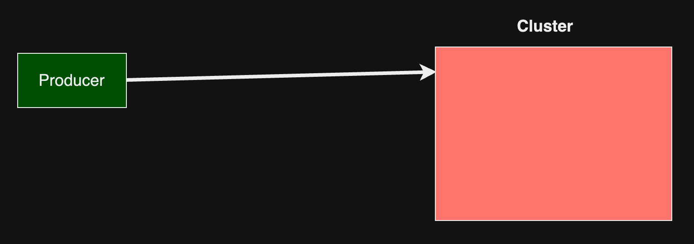
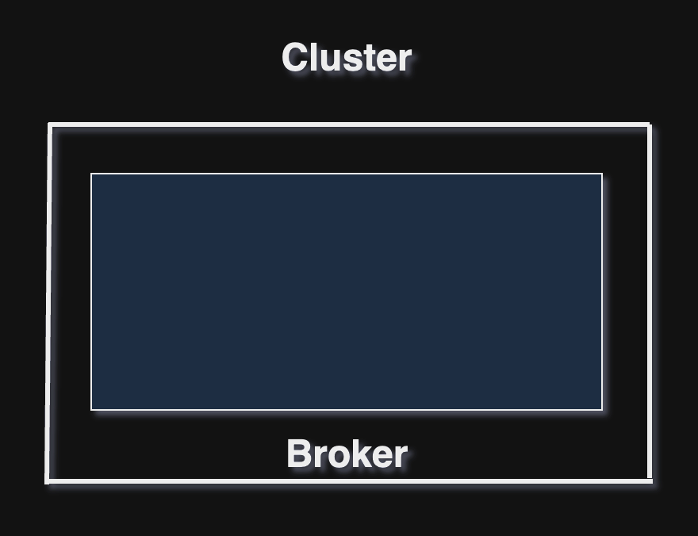
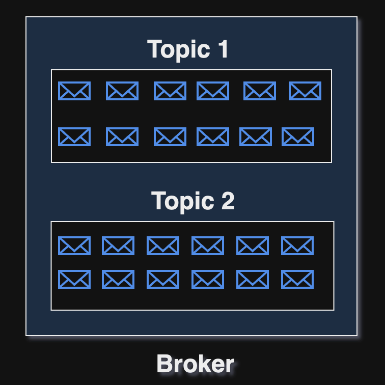
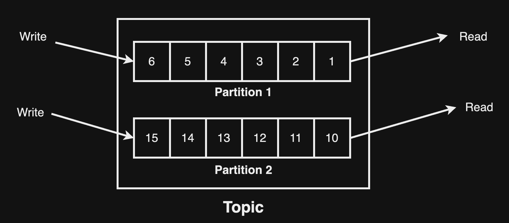
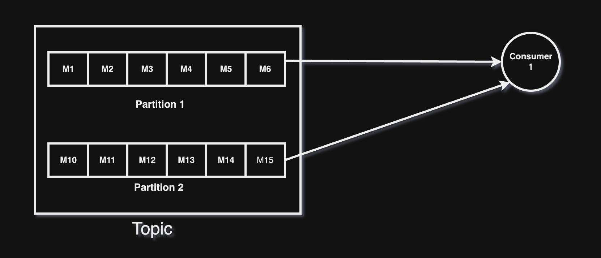
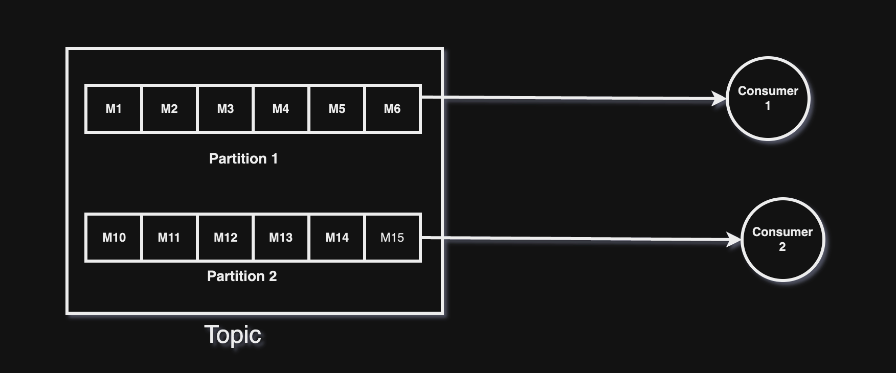
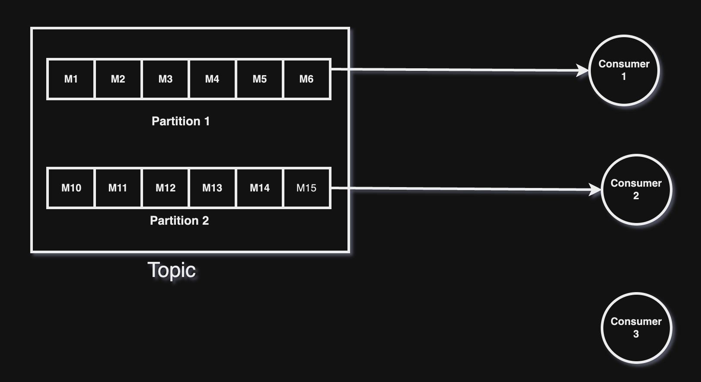
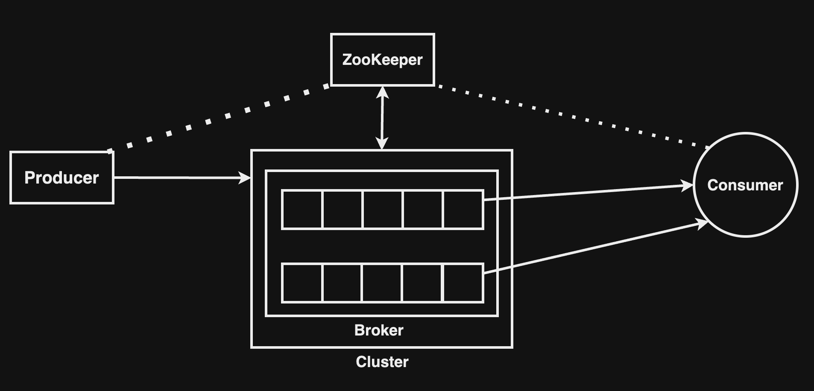
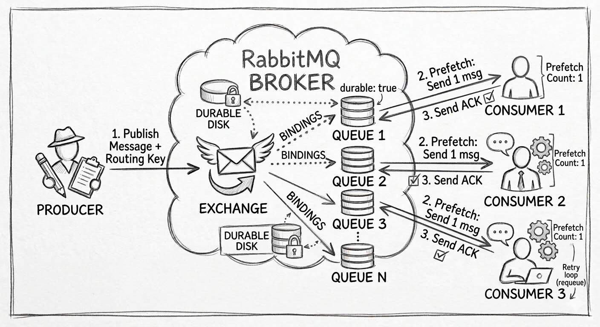
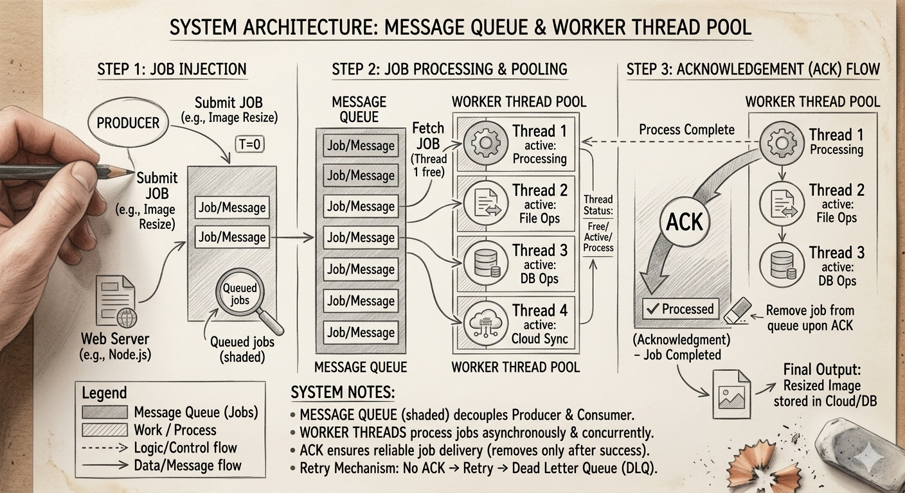

# Kafka

Kafka খুবই জনপ্রিয় Message Queue। High-performance data pipelines, streaming analytics, data integration, এবং mission-critical applications গুলোর জন্য Kafka ব্যবহার করা হয়। 

## Kafka এর components

- Producer: Producer কিংবা Publisher যার কাজ হচ্ছে message pass করা।

- Cluster: Producer message টি Cluster এ pass করবে। Cluster এর ভিতর Topics, Broker এবং ZooKeeper থাকবে।

  

- Broker: Cluster এর ভিতর Broker থাকে। এটি একটি সার্ভার যার কাজ হল message/data গ্রহণ এবং প্রসেস এর পর send করা। 

  

- Topic: Topic মূলত Broker এর একটি Core Section, যার কাজ হল মেসেজগুলোকে Organize করা। Broker এর ভিতর এক বা একাধিক Topic থাকবে।

  

Topic এর ভিতর Data Partitioning হয়ে থাকে। প্রতিটি Partition এ মূলত Set of Messages বিদ্যমান থাকে। প্রতিটি message identifie করা হয় partition এর offset দ্বারা। Messages গুলো partition এর শেষে যুক্ত হয় এবং অন্য দিক থেকে send করা হয়।

  

প্রতিটি মেসেজ একটি Dedicated Partition এ চলে যাবে।

- Consumer: Consumer মূলত Topic থেকে Message নিয়ে থাকে। Topic এর Partition থেকে Message Consumer এ যায়।

  

ছবিতে দুটি Partition এবং একটি Consumer আছে, Kafka এর আর্কিটেকচার অনুযায়ী একধিক Partition থেকে ডেটা consume করতে পারবে। 

  

এখানে দুটি Partition এবং দুটি Consumer আছে, Kafka এই দুটি Partition এবং দুটি Consumer কে সমানভাবে ডিস্ট্রিবিউট (Auto Balancing) করে দিবে।

  

যেহেতু ১টি Partition কে কেবল ১টি Consumer নিতে পারবে সেজন্য consumer 3 কিছু consume করতে পারবে না। 

- ZooKeeper: এটিতে মূলত Kafka Cluster এর information এবং Consumer এর details সংরক্ষন করা থাকে। এটি Active Broker এর একটি লিস্ট মেইনটেইন করে। যখন কোনো Broker নষ্ট হয়ে যায় কিংবা কোনো error হলে ZooKeeper একটি notification পাঠিয়ে দেয় Kafka'র কাছে। Kafka সার্ভারের জন্য ZooKeeper থাকা বাধ্যতামূলক।

  

# RabbitMQ

এটি একটি জনপ্রিয় Message Broker যা Message Queue - implement করে থাকে।

Message Broker কি?

যে system - message routing, delivery, exchanges, queues, acknowledgements, retries ইত্যাদি manage করে তাই হচ্ছে Message Broker।

## RabbitMQ এর components

- Producer: Producer যার কাজ হচ্ছে message pass করা।

- Exchange: producer থেকে message নিয়ে routing rule অনুযায়ী queue-তে পাঠায়।

- Queue: যেখানে message store থাকে, যতক্ষণ না consumer তা receive করে।

- Broker: এটি মেসেজের ডিস্ট্রিবিউটর। এর কাজ শুধু মেসেজ সঠিক জায়গায় পৌঁছানো নিশ্চিত করা।

- Consumer: যে queue থেকে message পড়ে। প্রসেসিং করার মূল দায়িত্ব consumer এর।

- Acknowledgement: consumer message process এর পর ack (acknowledgement) পাঠায়। ack না পেলে broker ধরে নেয় message properly process হয়নি। তখন message requeue/retry হতে পারে। 

- Durability: আপনি যখন একটি কিউ (Queue) তৈরি করেন, তখন তাকে `durable: true` হিসেবে ডিক্লেয়ার করতে হয়। যার ফলে Broker restart দিলেও Queue টিকে থাকবে। ধরুন, আপনার একটি ই-কমার্স সাইট আছে। কাস্টমার অর্ডার করার পর আপনি একটি মেসেজ পাঠালেন। হঠাৎ করে RabbitMQ সার্ভারে পাওয়ার disconnect হলো। এখন `durable: true` থাকলে, সার্ভার চালু হওয়ার পর RabbitMQ ডিস্ক থেকে মেসেজগুলো reload করবে এবং কনজিউমার সেগুলো প্রসেস করতে পারবে।

- Prefetch: Prefetch হলো একটি কন্ট্রোল মেকানিজম, যা নির্ধারণ করে একজন Consumer-এর কাছে একসাথে কতগুলো মেসেজ পাঠানো হবে।

  

## Message Queue এবং Worker Thread এর তফাৎ 

Message Queue এবং Worker Thread নিয়ে অনেকের ভিতর confusion কাজ করে – দুটোই asynchronous processing এ ব্যবহৃত হয়।

Message Queue হচ্ছে একটা asynchronous communication mechanism, যা ভিন্ন প্রসেস বা সার্ভিসের মধ্যে decoupled ভাবে কাজ করে। একটি service (producer) message পাঠায় queue-এ, এবং অন্য service (consumer) পরে সেটি নিয়ে প্রসেস করে। 

Worker Thread হচ্ছে একটি thread যেটি background এ task execute করে। এটি একই process এর ভিতরে কাজ করে।

Message Queue এবং Worker Thread একসাথে ব্যবহার করা যায়। সাধারণত Message Queue থেকে message বা job নিয়ে Worker Thread সেগুলো process করে। Process শেষ হলে worker acknowledgement (ACK) পাঠায়। 

  

## Real life Message Queue use-cases

- Real-time Data Processing.
- Messaging System.
- Stream Processing.
- Event-driven Architecture.
- Log Aggregation.

## Duplicate অর্ডার সমস্যা — RabbitMQ এবং Idempotency

একদিন সকালে John তাদের ওয়েবসাইটের orders টেবিল দেখছিলেন। হঠাৎ চোখে পড়ল — একই অর্ডার একাধিকবার ঢুকে গেছে Production Database-এ। ব্যাপারটা কী?

**সমস্যার শুরু কোথায়?**

John দেখলেন, payment module-এ RabbitMQ চলছে। আর সেখানেই লুকিয়ে ছিল আসল সমস্যা।

RabbitMQ (বা যেকোনো message queue) একটা গ্যারান্টি দেয় — at-least-once delivery। মানে, একটা message অন্তত একবার পৌঁছাবেই। কিন্তু এটা exactly-once না। অর্থাৎ, কোনো কোনো সময় একই message একাধিকবারও আসতে পারে।

**কীভাবে ঘটল?**

স্বাভাবিক flow ছিল এরকম —

- Consumer message নিল
- Database-এ insert করল
- RabbitMQ-কে ACK পাঠাল (মানে বলল — "হ্যাঁ, কাজ হয়ে গেছে")

কিন্তু ধরুন, insert হওয়ার পর ACK পাঠানোর আগেই consumer crash করল, অথবা network চলে গেল।

RabbitMQ তখন ভাবল — "ACK আসেনি, তার মানে message process হয়নি।" তাই সে আবার message পাঠিয়ে দিল।

আর consumer সেই একই কাজ আবার করল — আবার insert। ফলাফল? duplicate এন্ট্রি।

**সমাধান কী?**

- প্রথম কাজ — Database-এ Unique Constraint বসান

যদি consumer ভুলে একই data দুইবার insert করতে চায়, Database নিজেই সেটা reject করে দেবে। সহজ, কিন্তু কার্যকর।

তবে শুধু এটুকুতেই কাজ শেষ না।

Unique constraint error টা ধরবে ঠিকই, কিন্তু application-এ exception উঠবে। তাই এই exception টাকে "failure" হিসেবে না দেখে "ইতিমধ্যে হয়ে গেছে" হিসেবে handle করতে হবে।

- দ্বিতীয় কাজ — Idempotency Key ব্যবহার করুন

আরেকটু পরিষ্কার সমাধান হলো idempotency key — সাধারণত RabbitMQ-এর message_id ব্যবহার করা হয় এই কাজে।

প্রতিটা message-এর একটা unique ID থাকে। সেই ID টা আলাদা একটা জায়গায় রেখে দিন। পরের বার একই message আসলে আগেই চেক করুন — এই ID কি আগে দেখা গেছে?

যদি হ্যাঁ → ACK করুন, কিন্তু আর কিছু করবেন না

যদি না → Insert করুন, তারপর ACK করুন