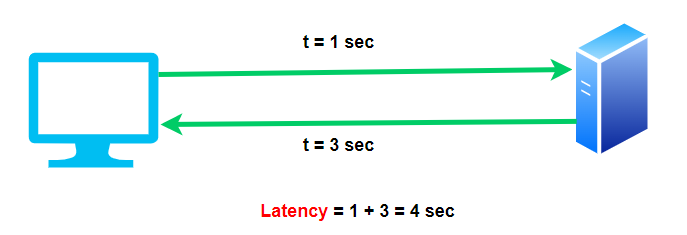
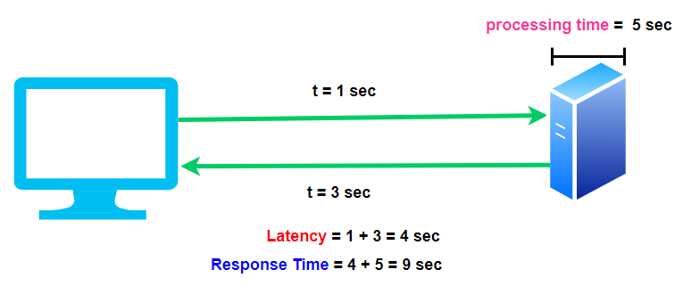

## Performance Metrics

### Latency

যখন রিকুয়েস্ট Client থেকে শুরু করে Server পর্যন্ত যেতে যত সময় লাগে এবং সেই Server থেকে আবার রেসপন্স যখন Client এ আসতে যত সময় লাগে সেই সময়টুকু হল Latency। Latency মূলত Network এর সময়টুকুর উপর নির্ভরশীল।

  

### Response Time

Response Time হল Server রিকুয়েস্ট প্রসেস করতে যত সময় নেয়, সেই সময় আর Latency এর সময়টুকুর সমষ্টি।

  

### Error Rate

সিস্টেম রিকোয়েস্ট প্রসেস করার সময় যতগুলো Error আসে আর সর্বমোট যতগুলো রিকোয়েস্ট প্রসেস করা হয় তার ভাগফল হল Error Rate। এটি খুবই গুরুত্বপূর্ণ যদি High Available System তৈরী করতে চান।
