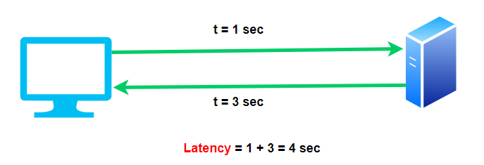
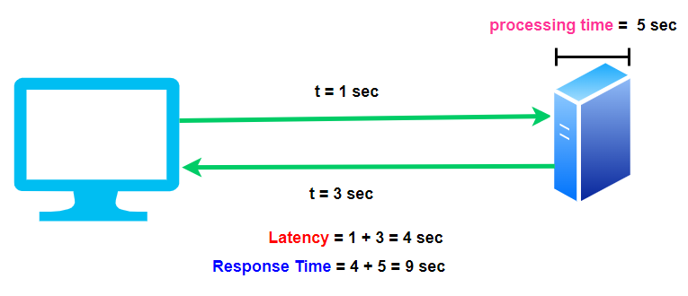

# Performance Metrics

## Latency

যখন রিকুয়েস্ট Client থেকে শুরু করে Server পর্যন্ত যেতে যত সময় লাগে এবং সেই Server থেকে আবার রেসপন্স যখন Client এ আসতে যত সময় লাগে সেই সময়টুকু হল Latency। Latency মূলত Network এর সময়টুকুর উপর নির্ভরশীল।

  

## Response Time

Response Time হল Server রিকুয়েস্ট প্রসেস করতে যত সময় নেয়, সেই সময় আর Latency এর সময়টুকুর সমষ্টি।

  

## Error Rate

সিস্টেম রিকোয়েস্ট প্রসেস করার সময় যতগুলো Error আসে আর সর্বমোট যতগুলো রিকোয়েস্ট প্রসেস করা হয় তার ভাগফল হল Error Rate। এটি খুবই গুরুত্বপূর্ণ যদি High Available System তৈরী করতে চান।

## DNS lookup time

DNS Lookup Time হলো একটি domain name (যেমন google.com) কে তার corresponding IP address-এ resolve করতে যে সময় লাগে, সেই সময়টা।

## Percentile-based Latency Metrics

### Percentile মানে কী?

P50, P90, P95, P99 — মানে হলো, কত শতাংশ request একটা নির্দিষ্ট সময়ের মধ্যে বা তার আগে complete হয়েছে।

- P50 (Median): এটা হলো মাঝামাঝি value — অর্ধেক request এর চেয়ে কম সময়ে শেষ হয়, অর্ধেক বেশি সময়ে। এটা "typical" experience বোঝায়, কিন্তু worst-case সম্পর্কে কিছু বলে না।

- P90: ১০০টা request এর মধ্যে ৯০টা request এই সময়ের মধ্যে শেষ হয়েছে, বাকি ১০টা এর চেয়ে বেশি সময় নিয়েছে।

- P95: ৯৫% request এই সময়ের মধ্যে শেষ হয়েছে, বাকি ৫% (সাধারণত slow path/edge case) এর বেশি সময় লেগেছে।

- P99: ৯৯% request এই সময়ের মধ্যে শেষ হয়েছে, বাকি ১% সবচেয়ে slow request। এটাকেই বলা হয় Tail Latency — distribution এর "tail" বা শেষের দিকের অংশ।