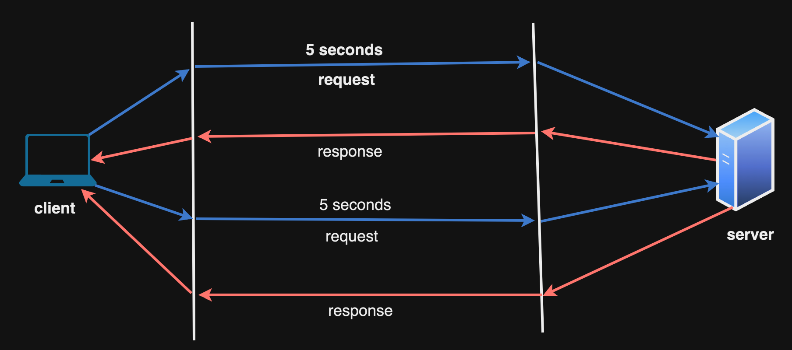
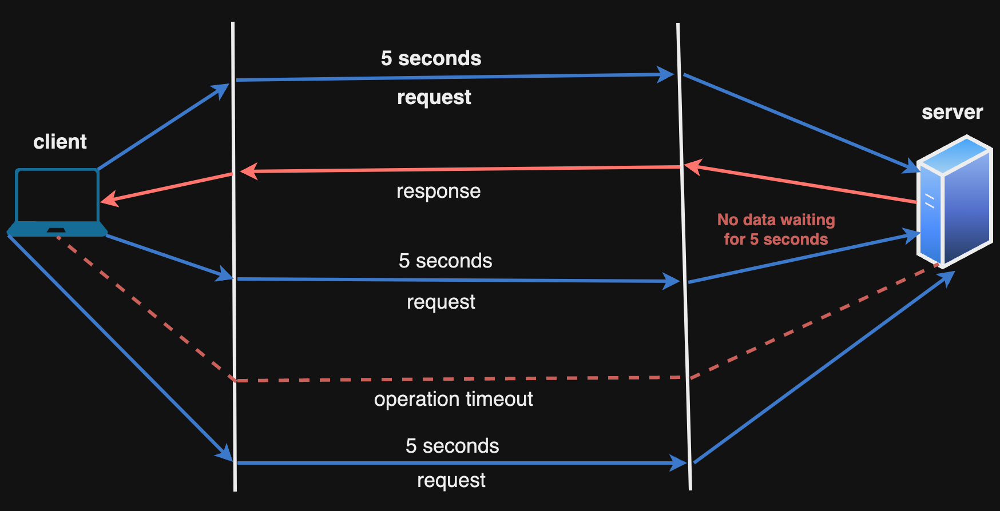
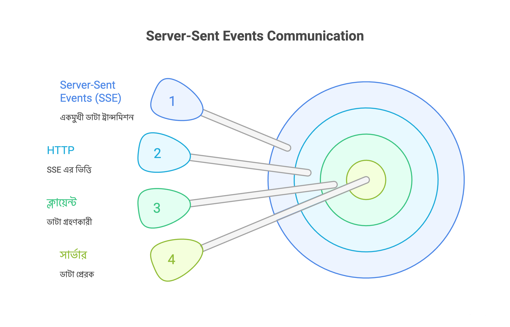

## Polling এর টাইপ

### Short Polling

এটি এক প্রকারের Polling, যেখানে ক্লায়েন্ট একটি সময় পর পর সার্ভারকে রিকোয়েস্ট করবে সার্ভার সেই রিকোয়েস্ট এর রেসপন্স করবে, সার্ভারের কাছে যদি সেই ডেটার রেসপন্স না থাকে তাহলে empty response পাঠাবে।

<p align="center">
  
</p>

### Long Polling

এখানে ক্লায়েন্ট একটি সময় পর পর সার্ভারকে রিকোয়েস্ট করবে সার্ভার সেই রিকোয়েস্ট এর রেসপন্স করবে, এখন যদি সার্ভার এর কাছে রেসপন্স না থাকে তাহলে সার্ভার একটি নির্দিষ্ট সময় অপেক্ষা করবে নির্দিষ্ট সময়ের ভিতর সার্ভারে ডেটা আসে তাহলে ডেটা সার্ভার রেসপন্স আকারে ক্লায়েন্ট কে দিয়ে দিবে না হয় অপারেশন Timeout হয়ে যাবে,তখন ক্লায়েন্ট আবার নির্দিষ্ট সময় পর সার্ভারকে রিকোয়েস্ট করবে।

<p align="center">
  
</p>

## Web Socket কিভাবে কাজ করে?

Web Socket একটি single TCP কানেকশন এর মাধ্যমে তৈরী হওয়া Bidirectional Communication Protocol। প্রসেস শুরু হয়,

- TCP Connection: client প্রথমে সার্ভার এর সাথে TCP Connection তৈরী করবে। এটি HTTP প্রোটোকলের মাধ্যমে "WebSocket Handshake" নামক একটি বিশেষ অনুরোধ পাঠায় (Upgrade: websocket হেডার সহ)।

- Connection সবসময় open থাকা: Server যদি WebSocket সাপোর্ট করে, তবে এটি HTTP 101 Switching Protocols দিয়ে উত্তর দেয় এবং TCP সংযোগ WebSocket সংযোগে রূপান্তরিত হয়। একবার সংযোগ স্থাপিত হলে, এটি সবসময় খোলা থাকে। এই Open কানেকশন এর মধ্যে Data Transmit হবে।

- Connection বন্ধ: যখন কোনো এন্ড(client কিংবা server) নির্দিষ্টভাবে কানেকশন বন্ধ করলে, তখন কানেকশন সিস্টেম বন্ধ হবে। অন্যথায় কানেকশন সবসময় Open থাকবে।

আমরা অনেক সময় রিভার্স প্রক্সি হিসেবে NGINX ব্যবহার করি, WebSocket এর জন্য NGINX config-এ এই location block ব্যবহার করি:

```
location /socket {
  proxy_pass http://localhost:5000;
  proxy_http_version 1.1;
  proxy_set_header Upgrade $http_upgrade;
  proxy_set_header Connection "upgrade";
  proxy_set_header Host $host;
}
```

**এটা কেন দরকার?**

কারণ WebSocket শুরু হয় HTTP request দিয়ে, কিন্তু পরে সেটি persistent, bidirectional connection এ upgrade হয়।

**Step-by-step কি হয়?**

- **Step 1 — Client প্রথমে HTTP request পাঠায়**

ক্লায়েন্ট সরাসরি WebSocket connection শুরু করে না। প্রথমে এটা পাঠায়:

GET /socket HTTP/1.1
Upgrade: websocket
Connection: Upgrade

মানে: “আমি HTTP দিয়ে শুরু করছি, কিন্তু WebSocket এ upgrade করতে চাই।”

- **Step 2 — NGINX যদি এটা handle না করে?**

তাহলে NGINX এটাকে normal HTTP request হিসেবে ধরবে।

Normal HTTP connection: request → response → connection close

তখন persistent two-way communication সম্ভব না, ফলে WebSocket কাজ করবে না।

### Web Socket এর সীমাবদ্ধতা

আপনি WebSocket ব্যবহার করে একটি চ্যাট অ্যাপ তৈরি করেছেন, যেখানে A এবং B নিজেদের মধ্যে চ্যাট করছে। যদি B-এর ইন্টারনেট সংযোগ বিচ্ছিন্ন হয়ে যায়, তাহলে কি চ্যাট স্বয়ংক্রিয়ভাবে নিষ্ক্রিয় হয়ে যাবে?

হ্যাঁ, যখন ইন্টারনেট সংযোগ বিচ্ছিন্ন হয়, তখন এটি ‘close’ ইভেন্ট ট্রিগার করবে।

আপনি এমন একটি মেকানিজম তৈরি করতে পারেন, যাতে A জানতে পারে যে B সংযোগ বিচ্ছিন্ন হয়েছে।

ধরুন A বার্তা পাঠিয়ে যাচ্ছে(B-এর ইন্টারনেট নাই), কিন্তু যদি কিছু সময় B-এর ইন্টারনেট পুনরায় চালু হয়, তাহলে B কী মেসেজগুলো পাবে যা A তাকে পাঠিয়েছিল যখন B-এর ইন্টারনেট বন্ধ ছিল?

B বার্তাগুলো সাথে সাথে পাবে না, যদি না সে chat page রিফ্রেশ করে বা ক্লায়েন্ট-সাইড লজিকে স্বয়ংক্রিয়ভাবে WebSocket সার্ভারের সাথে পুনরায় সংযোগ স্থাপনের ব্যবস্থা করা হয়।

এটাই(সাথে সাথে মেসেজ না পাওয়া) WebSocket এর সীমাবদ্ধতা।

## Server-Sent Events

Server-Sent Events (SSE) হলো একটি একমুখী communication মাধ্যম, যেখানে ডাটা শুধুমাত্র সার্ভার → ক্লায়েন্ট এ পাঠানো হয় এবং এটি HTTP এর উপর কাজ করে।

যা WebSocket-এর থেকে আলাদা(SSE কোনো protocol না), এখানে communication single direction-এ হয় (অর্থাৎ শুধু সার্ভার → ক্লায়েন্ট দিকেই হয়), অপরদিকে WebSocket Bidirectional Communication করে।

রিয়েল-টাইম নোটিফিকেশন, রিয়েল-টাইম ড্যাশবোর্ড, লগ, মনিটরিং ইত্যাদির জন্য Server-Sent Events effective।

<p align="center">
  
</p>

**কিভাবে Server-Sent Events কাজ করে?**

- ক্লায়েন্ট একটি সাধারণ HTTP রিকোয়েস্ট দিয়ে শুরু করলো।

```js
const eventSource = new EventSource('/events');

GET /events HTTP/1.1
Host: example.com
Accept: text/event-stream
Cache-Control: no-cache
Connection: keep-alive
```

- সার্ভার রিকোয়েস্ট গ্রহণ করলো এবং connection open রাখে। সার্ভার ক্লায়েন্টকে যা রিটার্ন করবে,

```js
HTTP/1.1 200 OK
Content-Type: text/event-stream
Cache-Control: no-cache
Connection: keep-alive
```

- ইভেন্ট স্ট্রিম ফরম্যাট,

সার্ভার কানেকশন ওপেন রেখে নিচের ফরম্যাটে ডেটা পাঠাতে থাকে।

সাধারণ মেসেজ ফরম্যাট,

```js
data: Hello world\n\n
```

একাধিক ফিল্ডসহ মেসেজ,

```js
event: meeting_created
id: 42
data: {"title":"Sprint Review"}
```

**SSE (Server-Sent Events) এর ক্ষেত্রে Heartbeat বা Keep-alive অত্যন্ত গুরুত্বপূর্ণ একটি mechanism। কানেকশনটি যাতে মাঝপথে কোনো কারণ ছাড়াই বন্ধ না হয়ে যায়, সেজন্যই এটি ব্যবহার করা হয়।**

HTTP কানেকশনগুলো সাধারণত Idle থাকলে প্রক্সি সার্ভার, লোড ব্যালেন্সার (যেমন: Nginx, Cloudflare) automatically কানেকশনটি বন্ধ করে দেয়। Heartbeat হিসেবে সার্ভার ছোট একটি কমেন্ট পাঠিয়ে ব্রাউজারকে এবং নেটওয়ার্ক ডিভাইসগুলোকে বুঝিয়ে দেয় যে কানেকশনটি এখনও সচল আছে।

### Server-Sent Events-এর লুকানো Edge Case গুলো

- \n\n না পাঠালে onmessage event fire হবে না।

```js
data: hello world\n
```

কাজ করবে না।

```js
data: hello world\n\n
```

- NGINX buffering

NGINX/Cloudflare buffer করে রাখে, যতক্ষণ না buffer full, data flush হয় না। এটি করা হয় performance বাড়ানোর জন্য, যাতে ক্লায়েন্টকে বড় বড় Chunk ডেটা পাঠানো যায়। কিন্তু SSE-তে আমরা চাই প্রতিটা মেসেজ তৈরি হওয়ার সাথে সাথে যেন ক্লায়েন্ট মেসেজ/ডেটা পেয়ে যায়। সমাধান,

```
proxy_buffering off;
proxy_cache off;
```

## Webhooks

এটি দ্বারা মূলত আমাদের তৈরী সিস্টেমে অন্য কোনো external সিস্টেম থেকে স্বয়ংক্রিয়ভাবে নোটিফিকেশন আসে যখন অন্য সিস্টেমে কোনো ইভেন্ট ট্রিগার হয়।

উদাহরণস্বরূপ, যদি একটি পেমেন্ট গেটওয়ে (যেমন, Stripe) এ কোনো পেমেন্ট সফল হয়, তাহলে তা আপনার সিস্টেমে Webhook-এর মাধ্যমে নোটিফিকেশন পাঠাতে পারে।

সংক্ষেপে, Webhook হলো একটি Event-driven পদ্ধতি, যা দুটি সিস্টেমের মধ্যে (semi) রিয়েল-টাইম ডেটা আদান-প্রদান সহজ করে।

Pooling এ আপনার সিস্টেম অন্য সিস্টেমকে বারবার জিজ্ঞাসা করতে থাকে। Webhook এ অন্য সিস্টেম নিজে আপনার সিস্টেমকে নোটিফাই করবে, সেই সিস্টেমে কোনো ইভেন্ট সফল হয়।

Webhook কে semi real-time বলা হয়। কারণ webhook এ কোনো নিশ্চয়তা থাকে না যে নোটিফিকেশন instantly হবে।
