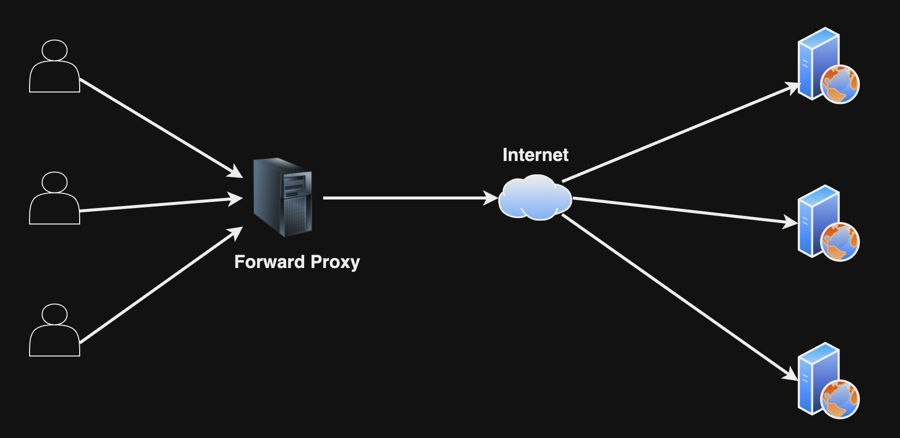
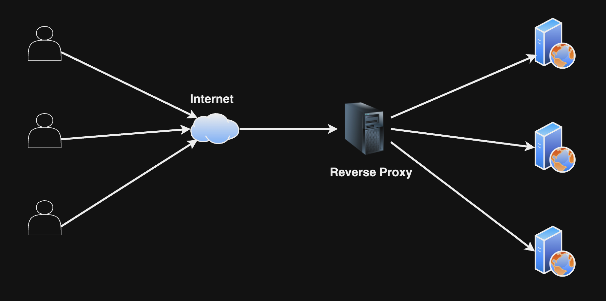
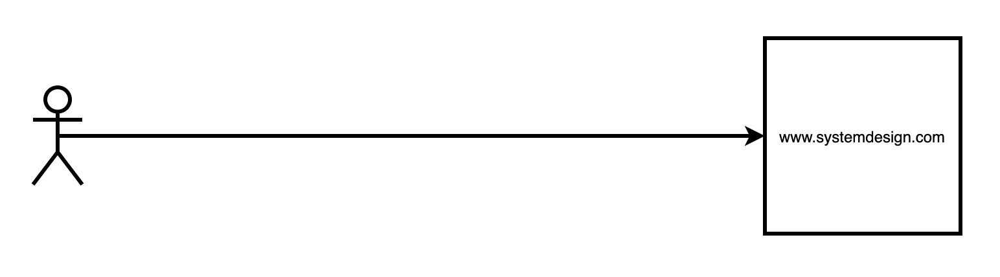
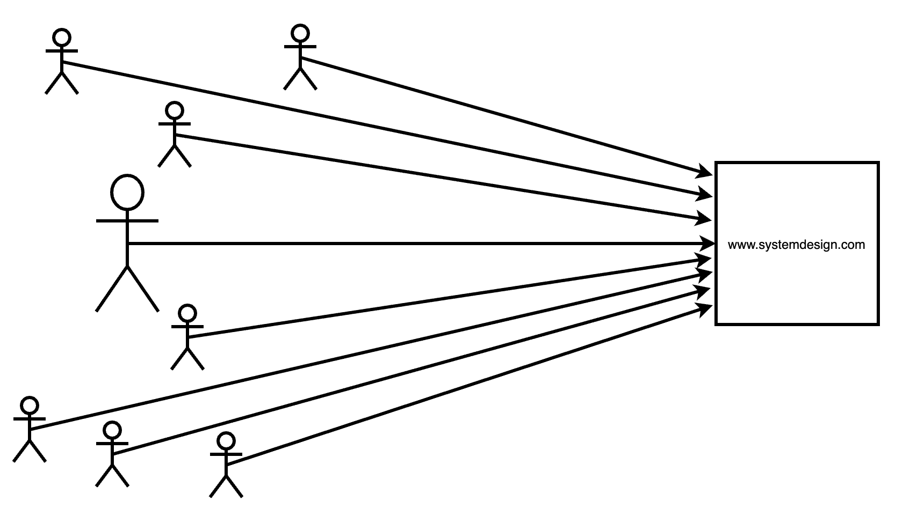
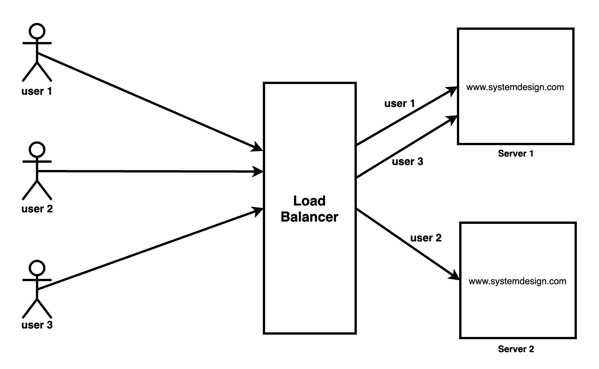

## Proxy

এখানে আমরা উক্ত বিষয়গুলো আলোচনা করব।

- [Forward Proxy and Reverse Proxy](#forward-proxy-and-reverse-proxy)
- [Load Balancing](#load-balancing)
- [Why Load Balancing](#why-load-balancing)
- [Advantages of Load Balancer](#advantages-of-load-balancer)

### Forward Proxy and Reverse Proxy

প্রক্সি কে ২ ভাগে ভাগ করা যায়, ফরওয়ার্ড প্রক্সি এবং রিভার্স প্রক্সি।

ফরওয়ার্ড প্রক্সি হল, এক বা একাধিক ক্লায়েন্ট যখন সার্ভারকে সরাসরি রিকুয়েস্ট না করে একটি প্রক্সি সার্ভারে রিকুয়েস্ট করবে এবং সেই প্রক্সি সার্ভার সরাসরি সার্ভারকে রিকুয়েস্ট করবে। ফরওয়ার্ড প্রক্সি-তে সার্ভার জানবে না কোন ক্লায়েন্ট তাকে রিকুয়েস্টটি দিয়েছে। 

  

ফরওয়ার্ড প্রক্সির ব্যবহার করার সুবিধা হল,

- কিছু স্পেসিফিক সাইট ব্লক করা যেতে পারে, যাতে ক্লায়েন্ট এক্সেস করতে না পারে।
- Caching এর জন্য ফরওয়ার্ড প্রক্সি ব্যবহার করা যায়। 

রিভার্স প্রক্সি হল, ক্লায়েন্ট রিকুয়েস্ট করবে প্রক্সি সার্ভারে এবং সেই প্রক্সি সার্ভার বলে দিবে এক বা একাধিক সার্ভারের মধ্যে কোন সার্ভার রিকুয়েস্ট টা নিবে, যার ফলে ক্লায়েন্ট কখোনই জানতে পারবে না কোন সার্ভার তাকে রিকুয়েস্ট তা নিয়েছে। 

  

রিভার্স প্রক্সির ব্যবহার করার সুবিধা হল,

- লোড ব্যালেন্সিং।

### Load Balancing

আমরা যদি প্রাক্টিকালি বলতে যাই, লোড ব্যালেন্সিং একটি টেকনিক যা আমাদের ক্লায়েন্ট রিকুয়েস্টগুলোকে একাধিক সার্ভারের মধ্য থেকে এক একটি সার্ভারে ডিসট্রিবিউট করতে পারে। উদাহরণ হল, NGINX।

### Why Load Balancing

ধরুন আমাদের একটি ওয়েবসাইট আছে, যেখানে ইউজাররা ভালোভাবে ব্যবহার করতে পারছে,

  

এখন আমাদের ওয়েবসাইটে কোন একসময় প্রচুর ইউজার ব্যবহার করা শুরু করল,

  

এত সংখ্যক ইউজারের লোড সহ্য করতে না পেরে সার্ভার ক্রাশ করতে পারে। এই প্রবলেম সমাধানের জন্য লোড ব্যালেন্সিং করা হয়।

লোড ব্যালেন্সিং হল ইউজারের রিকুয়েস্টকে ওয়েবসাইটের একাধিক সার্ভারের মধ্যে যেকোন একটিতে ডিসট্রিবিউট করা।

  

এতেকরে আমরা অত্যাধিক ইউজারের লোড নিয়ন্ত্রণ করতে পারি, এবং আমাদের সাইট ক্রাশ হওয়ার সম্ভাবনা কমে যায়।

Load Balancer সাধারণত ৩টি পদ্ধতিতে মেনে চলে লোড ডিসট্রিবিউট করতে পারে, রাউন্ড রবিন, লোড বেইজড ডিসট্রিবিউশন এবং রিসোর্স বেইজড ডিসট্রিবিউশন। 

### Advantages of Load Balancer

লোড ব্যালেন্সার ব্যবহারের সুবিধা হল,

- স্কেলেবিলিটি (Scalability), লোড ব্যালেন্সার হরাইজন্টাল স্কেলিং পদ্ধতি ব্যবহার করে আমাদের ওয়েবসাইটকে স্কেল করে থাকে।
- এভাইল্যাবিলিটি (Availability), কোন সার্ভার যদি কোন কারণে নষ্ট হয়ে যায় লোড ব্যালেন্সারের সেই রিকুয়েস্টকে অন্য সার্ভারে ট্রান্সফার করতে পারবে।

### Resources

- <a href="https://youtu.be/ozhe__GdWC8" target="_blank">Proxy vs. Reverse Proxy (Explained by Example)</a>
- <a href="https://youtu.be/Nu-4Q3OoR4E" target="_blank">Proxies by sudoCODE</a>