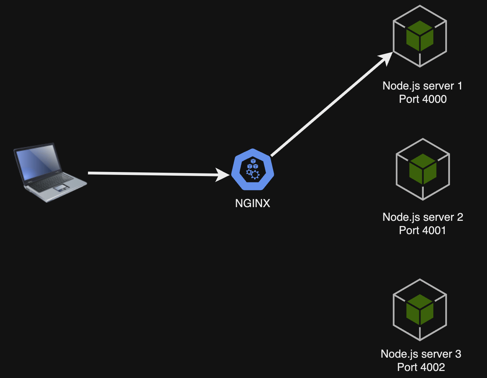
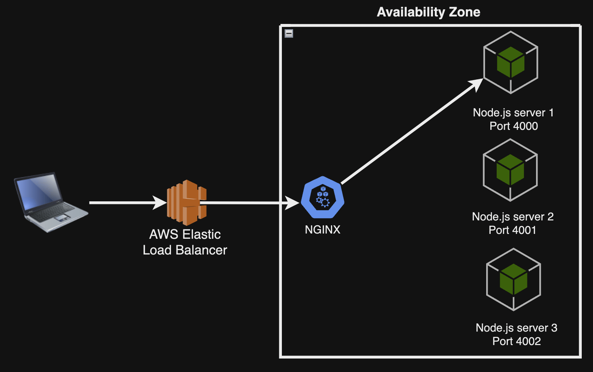

## Forward Proxy এবং Reverse Proxy

প্রক্সি কে ২ ভাগে ভাগ করা যায়, ফরওয়ার্ড প্রক্সি এবং রিভার্স প্রক্সি।

ফরওয়ার্ড প্রক্সি হল, এক বা একাধিক ক্লায়েন্ট যখন ইন্টারনেট সার্ভারে সরাসরি রিকুয়েস্ট না করে একটি প্রক্সি সার্ভারে রিকুয়েস্ট করবে এবং সেই প্রক্সি সার্ভার সরাসরি ইন্টারনেটের মাধ্যমে সার্ভারকে রিকুয়েস্ট করবে। ফরওয়ার্ড প্রক্সি-তে সার্ভার জানবে না কোন ক্লায়েন্ট তাকে রিকুয়েস্টটি দিয়েছে।

<p align="center">
  
</p>

ফরওয়ার্ড প্রক্সির ব্যবহার করার সুবিধা হল,

- কিছু স্পেসিফিক সাইট ব্লক করা যেতে পারে, যাতে করে ক্লায়েন্ট এক্সেস করতে না পারে।
- Caching এর জন্য ফরওয়ার্ড প্রক্সি ব্যবহার করা যায়।

রিভার্স প্রক্সি হল, ক্লায়েন্ট ইন্টারনেটের মাধ্যমে প্রক্সি সার্ভারে রিকুয়েস্ট করবে এবং সেই প্রক্সি সার্ভার বলে দিবে এক বা একাধিক সার্ভারের মধ্যে কোন সার্ভার রিকুয়েস্ট টা নিবে, যার ফলে ক্লায়েন্ট কখোনই জানতে পারবে না কোন সার্ভার তাকে রিকুয়েস্টটি নিয়েছে।

<p align="center">
  
</p>

রিভার্স প্রক্সির ব্যবহার করার সুবিধা হল,

- Load Distribution: Reverse proxy সবসময় client থেকে আসা request গুলোকে multiple backend server এর মধ্যে distribute করে।
- High Availability: Multiple সার্ভার থাকার ফলে Distribution করার মাধ্যমে আমরা High Availability নিশ্চিত করতে পারি।
- Security: Reverse Proxy তে যখন রেসপন্স ক্লায়েন্ট কে দেয়া হয় তখন সার্ভারের ইনফরমেশন/ip সাথে করে দেয়া হয় না সেজন্য সার্ভার secured থাকে।
- SSL/TLS Encryption and Decryption: Reverse Proxy SSL/TLS Encryption এবং Decryption করে থাকে।

### Load Balancing

আমরা যদি প্রাক্টিকালি বলতে যাই, লোড ব্যালেন্সিং একটি টেকনিক যা আমাদের ক্লায়েন্ট রিকুয়েস্টগুলোকে একাধিক সার্ভারের মধ্য থেকে এক একটি সার্ভারে ডিসট্রিবিউট করতে পারে। উদাহরণ হল, NGINX।

### কেন Load Balancing

ধরুন আমাদের একটি ওয়েবসাইট আছে, যেখানে ইউজাররা ভালোভাবে ব্যবহার করতে পারছে,

<p align="center">
  
</p>

এখন আমাদের ওয়েবসাইটে কোন একসময় প্রচুর ইউজার ব্যবহার করা শুরু করল,

<p align="center">
  
</p>

এত সংখ্যক ইউজারের লোড সহ্য করতে না পেরে সার্ভার ক্রাশ করতে পারে। এই প্রবলেম সমাধানের জন্য লোড ব্যালেন্সিং করা হয়।

লোড ব্যালেন্সিং হল ইউজারের রিকুয়েস্টকে ওয়েবসাইটের একাধিক সার্ভারের মধ্যে যেকোন একটিতে ডিসট্রিবিউট করা।

<p align="center">
  
</p>

এতেকরে আমরা অত্যাধিক ইউজারের লোড নিয়ন্ত্রণ করতে পারি, এবং আমাদের সাইট ক্রাশ হওয়ার সম্ভাবনা কমে যায়।

Load Balancer সাধারণত ৩টি পদ্ধতিতে মেনে চলে লোড ডিসট্রিবিউট করতে পারে, রাউন্ড রবিন, লোড বেইজড ডিসট্রিবিউশন এবং রিসোর্স বেইজড ডিসট্রিবিউশন।

### Load Balancer এর সুবিধাগুলো

লোড ব্যালেন্সার ব্যবহারের সুবিধা হল,

- স্কেলেবিলিটি (Scalability), লোড ব্যালেন্সার হরাইজন্টাল স্কেলিং পদ্ধতি ব্যবহার করে আমাদের ওয়েবসাইটকে স্কেল করে থাকে।
- এভাইল্যাবিলিটি (Availability), কোন সার্ভার যদি কোন কারণে নষ্ট হয়ে যায় লোড ব্যালেন্সারের সেই রিকুয়েস্টকে অন্য সার্ভারে ট্রান্সফার করতে পারবে।

### রিভার্স প্রক্সি হিসেবে NGINX

NGINX একটি জনপ্রিয় রিভার্স প্রক্সি। এর মত আরো কিছু রিভার্স প্রক্সি রয়েছে। সাধারণত NGINX রিকোয়েস্টকে একাধিক সার্ভার এর মধ্য থেকে একটি সার্ভারে ফরওয়ার্ড করে দেয়, প্রসেসিং এর জন্য।

NGINX এর কনফিগারেশন ফাইল সাধারণত এরকম থাকে।

```nginx
worker_processes 1;  # Number of worker processes
events {
  worker_connections 1024;  # Maximum number of simultaneous connections per worker
}

http {
  include       mime.types;  # Include MIME types
  default_type  application/octet-stream;  # Default MIME type

  sendfile          on;  # Enable efficient file transfers
  keepalive_timeout 65;  # Timeout for persistent connections

  server {
    listen 80;  # Listen on port 80 (HTTP)
    server_name example.com www.example.com;  # Your domain names

    location / {
      root /var/www/html;  # Root directory for your files
      index index.html;  # Default file to serve
    }

    error_page 404 /404.html;  # Custom error page
  }
}
```

এখানে / সংযুক্ত রিকোয়েস্টগুলোকে /var/www/html ডিরেক্টরির index.html ফাইল দেখাবে।

এখন আপনি যদি Node.js NGINX দ্বারা পয়েন্ট করে দিতে চান,

```nginx
server {
  listen 80 default_server;
  listen [::]:80 default_server;
  server_name  localhost;

  # Load configuration files for the default server block.
  include /etc/nginx/default.d/*.conf;

  location /api/ {
    proxy_pass http://localhost:4000;
    proxy_http_version 1.1;
    proxy_set_header Upgrade $http_upgrade;
    proxy_set_header Connection 'upgrade';
    proxy_set_header Host $host;
    proxy_cache_bypass $http_upgrade;
  }
}
```

উপরের server ব্লক এর মধ্যে দেখা যাচ্ছে, রিকোয়েস্ট এর মধ্যে /api থাকলে তা আমাদের node.js ইনস্ট্যান্স কে হিট করবে, যার পোর্ট হচ্ছে 4000।

আমরা চাইলে NGINX এর Load Balancing এর সুবিধা নিতে পারবো, যদি আমরা Performance, Reliability এবং Scalability চিন্তা করি।

NGINX Load Balancer ব্যবহারের সর্বোত্তম সময় আমাদের consider করতে হবে,

- যখন দেখবো আমাদের সিস্টেম ট্রাফিক রিকোয়েস্ট হ্যান্ডেল করতে scalability প্রয়োজন।
- আমাদের সিস্টেমে Downtime কমানোর প্রয়োজন।
- যখন আমরা Distributed System তৈরী করবো।

এসব ক্ষেত্রে লোড ব্যালেন্সিং করবো।

উপরের NGINX কোড কে লোড ব্যালেন্সিং করলে,

```nginx
http {
  upstream backend_servers {
    # Define the backend servers
    server 127.0.0.1:4000;  # Primary backend server
    server 127.0.0.1:4001;  # Secondary backend server
    server 127.0.0.1:4002;  # Tertiary backend server
  }

  server {
    listen 80 default_server;
    listen [::]:80 default_server;
    server_name localhost;

    # Load configuration files for the default server block.
    include /etc/nginx/default.d/*.conf;

    location /api/ {
      proxy_pass http://backend_servers;  # Pass requests to the load balancer
      proxy_http_version 1.1;
      proxy_set_header Upgrade $http_upgrade;
      proxy_set_header Connection 'upgrade';
      proxy_set_header Host $host;
      proxy_cache_bypass $http_upgrade;

      # Additional settings for proxying
      proxy_connect_timeout 60s;
      proxy_read_timeout 60s;
      proxy_send_timeout 60s;
    }
  }
}
```

### কিভাবে রিভার্স প্রক্সিতে HTTPS কাজ করে?

যখন প্রক্সি সার্ভার(NGINX) HTTPS রিকোয়েস্ট পেয়ে থাকে তখন ২টি ধাপ প্রসেস হয়।

- SSL/TLS Handshake ধাপ
- Request Processing ধাপ

#### SSL/TLS Handshake ধাপ

যখন ক্লায়েন্ট এর কাছে থেকে https রিকোয়েস্ট পায়, তখন

- Client Hello: ক্লায়েন্ট TLS ভার্সন এবং Cipher Suites প্রেরণ করে।
- Server Hello: NGINX তার Cipher Suite এবং TLS ভার্সন ক্লায়েন্টকে পাঠিয়ে দেয়।
- Certificate Exchange: NGINX তার SSL সার্টিফিকেট, ক্লায়েন্টকে প্রেরণ করে।
- Key Exchange: ক্লায়েন্ট সার্টিফিকেট যাচাই করে এবং একটি Session key তৈরী করে।
- Session Established: সুরক্ষিত communication শুরু।

(Cipher Suites কী? এটি এক বা একাধিক Alogirithm এর সমষ্টি যা সুরক্ষিত নেটওয়ার্ক connection তৈরী করতে সাহায্য করে থাকে। এতে মূলত encryption, authentication এবং key exchange method গুলো উল্লেখ থাকে।)

#### Request Processing ধাপ

সুরক্ষিত communication শুরু হওয়ার পরে,

- Request Decryption: Nginx HTTPS রিকোয়েস্টকে সেই session key ডিক্ৰিপ্ট করে।
- Request Processing: ডিক্ৰিপ্ট করা HTTP রিকোয়েস্টকে প্রসেস করে।
- Response Encryption: রেসপন্স এনক্রিপ্ট করে ক্লায়েন্ট এর কাছে পাঠিয়ে দেয়।

দুটি ধাপ(SSL/TLS Handshake, Request Processing) control করার জন্য NGINX এর কনফিগারেশন থাকে,

```nginx
server {
  listen 443 ssl; # Enables HTTPS on port 443
  server_name example.com;
  ssl_certificate /etc/nginx/ssl/example.crt;
  ssl_certificate_key /etc/nginx/ssl/example.key;

  location / {
    proxy_pass http://backend_server;
  }
}
```

এখানে ssl_certificate এবং ssl_certificate_key মূলত SSL/TLS Handshake এর অংশ। অন্যদিকে location এবং proxy_pass, Request Processing এর অংশ।

### NGINX Load Balancer এবং AWS Elastic Load Balancer

NGINX Load Balancer মূলত একাধিক ইনকামিং রিকোয়েস্টগুলোকে একাধিক সার্ভারের মধ্য থেকে এক একটি সার্ভারে ডিস্ট্রিবিউট করে দেয়।

<p align="center">
  
</p>

AWS ELB মূলত ইনকামিং ট্রাফিকগুলোকে এক একটি নির্দিষ্ট টার্গেট এর মধ্যে ডিস্ট্রিবিউট করে। এখানে টার্গেট হতে পারে EC2 Instance।

<p align="center">
  
</p>

দুটির মধ্যে তফাৎ NGINX Load Balancer সরাসরি এপ্লিকেশন লেভেল এর মধ্যে ডিস্ট্রিবিউট করে আর AWS ELB ইনস্ট্যান্স লেভেল এর ডিস্ট্রিবিউট করে। আমরা আমাদের সিস্টেমের Availability জন্য দুটোই ব্যবহার করতে পারি।

### Node.js-এর সাথে NGINX রিভার্স প্রক্সি হিসেবে ব্যবহার করার কারণ কী?

Node.js দিয়ে Web Server তৈরী করা যায় এবং NGINX নিজেই Web Server।

- Node js মূলত আমাদের জাভাস্ক্রিপ্ট কোডকে ব্রাউসার এর বাহিরে চালাতে সাহায্য করে, অন্যদিকে NGINX static content(যেমন HTML, CSS, JavaScript) সার্ভ করে থাকে।

- NGINX Reverse Proxy হিসেবে কাজ করতে পারে। এটি ট্রাফিক ফ্লো কে একাধিক নোড জেএস ইনস্ট্যান্স এ ডিস্ট্রিবিউট করতে পারে।

- NGINX বিভিন্ন ডোমেইন ও সাবডোমেইন (যেমন, app.example.com) পরিচালনা করতে পারে। এগুলোর জন্য নোড জেএস ফ্লেক্সিবল না।

এগুলো থেকে বুঝা যায় নোড জেএস General-Purpose Web Server না। এজন্য নোড জেএস এর সাথে General-Purpose Web Server হিসেবে NGINX ব্যবহার করা হয়।
