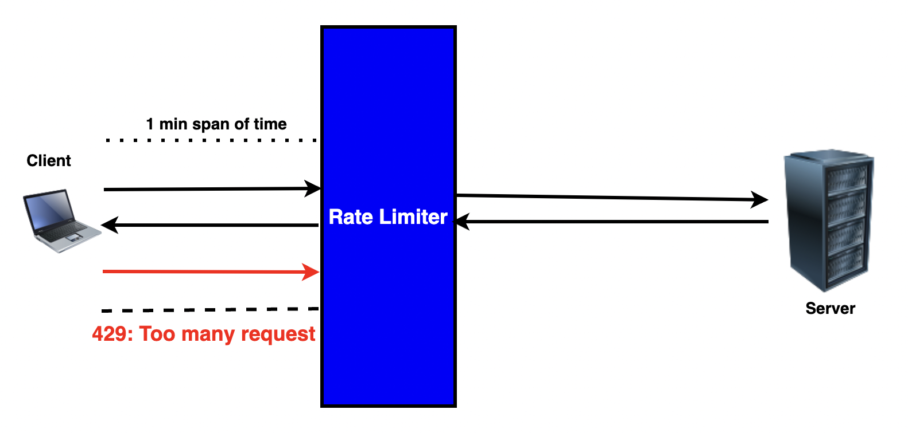
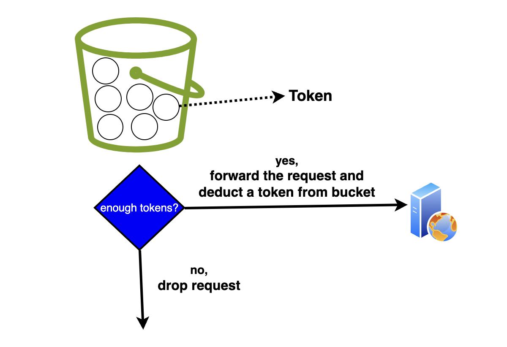
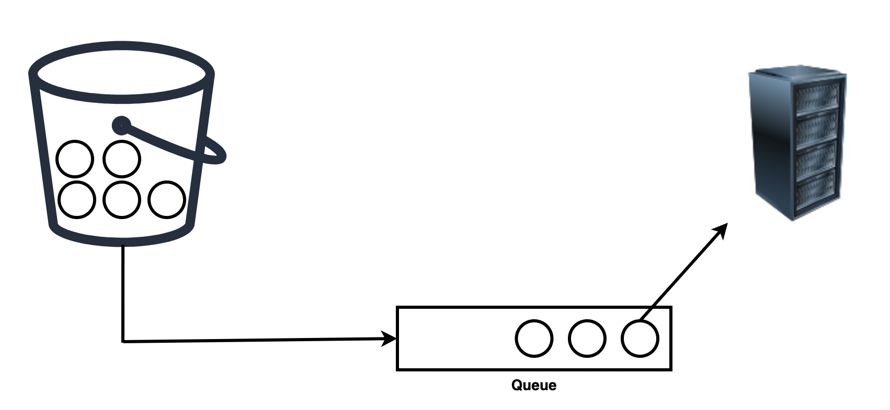

## কেন Rate Limiter?

- Denial of Service(DoS) attack প্রতিরোধ করতে পারি।
- অপ্রয়োজনীয় রিকোয়েস্ট block করার মাধ্যমে আমরা cost reduce করতে পারি।

## কোথায় Rate Limiter ইমপ্লিমেন্ট করবো?

আমরা চাইলে client-side কিংবা server-side এ ইমপ্লিমেন্ট করতে পারবো। তবে server-side এ ইমপ্লেমেট করা better। কারন client-side এত reliable না।

## HTTP Rate Limiter

  

যখন ক্লায়েন্ট নির্দিষ্ট সময়ের ভিতর নির্দিষ্ট পরিমাণ এর থেকে বেশি http রিকোয়েস্ট সেন্ড করে তখন HTTP status code 429 যার মানে To many request পাঠিয়ে দেয়া হয়।

## Rate Limiter এর Throttle কিসের উপর নির্ভর করে তৈরী করবো?

আপনি চাইলে নির্দিষ্ট IP ধরে কিংবা নির্দিষ্ট user ID ধরে rate limiter এর throttle তৈরী করতে পারেন। IP ধরে করলে করলে নির্দিষ্ট সময়ের ভিতর নির্দিষ্ট IP থেকে নির্দিষ্ট পরিমাণের থেকে বেশি রিকোয়েস্ট আসলে তা block হয়ে যাবে।

## Rate Limiting Algorithms

কিছু Algorithm যা ব্যবহার করে আমরা Rate Limit ইমপ্লিমেন্ট করতে পারব।

* Token Bucket
* Leaky Bucket
* Fixed Window Counter
* Sliding Window Log
* Sliding Window Counter

এখানে আমরা শুধু Token Bucket এবং Leaky Bucket সম্পর্কে জানব।

### Token Bucket

Rate Limit ইমপ্লিমেন্ট করার জন্য এটি খুবই জনপ্রিয় algorithm। এটি যেরকম কাজ করে থাকে,

নির্দিষ্ট capacity সম্পন্ন একটি bucket থাকবে। bucket এর ভিতর নির্দিষ্ট পরিমান token থাকবে।

যখন একটি request আসবে bucket থেকে একটি token বাদ দেয়া হবে। এরকম আরেকটি request আসলে আরেকটি token বাদ দেয়া হবে।

এরকম bucket থেকে সব token শেষ হয়ে গেলে তখন আর কোনো রিকোয়েস্ট নেওয়া হবে না কিংবা প্রসেস করা হবে না।

  

এরকম আমরা অতিরিক্ত রিকোয়েস্টগুলোকে আমাদের সিস্টেম থেকে বিরত রাখতে পারবো।

একবার bucket খালি হয়ে গেলে আমরা আবার bucket এর মধ্যে token দিয়ে পূর্ণ করে রিকোয়েস্টগুলোকে প্রসেস করতে পারবো।

### Leaky Bucket

Leaky Bucket algorithm কিন্তু Token Bucket algorithm এর মত। পার্থক্য হল Leaky Bucket algorithm এ রিকোয়েস্টগুলো একটি constant rate এ প্রসেস হয়ে থাকে, মানে রিকোয়েস্টগুলো FIFO মানে First-in-first-out মেনে প্রসেস হয়ে থাকে।

  

Bucket এ যদি তার capacity থেকে কম Token থাকে তাহলে নতুন Token কিংবা request bucket এর ভিতর প্রবেশ করবে আর তারপর FIFO অনুযায়ী প্রসেস হবে।

এখন bucket এ যদি capacity অনুযায়ী Token থাকে তাহলে নতুন টোকেন আর bucket এ প্রবেশ করতে পারবে না।
