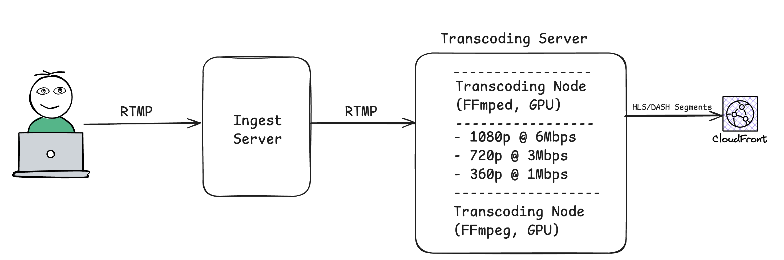

# Design a Live Streaming platform like Twitch

আপনি এরকম ভাবতে পারেন আপনার অফিসে আপনার দ্বারা নতুন একটি লাইভ স্ট্রিমিং(Twitch এর মত) তৈরী করার requirements এসেছে।

## Key requirements

আপনার design করা সিস্টেমে নিচের পয়েন্ট গুলো থাকতে হবে,

- real-time streaming।
- viewer রা বিভিন্ন resolution এ ভিডিও লাইভ দেখতে পারবে।
- real-time chat যাতে viewer; streamers এবং অন্যান্য viewer দের সাথে interect করতে পারে।
- Low Latency এবং ৯৯.৯৯% uptime।

## সমাধান

I. আমাদের প্রথম স্টেপ হচ্ছে, স্ট্রিমার(যে স্ট্রিমিং করছেন) দ্বারা তৈরী লাইভ স্ট্রিমিং ভিডিও stream আকারে নিয়ে আসা। যে সার্ভারে আসবে সেখানে সবকিছু(Authorization, ইত্যাদি) প্রথমে যাচাই করে নিবে।

**যে সার্ভার লাইভ ভিডিও/অডিও গ্রহণ করবে আমরা তাকে Ingest Server বলবো**।

  

II. রিয়েল টাইম communication (chat) এর জন্য আমাদের কাছে যেমন WebSocket প্রোটোকল রয়েছে, ঠিক তেমনই লাইভ স্ট্রিমিং এর জন্য RTMP কিংবা Real-Time Messaging Protocol। **RTMP মূলত TCP উপর তৈরী করা হয়েছে, সেজন্য Reliable**। পোর্ট হচ্ছে ১৯৩৫।

RTMP মূল কাজ অডিও/ভিডিও chunk আকারে রিয়েল টাইম প্রেরণ করা। কাকে প্রেরণ করবে? Transcode Service, যা আমরা দেখব।

  

এখন আমাদের মাথায় প্রশ্ন আসতে পারে, RTMP নিজে TCP উপর ভিত্তি করে তৈরী, আমরা এখানে UDP কেনো ব্যবহার করছি না?

এখানে ২টি কারণ আছে,

- Reliability ম্যাটার করে। আমরা জানি UDP তে কোনো প্যাকেট লস হলে তা আর রিকভার করা যায় না। সেজন্য আমরা এখানে TCP ব্যবহার করছি।

- Ingest সার্ভার এর জন্য Bandwidth ম্যাটার করে না। Ingest সার্ভার এর কাজ সীমিত।

III. Transcode Service হলো, কোনো স্ট্রিমারের দ্বারা লাইভ স্ট্রিমিং এর ভিডিও (যেমন, RTMP) বিভিন্ন রেজোলিউশনে (যেমন, 360p, 720p, 1080p) কনভার্ট করার প্রক্রিয়া, যাতে Adaptive Bitrate Streaming সম্ভব হয়। এটি কম্পিউটেশনাল দিক থেকে অত্যন্ত expensive, এবং প্রায়ই GPU এক্সেলোরেশন (যেমন, NVIDIA NVENC) প্রয়োজন হয়।

Transcoding এর কাজ Ingest সার্ভারে কেনো করা হলো না?

Transcoding-কে ingest বা অন্যান্য সার্ভিস থেকে আলাদা রাখার কারণে CPU/GPU-নির্ভর কাজগুলো অন্যান্য অপারেশনকে ধীর করে দেয় না।

Transcoded স্ট্রিমগুলোকে HLS ফরম্যাটে ভাগ করা হয় এবং এরপর একটি CDN-এ (যেমন, AWS CloudFront) আপলোড করা হয়।

  

উপরের ছবি ভালোভাবে লক্ষ্য করলে দেখা যায়,

- একজন স্ট্রিমার 1080p রেজোলিউশনের স্ট্রিম 6 Mbps গতিতে RTMP এর মাধ্যমে ingest সার্ভারে পাঠান।

- Ingest সার্ভার স্ট্রিম কী যাচাই করে এবং স্ট্রিমটি transcoding সার্ভারে ফরোয়ার্ড করে।

- Transcoding সার্ভার (যেমন, GPU-সক্ষম ইনস্ট্যান্সে FFmpeg চালানো) স্ট্রিমটিকে 1080p, 720p, এবং 360p রেজোলিউশনের ভ্যারিয়েন্টে রূপান্তর করে।

- Transcoded স্ট্রিমগুলো HLS ফরম্যাটে ভাগ করা হয় এবং একটি CDN-এ (যেমন, AWS CloudFront) আপলোড করা হয়।

- ভিউয়াররা তাদের নেটওয়ার্ক কন্ডিশনের উপর ভিত্তি করে CDN থেকে উপযুক্ত রেজোলিউশন লাইভ স্ট্রিমিং ভিডিও রিয়েল টাইম দেখতে পারবে।

যেহেতু আমরা CDN বজনহার করেছি সেহেতু তা সবসময় user কে নিকটবর্তী Point of Presence থেকে কনটেন্ট সার্ভ করবে। তাহলে এতে অনেক Latency কম হবে।

এখন আমরা Bi Directional প্রোটোকল WebSocket ব্যবহার করে ভিউয়ার এবং স্ট্রিমার কিংবা ভিউয়ার এবং ভিউয়ার এর সাথে real-time chat করতে পারবো। (WebSocket নিয়ে সামনে আরো অনেক real-world problem নিয়ে লিখবো।)

কিভাবে ৯৯.৯৯% uptime রাখবো?

আমি পরবর্তীতে নতুন করে লিখবো, এই সিস্টেম কে কিভাবে ৯৯.৯৯% uptime রাখা যায়।
