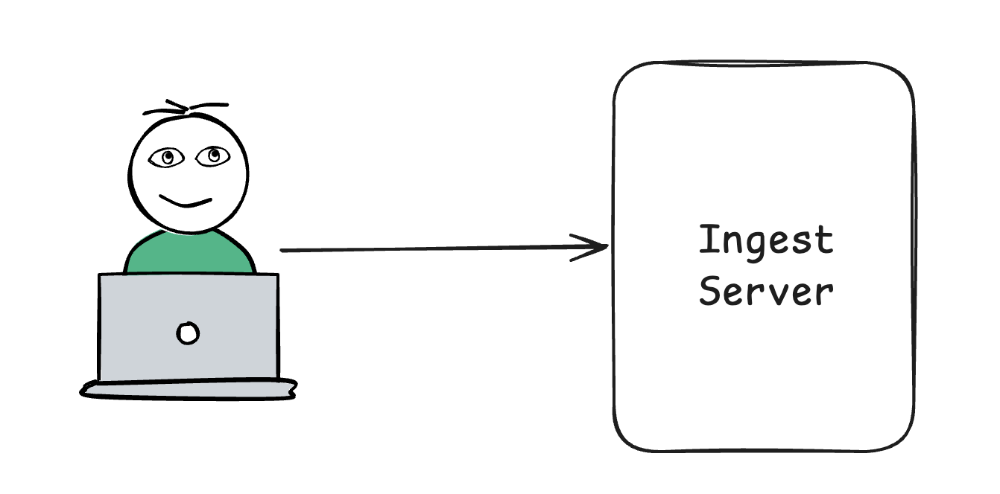
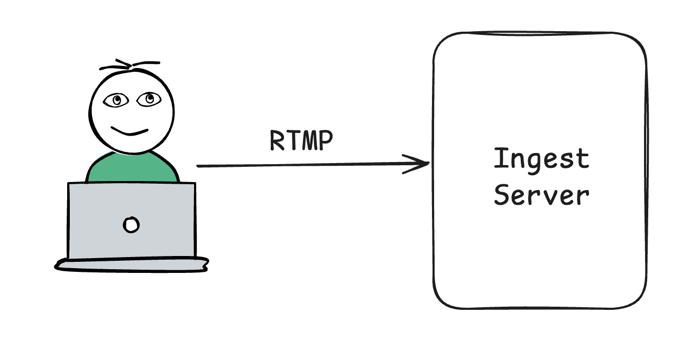

# Design a Live Streaming platform like Twitch

আপনি এরকম ভাবতে পারেন আপনার অফিসে আপনার দ্বারা নতুন একটি লাইভ স্ট্রিমিং(Twitch এর মত) তৈরী করার requirements এসেছে।

## Key requirements

আপনার design করা সিস্টেমে নিচের পয়েন্ট গুলো থাকতে হবে,

- real-time streaming।
- viewer রা বিভিন্ন resolution এ ভিডিও লাইভ দেখতে পারবে।
- real-time chat যাতে viewer; streamers এবং অন্যান্য viewer দের সাথে interect করতে পারে।
- Low Latency এবং 99.9% uptime।

## সমাধান

- আমাদের প্রথম স্টেপ হচ্ছে, স্ট্রিমার(যে স্ট্রিমিং করছেন) দ্বারা তৈরী লাইভ স্ট্রিমিং ভিডিও stream আকারে নিয়ে আসা। যে সার্ভারে আসবে সেখানে সবকিছু(Authorization, ইত্যাদি) প্রথমে যাচাই করে নিবে।

**যে সার্ভার লাইভ ভিডিও/অডিও গ্রহণ করবে আমরা তাকে Ingest Server বলবো**।

  

- রিয়েল টাইম communication (chat) এর জন্য আমাদের কাছে যেমন WebSocket প্রোটোকল রয়েছে, ঠিক তেমনই লাইভ স্ট্রিমিং এর জন্য RTMP কিংবা Real-Time Messaging Protocol। **RTMP মূলত TCP উপর তৈরী করা হয়েছে, সেজন্য Reliable**। পোর্ট হচ্ছে ১৯৩৫।

RTMP মূল কাজ অডিও/ভিডিও chunk আকারে রিয়েল টাইম প্রেরণ করা।

  

এখন আমাদের মাথায় প্রশ্ন আসতে পারে, RTMP নিজে TCP উপর ভিত্তি করে তৈরী, আমরা এখানে UDP কেনো ব্যবহার করছি না?

এখানে ২টি কারণ আছে,

- Reliability ম্যাটার করে। আমরা জানি UDP তে কোনো প্যাকেট লস হলে তা আর রিকভার করা যায় না। সেজন্য আমরা এখানে TCP ব্যবহার করছি।

- Ingest সার্ভার এর জন্য Bandwidth ম্যাটার করে না। Ingest সার্ভার এর কাজ সীমিত। এখানে কোনো স্কেলিং এর প্রয়োজন পড়ে না।

(চলমান)
