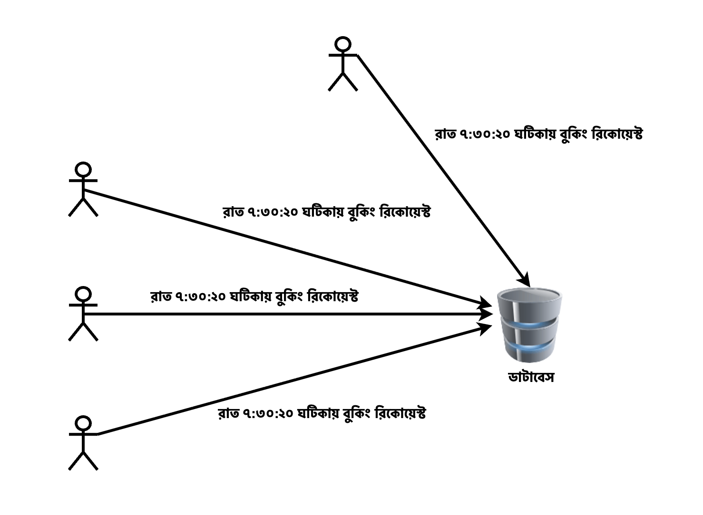

# Design a Highly Concurrent Wordcamp Event Booking System

## Problem Statement

WordCamp একটি জনপ্রিয় ওয়ার্ডপ্রেস-সম্পর্কিত ইভেন্ট, যেখানে নির্দিষ্ট সংখ্যক সিট থাকে এবং হাজার হাজার মানুষ একসাথে রেজিস্ট্রেশনের চেষ্টা করে। আমাদের উদ্দেশ্য একটি Highly Concurrent Event Booking System ডিজাইন করা, যা একই সিটের জন্য অত্যন্ত বেশি সংখ্যক রিকোয়েস্ট (উদাহরণস্বরূপ: ৫০০+ concurrent requests per seat) সামলাতে পারবে।

## Key requirements

**Concurrency Handling**:

- একই সময়ে হাজারো ইউজার একটি সিট বুক করার চেষ্টা করবে।

- রেস কন্ডিশন (Race Condition) বা ওভারবুকিং যেন না হয়, তা নিশ্চিত করতে হবে।

**Atomic Seat Booking**:

- বুকিং প্রক্রিয়াটি এমনভাবে করতে হবে যাতে একবারে কেবল একজনই সফল হয়।

- সিট বুকিং হবে "first-come, first-served" ভিত্তিতে, transaction যেন atomic হয়।

**Latency Optimization**:

- ইউজার যেন দ্রুত response পায়, সেটা নিশ্চিত করতে হবে (low-latency response)।

**Failure Handling & Retry Mechanism**:

- সার্ভার লোডের কারণে কোনো ফেইল হওয়া রিকোয়েস্ট কীভাবে হ্যান্ডেল করা হবে, তার সুনির্দিষ্ট পদ্ধতি থাকতে হবে।

## আমরা কি শিখবো?

**Concurrency Management**

- একসাথে হাজারো রিকোয়েস্ট কিভাবে হ্যান্ডেল করতে হয়

- কীভাবে এক সিটকে একাধিক ইউজার বুক করতে না দিয়ে কনফ্লিক্ট এড়াতে হয়

**Atomic Transactions**

- Atomicity কী এবং কেন এটা গুরুত্বপূর্ণ

- SQL বা NoSQL ডেটাবেসে কীভাবে atomic বুকিং অপারেশন বানাতে হয়

**Caching & Queuing Systems**

- Redis/Memcached দিয়ে কিভাবে performance বাড়ানো যায়

- Message Queue (RabbitMQ, Kafka) ব্যবহার করে কিভাবে বুকিংকে asynchronous করা যায়

**Error Handling & Retry Logic**

- Request fail হলে কীভাবে retry করা হবে

- Idempotency কীভাবে implement করতে হয়

## সমাধান

ধরে নি, আমাদের ডাটাবেস MySQL। একসাথে হাজারো রিকোয়েস্ট একটি নির্দিষ্ট সিট বুকিং এর জন্য আসতে পারে।

<p align="center">
  
</p>

আমরা জানি, MySQL নিজে ACID নিশ্চিত করে থাকে।

Concurrency সমস্যা সমাধানের জন্য আমাদেরকে Exclusive Locking mechanism বুজতে হবে।

Exclusive Lock হলো একটি লক যা একটি row এর উপর কেবল একটি ট্রানজেকশনকে সম্পূর্ণ control দেয়। আমাদের উদাহরণ অনুযায়ী,

```sql
START TRANSACTION;

SELECT * FROM seats WHERE seat_id = 123 AND status = 'available' FOR UPDATE;

UPDATE seats SET status = 'booked', user_id = 456 WHERE seat_id = 123; COMMIT;
```

এখানে FOR UPDATE; Exclusive Lock তৈরী করেছে। যার ফলে এখন সেই নির্দিষ্ট row তে Exclusive Lock থাকাকালীন, অন্য কোনো Transaction সেই row টিকে পরিবর্তন করতে পারবে না।

অন্য কোনো ট্রানজেকশন ঐ row-টাকে update/delete করতে চাইলে, সেটা অপেক্ষা করতে হবে যতক্ষণ না বর্তমান ট্রানজেকশন commit/rollback হয়।

অর্থাৎ এক সময়ে একটিমাত্র ট্রানজেকশন সেই row পরিবর্তন করতে পারবে। অর্থাৎ এখানে রেস কন্ডিশন (Race Condition) বা ওভারবুকিং হবে না।

(চলবে)
