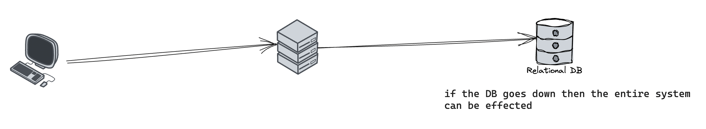
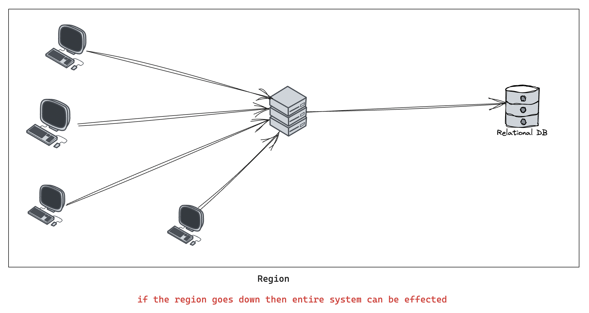

## Reliability

সিস্টেম কোনো প্রকারের Fault/Error থাকার পরও কাজ করতে পারে সেটাই Reliability। তখন সেই সিস্টেমকে Fault Tolerant বা Resilent বলে।

সাধারণত ৩ প্রকারের Fault রয়েছে যা থাকলে আমরা সিস্টেমটিকে UnReliable করে ফেলে,

### Hardware Fault

সিস্টেম UnReliable করতে Hardware Fault এর ভূমিকা রয়েছে। যেমনঃ Electricity Power Cut হওয়ার ফলে সিস্টেম বন্ধ হয়ে যেতে পারে তখন সেই সিস্টেমটি UnReliable হয়ে পড়ে।

### Software Fault

Software এর কোনো বাগ (bug) যদি আমাদের সিস্টেম Crash করে ফেলে তাহলে সেটা Software Fault। আমরা সেই Fault গুলোকে Testing (Unit, Integration) দ্বারা প্রতিরোধ করতে পারি।

### Human Fault

মানুষ(Developer) যখন সিস্টেমটিতে কোনো ভুল Configuration করে থাকে আর সেজন্য যদি সিস্টেমটি Crash করে ফেলে, তখন সেটা আর Reliable হল না। এরকমের Fault গুলোকে আমরা Testing (Unit, Integration) দ্বারা প্রতিরোধ করতে পারি। অন্য পদ্ধতি হল আমরা Sandbox Environment তৈরি করে রাখতে পারি যেখানে মানুষ Explore কিংবা Experiment করতে পারবে আমাদের Features গুলোকে, কোনো প্রাকারের Real User কে effect করা ছাড়া।

## Single Point of Failure

যদি সিস্টেমের কোনো পার্ট নষ্ট হয়ে যায় এবং এর জন্য সম্পূর্ণ সিস্টেম বন্ধ হয়ে যায় তাহলে সেই নষ্ট হয়ে যাওয়া পার্ট হল Single Point of Failure।

উদাহরণ, ডাটাবেস সার্ভার নষ্ট হয়ে গেলে সম্পূর্ণ সিস্টেম কাজ করা বন্ধ হয়ে যেতে পারে,

  

আরেকটি উদাহরণ Region বন্ধ হয়ে গেলে সেই Region এর সম্পূর্ণ সিস্টেম বন্ধ হয়ে যেতে পারে।

  

### Resources

- <a href="https://youtu.be/g4EnIOgYuHQ" target="_blank">Reliability, Faults and Failures in Software Engineering by Rachit</a>
