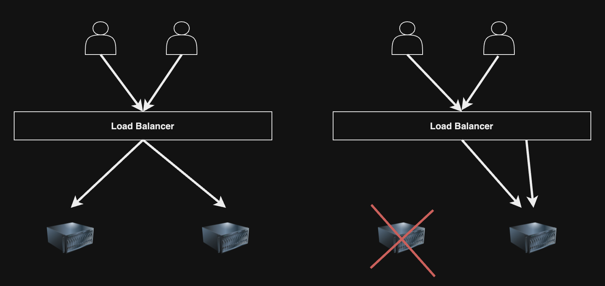
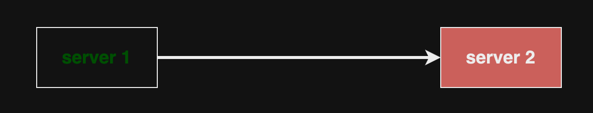
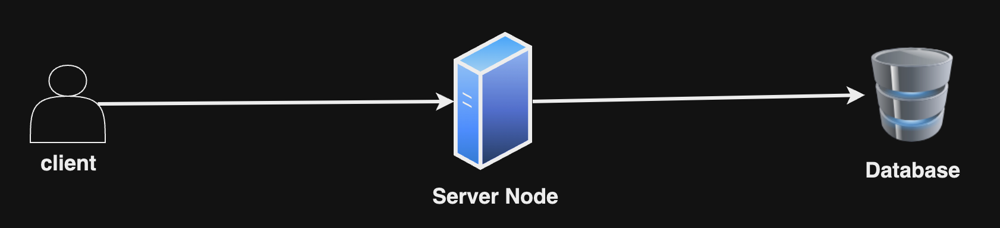
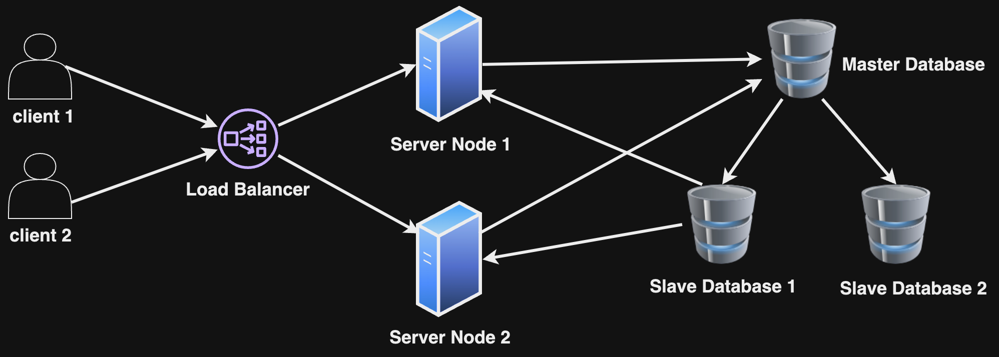

## Reliability

সিস্টেম কোনো প্রকারের Fault/Error থাকার পরও কাজ করতে পারে সেটাই Reliability। তখন সেই সিস্টেমকে Fault Tolerant বা Resilent বলে।

সাধারণত ৩ প্রকারের Fault রয়েছে যা থাকলে আমরা সিস্টেমটিকে UnReliable করে ফেলে,

### Hardware Fault

সিস্টেম UnReliable করতে Hardware Fault এর ভূমিকা রয়েছে। যেমনঃ Electricity Power Cut হওয়ার ফলে সিস্টেম বন্ধ হয়ে যেতে পারে তখন সেই সিস্টেমটি UnReliable হয়ে পড়ে।

### Software Fault

Software এর কোনো বাগ (bug) যদি আমাদের সিস্টেম Crash করে ফেলে তাহলে সেটা Software Fault। আমরা সেই Fault গুলোকে Testing (Unit, Integration) দ্বারা প্রতিরোধ করতে পারি।

### Human Fault

মানুষ(Developer) যখন সিস্টেমটিতে কোনো ভুল Configuration করে থাকে আর সেজন্য যদি সিস্টেমটি Crash করে ফেলে, তখন সেটা আর Reliable হল না। এরকমের Fault গুলোকে আমরা Testing (Unit, Integration) দ্বারা প্রতিরোধ করতে পারি। অন্য পদ্ধতি হল আমরা Sandbox Environment তৈরি করে রাখতে পারি যেখানে মানুষ Explore কিংবা Experiment করতে পারবে আমাদের Features গুলোকে, কোনো প্রাকারের Real User কে effect করা ছাড়া।

## High Availability

একাধিক ক্লায়েন্ট যখন একাধিক সার্ভারে Load Balancer এর মাধ্যমে সার্ভ হচ্ছে তখন কোনো কারণে যদি একটি সার্ভার ডাউন হয়ে যায় তখন অন্য সার্ভারের মাধ্যমে সার্ভ করা হয়, তা হচ্ছে High Availability।

  

Load Balancer Health Check ব্যবহার করে ট্র্যাক করবে কোন কোন Server Instance ঠিকভাবে কাজ করছে কি না। Load Balancer যখন দেখবে যে Server Instance ঠিকভাবে কাজ করছে না সে সার্ভারে আর রিকোয়েস্ট ফরওয়ার্ড করবে না।

## Fault Tolerant

যখন কোনো সার্ভারের ডিপেন্ডেন্সি failure হয় তখন সার্ভারের এর ডিপেন্ডেন্সি failure handle করাকে Fault Tolerant বলে।

  

Server 1 যদি Server 2 এর সাথে ডিপেন্ডেন্ট থাকে, আর কোনো কারণে Server 2 ক্র্যাশ হয় তখন Server 1 এর সেই situation handle করাকে Fault Tolerant বলে।

## Downtime

কোনো সার্ভার যতসময় বন্ধ(down) থাকে সেই সময়টুকুকে Downtime বলে।

## The x-9 structure of Availability

যখন বলা হয় সিস্টেমের availability 99.99% তারমানে হল এক বছরে সিস্টেমের ডাউনটাইম হবে 52.60 minutes। AWS S3 এর Availability বলা হয় 99.99%। 

| Availability %  | Downtime per year |
| ------------- | ------------- |
| 90% (one nine)  | 36.53 days  |
| 99% (two nines)  | 3.65 days  |
| 99.9% (three nines) | 8.77 hours |
| 99.99% (four nines) | 52.60 minutes |
| 99.999% (five nines) | 5.26 minutes |
| 99.9999% (six nines) | 31.56 seconds |
| 99.99999% (seven nines) | 3.16 seconds | 
| 99.999999% (eight nines) | 315.58 milliseconds |
| 99.9999999% (nine nines) | 31.56 milliseconds |

## Single Point of Failure

যদি সিস্টেমের কোনো পার্ট নষ্ট হয়ে যায় এবং সিস্টেম যদি Fault Tolerant না হয় তাহলে এর জন্য সম্পূর্ণ সিস্টেম বন্ধ হয়ে যায় তাহলে সেই নষ্ট হয়ে যাওয়া পার্ট হল Single Point of Failure।

উদাহরণ, ডাটাবেস সার্ভার নষ্ট হয়ে গেলে সম্পূর্ণ সিস্টেম কাজ করা বন্ধ হয়ে যেতে পারে,

  

আরেকটি উদাহরণ Region বন্ধ হয়ে গেলে সেই Region এর সম্পূর্ণ সিস্টেম বন্ধ হয়ে যেতে পারে।

  

### How to prevent Single Point of Failure

ধরুন আমাদের একটি সিস্টেম আছে যেখানে একটি সার্ভার নোড এবং একটি ডেটাবেস সার্ভার আছে।

  

এখানে **সার্ভার নোড** আর **ডাটাবেস** হচ্ছে Single Point of Failure। সার্ভার নোড কিংবা ডাটাবেস বন্ধ হয়ে গেলে সম্পূর্ণ সিস্টেম ডাউন হয়ে যাবে। Single Point of Failure prevent করতে হলে আমাদের,

- একাধিক সার্ভারের সাপোর্ট দিতে হবে।
- একাধিক ডেটাবেস সার্ভার মানে <a href="../../README.md#section-15-database-replication" target="_blank">Database Replication</a> করতে হবে।

এখন একাধিক সার্ভার যোগ করার পর, আমরা Load Balancer এর মাধ্যমে একাধিক সার্ভারে ক্লায়েন্ট রিকোয়েস্ট ডিস্ট্রিবিউট করতে পারি।

  

এখানে Load Balancer নিজে Single Point of Failure। একাধিক Load Balancer যোগ করে DNS এর মাধ্যমে আমাদের ক্লায়েন্ট রিকোয়েস্ট নির্দিষ্ট Load Balancer চলে যাবে।

এরকম আমরা Single Point of Failure prevent করতে পারব।
