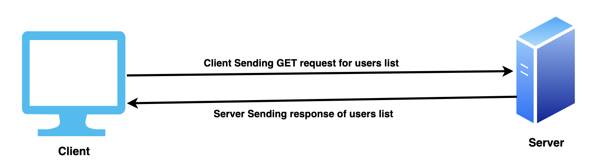
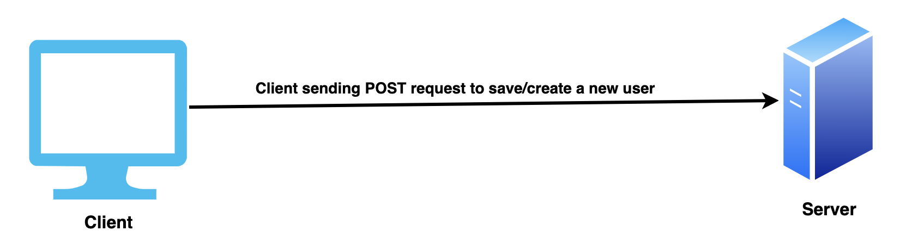
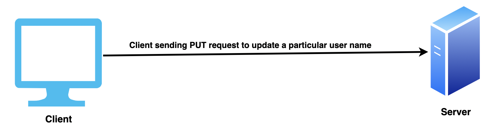
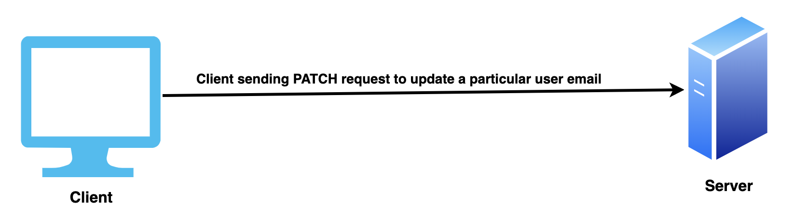
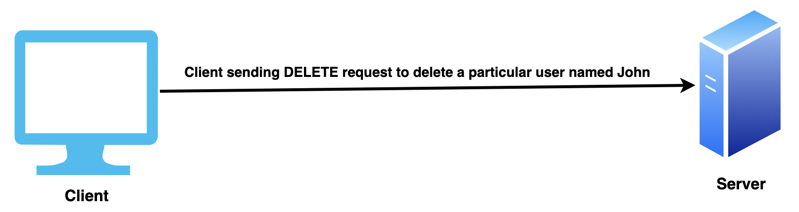

## REST API

### Principal of REST API

#### Client এবং Server পৃথক

REST Architecture এর প্রধান Principal হল Client এবং Server পৃথক থাকতে হবে। Client শুধু Request করবে এবং Server Response দিবে। User Interface এবং Data Storage পৃথক থাকবে।

#### Stateless

প্রতিটি Api এর Request এবং Response পূর্বের এবং পরবর্তী Request এবং Response উপর কোনো নির্ভর করবে না।

#### Cacheable

Stateless হওয়ার পরেও আমরা Request এবং Response কে Cache করতে পারব। 

REST Api মূলত ৫'টি প্রধান HTTP Methods দ্বারা স্টেট ট্রান্সফার নিশ্চিত করে থাকে।

#### GET

GET ম্যাথোড ব্যবহারের মাধ্যমে ক্লায়েন্ট কিছু স্পেসিফিক রির্সোস এর জন্য সার্ভারকে রিকুয়েস্ট করতে পারবে।

যেমন, ক্লায়েন্ট ইউজারদের লিস্ট এর জন্য রিকুয়েস্ট করতে পারে,

<p align="center">
  
</p>

#### POST

POST ম্যাথোড ব্যবহার করা হয় নতুন রিসোর্স তৈরি করার লক্ষ্যে, ক্লায়েন্ট সার্ভারকে রিকুয়েস্ট করতে পারে। 

যেমন, ক্লায়েন্ট নতুন ইউজার তৈরি করতে সার্ভারকে POST রিকুয়েস্টের মাধ্যমে রিকুয়েস্ট করতে পারে, 

<p align="center">
  
</p>

#### PUT

PUT ম্যাথোড ব্যবহার করা হয় নতুন রিসোর্স তৈরি করার লক্ষ্যে কিংবা কোন স্পেসিফিক রিসোর্সকে পরিবর্তন করতে।

যেমন, ক্লায়েন্ট সার্ভারকে রিকুয়েস্ট করতে পারে কোন ইউজারের নাম পরিবর্তন করতে,

<p align="center">
  
</p>

#### PATCH

PATCH ম্যাথোড ব্যবহার করা হয় কোন স্পেসিফিক রিসোর্সের স্পেসিফিক ভ্যালু পরিবর্তন করতে।

যেমন, ক্লায়েন্ট সার্ভারকে রিকুয়েস্ট করতে পারে কোন ইউজারের শুধু ইমেইল পরিবর্তন করতে,

<p align="center">
  
</p>

#### DELETE

DELETE ম্যাথোড ব্যবহার করা হয় কোন স্পেসিফিক রিসোর্স ডিলিট করতে।

যেমন, ক্লায়েন্ট সার্ভারকে রিকুয়েস্ট করতে পারে কোন স্পেসিফিক ইউজার ডিলিট করতে যার নাম হবে John,

<p align="center">
  
</p>

### POST এবং PUT এর মধ্যে পার্থক্য

POST এবং PUT এর মধ্যে পার্থক্য হল, POST সবসময় নতুন রিসোর্স তৈরি করে থাকে যেখানে PUT হল idempotent মানে রিসোর্স যদি ইতিমধ্যে থাকে তাহলে সে আর নতুন রিসোর্স তৈরি করবে না।

### PUT এবং PATCH এর মধ্যে পার্থক্য

PUT এবং PATCH এর মধ্যে পার্থক্য হল, PUT এর ক্ষেত্রে ক্লায়েন্ট একটি স্পেসিফিক ডাটার কিছু পরিবর্তন করতে চাইলে তাকে সেই ডাটার সম্পূর্ণ Attributes সার্ভারকে দিতে হবে এবং PATCH এর ক্ষেত্রে ক্লায়েন্ট সেই ডাটার যে Attribute পরিবর্তন হবে সেই Attribute টাই শুধু সার্ভারকে দিতে হবে।

### HTTP Headers

REST API তে Client এবং Server একে অপরের মধ্যে কিছু অতিরিক্ত তথ্য আদান-প্রধান করতে পারে তা করা হয় HTTP Headers ব্যবহার করে।

HTTP Headers কে ৪ category তে ভাগ করা হয়,

- Request headers: Client থেকে Server
- Response headers: Server থেকে Client
- Representation headers: Information about the body of the resource.
- Payload headers: Information about the payload data.

### REST API best practices

- JSON format ব্যবহার করা রিকুয়েস্ট এবং রেসপন্সের পাঠানোর সময়। উদাহরণ,

```js
router.get('/users', (req, res) => {
  res.status(200).json(users); // response format is JSON
})
```

- Noun ব্যবহার করা, verb এর পরিবর্তে। উদাহরণ,

```txt
--- recommanded ---
'/users'
'/users/{id}'
'/products'

--- not recommanded ---
'/get-users'
'/get-user'
'/fetch-products'
```

- Filtering, Sorting এর জন্য Query Params ব্যবহার করা। উদাহরণ,

{api_endpoint}/posts?tags=react

? এর পরের অংশটুকু হল Query Parameters.

### HTTP Status Code

HTTP Status Code আমাদেরকে বলে দেয় একটি নির্দিষ্ট HTTP Method(GET, POST, PUT) এর রিকুয়েস্ট সাকসেসফুল হয়েছে কি না।

এটি ব্যবহার করা একটি উওম প্রাকটিস বলে গণ্য করা হয়।

HTTP Status Code কে পাঁচ শ্রেণিতে ভাগ করা হয়,

- Informational Responses(100-199)
- Successfull Responses(200-299)
- Redirects(300-399)
- Client Errors(400-499)
- Server Errors(500-599)

নিচে কিছু HTTP Status Code এর নির্দিষ্ট ব্যবহার বলা হল,

- 200, মানে হল রিকুয়েস্ট সাকসেস হয়েছে।
- 201, মানে হল রিকুয়েস্ট সাকসেস হয়েছে এবং নতুন রিসোর্স তৈরি হয়েছে। (উদাহরণঃ নতুন ইউজার রেজিস্ট্রেশন)
- 400, মানে হল সার্ভার বুজতে পারছে না কোন ভুল সিনট্যাক্স দেয়ার জন্য।
- 401, হল unauthorized, মানে ক্লায়েন্ট এমন কিছুর জন্য রিকুয়েস্ট করেছে যার জন্য সে authorized না।
- 404, মানে হল সার্ভার রেসপন্সটি খুঁজে পায় নাই।
- 500, মানে সার্ভার এমন কিছু Error পেয়েছে যা সে জানে না কিভাবে ঠিক করবে।

আরও জানতে এই লিংকে যেতে পারেন, https://developer.mozilla.org/en-US/docs/Web/HTTP/Status

### Resources

- <a href="https://youtu.be/ST8XxjOTIsg" target="_blank">What is a REST API? Basics of HTTP REST APIs, taxonomy , HTTP verbs and more</a>
- <a href="https://youtu.be/aumDleTg_UQ" target="_blank">What is an HTTP POST API? REST API Series,POST method, response codes, errors, best practices & more</a>
- <a href="https://youtu.be/76CcJ90Lz4U" target="_blank">How to use headers in REST APIs? Different types of headers, how and where to use?</a>