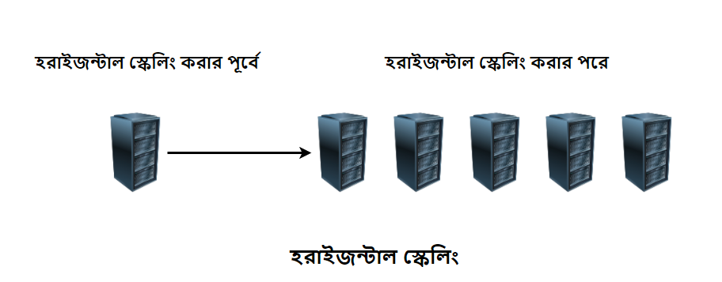

### Vertical & Horizontal Scaling

#### Vertical Scaling

ভার্টিকাল স্কেলিং হল, একটি সার্ভারের রিসোর্স বৃদ্ধি করে স্কেল করা। এখানে রিসোর্স বলতে সার্ভারের Capacity(CPU/RAM/DISK) কে বুঝানো হয়েছে।

ভার্টিকাল স্কেলিং এর উদাহরণ হল MySQL.

  

### Horizontal Scaling

হরাইজন্টাল স্কেলিং হল, নতুন সার্ভার যোগ করে স্কেল করা। সার্ভারের Capacity বৃদ্ধি করার পরিবর্তে নতুন সার্ভার যোগ করাই হল হরাইজন্টাল স্কেলিং।

হরাইজন্টাল স্কেলিং এর উদাহরণ হল Cassandra, MongoDB। AWS Lambda হরাইজন্টাল স্কেলিং করে থাকে।

  

Horizontal Scaling ব্যবহার করার সবচেয়ে বড় সুবিধা, <a href="../reliability/README.md" target="_blank">Fault Tolarance</a> and Availability.

Horizontal Scaling এর একটি সম্পূর্ণ উদাহরণ AWS Auto Scale. আপনার যদি একটি EC2 instance server থাকে এবং আপনার সার্ভার প্রচুর Request পেয়ে থাকে তখন AWS Auto Scale নতুন সার্ভার/instance তৈরি করে এবং Horizontal Scale ভিত্তিক কাজ করে।
