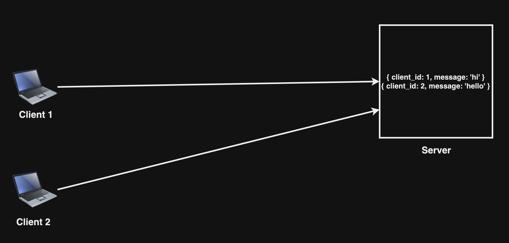

## Stateful Architecture এর Limitation

আমরা জানি Stateful Archtecture ডেটা সার্ভার স্টোর করে রাখে। এখন যদি request এর পরিমাণ বেশি হয় তখন কোনো এক কারণে সার্ভারে কোনো ত্রুটি হওয়ার ফলে ডেটা নষ্ট হয়ে যেতে পারে, তখন ডেটা recover করার সুযোগ থাকে না।

  

ডেটা নষ্ট হওয়ার আগে।

  

অতিরিক্ত Client Request এর ফলে Client 1 এর Deta নষ্ট হওয়ার পর, সার্ভারে Client 1 এর ডেটা আর নাই।

এটি হল একটি Limitation (Scale না করতে পারা)।
