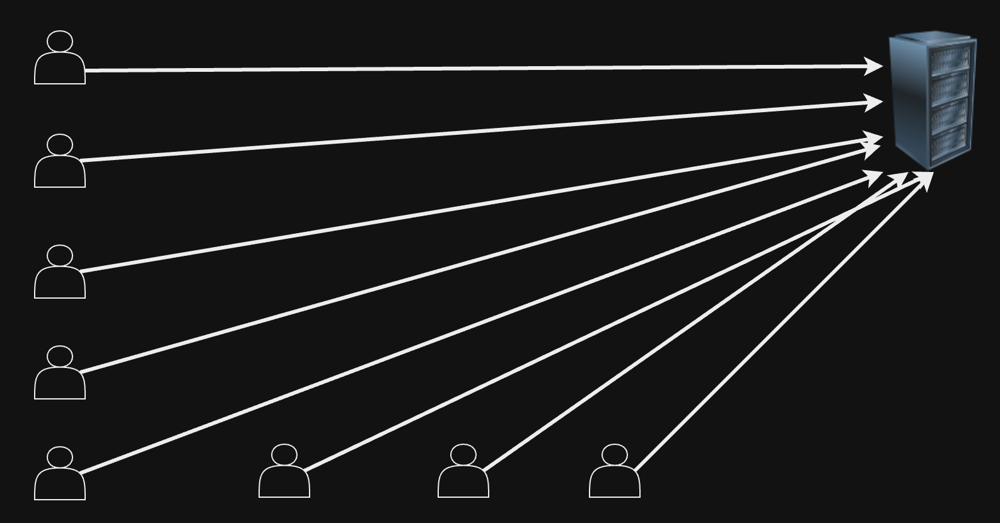
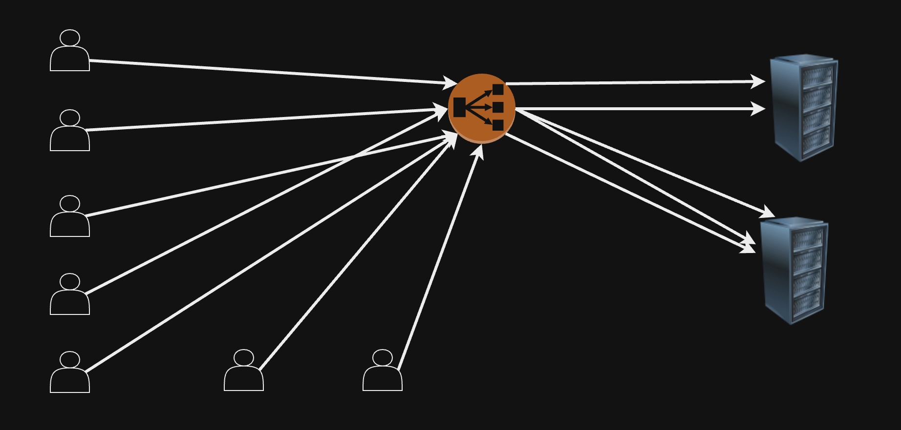
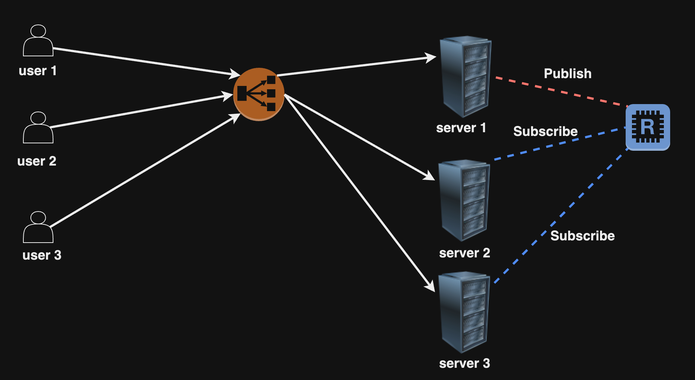

## High Traffic in a Stateful Architecture

আমরা জানি Stateful Archtecture ডেটা সার্ভার স্টোর করে রাখে। এখন যদি request এর পরিমাণ বেশি হয় তখন কোনো এক কারণে সার্ভারে কোনো ত্রুটি হওয়ার ফলে ডেটা নষ্ট হয়ে যেতে পারে, তখন ডেটা recover করার সুযোগ থাকে না।

  

ডেটা নষ্ট হওয়ার আগে।

  

অতিরিক্ত Client Request এর ফলে Client 1 এর Data নষ্ট হওয়ার পর, সার্ভারে Client 1 এর ডেটা আর নাই।

## Scalability - Stateful এবং Stateless Architecture

উপরের যে issue নিয়ে বলা হলো তা Stateful Architecture এ হয়ে থাকে। একই issue Stateless Architecture যেরকম কাজ করে,

  

একাধিক user সার্ভারে call দেয়া শুরু করলো, আমাদের সার্ভারের রিসোর্স কম সেজন্য আমাদের সার্ভার একটি সময় ক্র্যাশ করবে। এই সমস্যা সমাধানের জন্য আমরা Load Balancer দিয়ে Horizontal Scaling ব্যবহার করতে পারি।

  

যেহেতু Stateless Architecture এ সার্ভারের মধ্যে কোনো প্রকারের ডেটা কিংবা ইনফরমেশন সংরক্ষন হচ্ছে না, সেহেতু ক্লায়েন্ট যেকোন সার্ভার থেকে ডেটা পেলেই হবে। এরকম আমরা Stateless Architecture এ খুব সহজে Scale করতে পারি।

একই সমস্যা আমরা Stateful Architecture এ একইভাবে সমাধান করতে পারবো না, কারণ এই Architecture এ সার্ভারের ভিতর ক্লায়েন্টের ইনফরমেশন/ডেটা সংরক্ষন থাকে। তাহলে কিভাবে সমাধান করবো?

## কিভাবে Stateful আর্কিটেকচার কে scale করা যায়?

এই সমস্যা সমাধানের জন্য আমাদের কাছে দুটি options আছে। Message Queue এবং Pub-Sub।

Pub-sub দিয়ে যদি আমরা সমাধান করি, তাহলে প্রথমে আমাদের বুজতে হবে pub-sub কি। Pub-sub মানে হলো Publish and Subscribe pattern। Publisher ডেটা পাঠাবে এবং সেই ডেটা বিভিন্ন সাবস্ক্রাইবার যে সাবস্ক্রাইব করে রাখবে তাদের কাছে চলে যাবে। Redis ভালোভাবে Publish and Subscribe pattern provide করে থাকে।

  

উপরের ছবি অনুযায়ী আমরা ধরে রাখি user 1 এর ইনফরমেশন সার্ভার 1 এর কাছে রয়েছে, user 2 এর ইনফরমেশন সার্ভার 2 এর কাছে এবং user 3 এর ইনফরমেশন সার্ভার 3 এ রয়েছে। user 1 যখন ডেটা সার্ভার 1 এ পাঠাবে তখন সার্ভার 1, publisher মানে redis এ সেই ডেটা publish করবে, এখন redis publisher এ যদি সার্ভার 2 এবং 3 subscribe করে রাখে তাহলে এরাও সেই ডেটা পেয়ে যাবে। তারপর সার্ভার 2 এবং ৩, user 2 এবং 3 এর মধ্যে ডেটা পাঠিয়ে দিবে।

এরকম আমরা Stateful Architecture স্কেল করতে পারি।

## কেনো TCP স্টেটফুল এবং HTTP স্টেটলেস?

একজন ইঞ্জিনিয়ার হিসেবে TCP কেন Stateful এবং HTTP কেন Stateless এটি জানা অত্যন্ত গুরুত্বপূর্ণ। TCP হলো Transmission প্রোটোকল এবং HTTP হলো (Hyper)Text Transfer প্রোটোকল।

TCP তে একটি host যখন অন্য host এর সাথে কানেকশন তৈরী হয় তখন host'গুলোর বর্তমান অবস্থা অর্থাৎ এদের sequence number, এদের ভিতরের acknowledgment ট্র্যাক করে রাখা হয়। এজন্য TCP Stateful।

HTTP Stateless কারণ প্রতিটা রিকোয়েস্ট তার পূর্বের রিকোয়েস্ট থেকে ভিন্ন। এখানে যেহেতু প্রতিটা রিকোয়েস্টগুলোর তথ্য সংরক্ষন করে রাখা হচ্ছে না, সেহেতু HTTP Stateless।

## গুরুত্বপূর্ণ প্রশ্নগুলো

- Stateless আর্কিটেকচার এর সুবিধাগুলো কি কি?
- Stateful আর্কিটেকচার এর সুবিধাগুলো কি কি?
- আপনি যদি একজন user লগইন অবস্থায় আছে কি না তা ট্র্যাক করতে চান তাহলে আপনি কোনো আর্কিটেকচার এবং কেনো ব্যবহার করবেন?
- কেনো TCP Stateful এবং HTTP Stateless?
- WebSocket কেনো Stateful?
